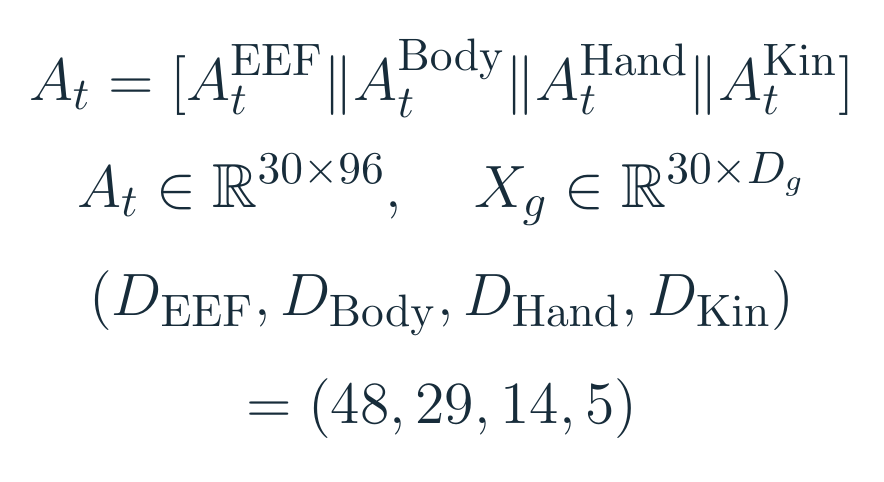
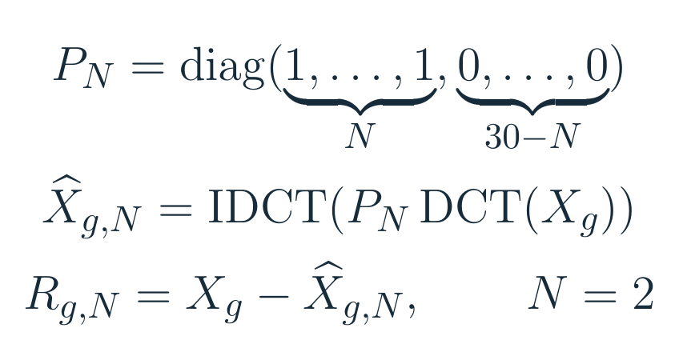
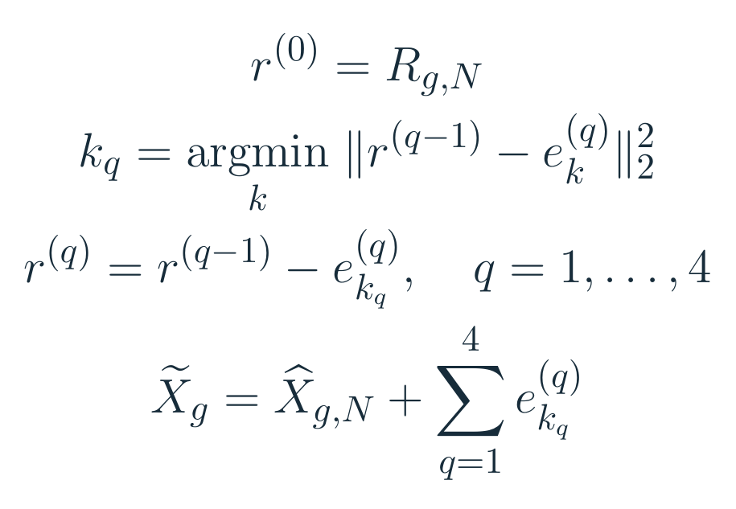
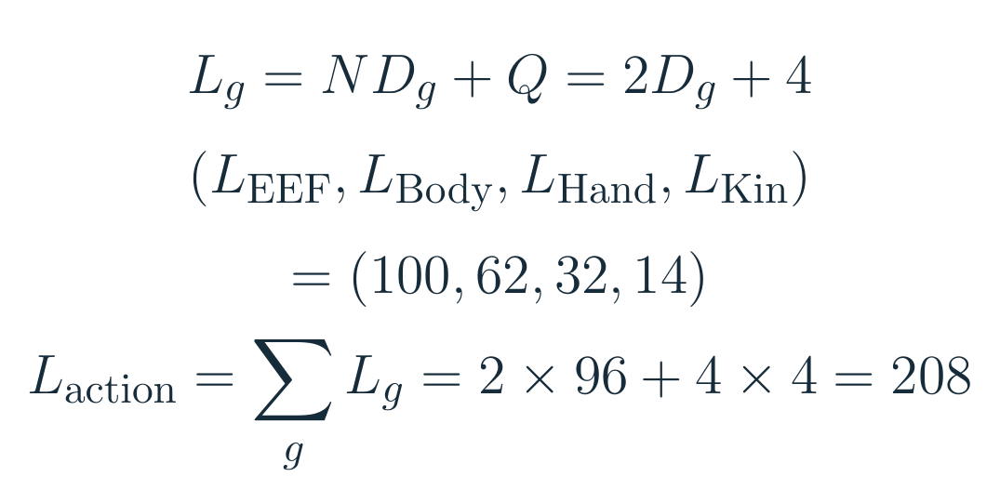
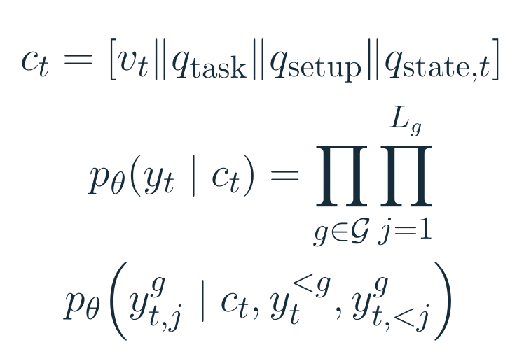
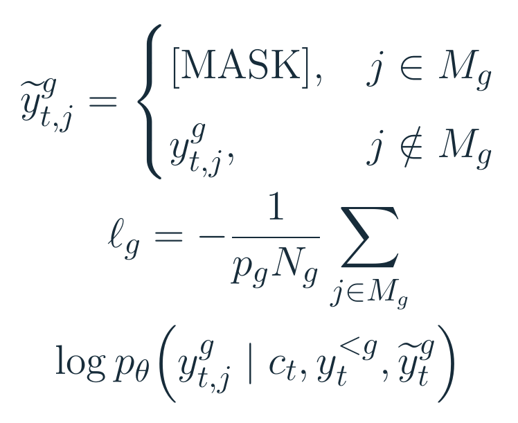
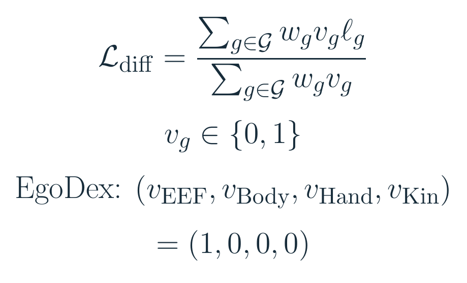
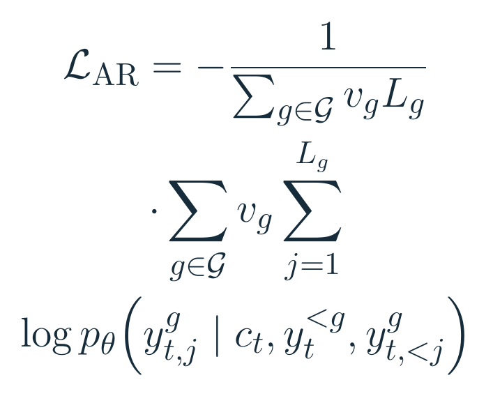

# 全身动作写成208个token，机器人就懂了吗？

> **具身智能的 World**，把论文里的机器人拆开来看：它看见什么、计算什么、为什么这样动。公众号沿原文讲机制和实验；[GitHub 知识库](https://github.com/Zhu-Huixiang/embodied-world)保存完整解读、高清图和公式源文件，还提供[具身论文地图](https://github.com/Zhu-Huixiang/embodied-world/blob/main/paper-map/README.md)、[顶会顶刊集锦](https://github.com/Zhu-Huixiang/embodied-world/blob/main/venues/README.md)与[下周解读日程](https://github.com/Zhu-Huixiang/embodied-world/blob/main/calendar/README.md)。读完一篇，可以顺着问题找到下一篇。

机器人走到桌边拿杯子，手腕伸过去，腰得跟着转，脚还要找一个撑得住的位置。对语言模型而言，“拿杯子”只有三个字；落到身体上，却是一整段彼此牵制的轨迹。

地平线 Holo-M 选择把这些轨迹写成语言模型可以直接生成的 token。它挑战的是 π0、Ψ0 等连续动作专家路线里的一个分工：**视觉语言模型已经理解了任务，动作还要交给另一个模型吗？** 作者希望动作和文字共享词表、共享序列模型，从架构上消去两者之间的接口。<!-- evidence:C01 -->

这条路马上碰到三个问题。下面按论文的顺序，带着它们往下走：

1. **一秒全身动作，怎样压成208个token，又怎样还原？**
2. **人的手部视频与机器人的全身示范，怎样用同一个目标训练？**
3. **同一个语言模型怎样并行生成动作，并赶上控制时钟？**

> **论文信息**  
> Humanoid Loco-Manipulation With Discrete VLA Model（Holo-M）  
> Wenxin Shao、Siqi Chai、Kun Li、Kerou Zhang、Xinzhou Jiang、Wei Xu、Qiang Liu；Horizon Robotics（地平线）。  
> 2026 年 9 月 28 日公开，本文阅读 arXiv v1。  
> [论文原文](https://arxiv.org/abs/2609.35709v1) · [官方项目与演示](https://horizonrobotics.github.io/gail/Holo-M/)

**阅读目录（对应原文 §1–§5）**

- §1 引言：全身动作为什么让离散 VLA 犯难？
- §2 相关工作：Holo-M 接了哪些前人的思路？
- §3 方法：动作编码 → VLM 输入 → 分组去 mask → 四阶段训练。
- §4 实验：评测设置 → Generalist → Specialist → 数据消融 → 实机时序。
- §5 结论：三个问题的答案，以及下一步值得怎样试。

## §1 引言：麻烦从“一只手”变成了“整个身体”

机械臂的输出可以是手腕位姿与夹爪开合。人形机器人还要同时决定躯干、双臂、手指和底座如何运动。直接把每个时刻、每个维度都分箱写成 token，序列会迅速变长；而手指的小幅变化与身体的大幅移动，又很难共用一种粗细合适的编码。

数据也跟不上这种完整性要求。第一视角人类视频有手腕和指尖轨迹，机器人示范有自己的关节目标，仿真还能提供另一套标签。把它们放进同一个训练集，首先要决定哪些东西可以对齐。

最后是时间。一段动作如果要顺序生成几百次，机器人可能还在等答案。Holo-M 的三个设计正好对应这三处：分身体部位编码、只监督有标签的组、组内并行生成。

先看 Fig. 1 的中间路径：图像、指令和状态进入 Qwen3-VL-2B，模型输出动作 token，再解码成连续目标。最下方的 Whole-Body Controller（WBC）负责跟踪这些目标、维持全身控制。语言模型与底层控制器各自承担哪一段，在这里很清楚。<!-- evidence:C02 -->

论文 Fig. 1。沿着箭头往下看：模型生成动作目标，Whole-Body Controller 负责把它变成全身控制。

## §2 相关工作：四条线索，接到同一个接口上

原文先比较动作解码。π0、Ψ0 用连续专家生成轨迹；离散 VLA 则让动作成为序列模型的输出。连续专家和预训练骨干联合训练时，要处理动作梯度对原有语义表征的影响。Holo-M 选择直接扩展词表，让动作预测进入同一个序列模型。作者把这视为架构上的优势；读到实验，我们还要看这个选择怎样影响任务表现。<!-- evidence:C01 -->

随后是动作 tokenization。FAST 的启发是：相邻时刻的轨迹有冗余，可以先做离散余弦变换（DCT），再编码系数。Holo-M 保留这个压缩方向，却改成固定长度，方便后面的 mask 并行恢复。

第三节讨论 WBC，也就是“目标如何落到身体上”。Holo-M 沿用 Ψ0 的解耦控制路线，把强化学习的下肢控制与逆运动学的上肢控制接起来。高层动作生成方式改变了，底层控制的分工仍保留。

第四节引出离散扩散，解决“一串 token 怎样少等几轮”。在这篇里，它指的是逐轮补全被遮住的 token。记住这个操作，后面的数学就容易跟上了。<!-- evidence:C18 -->

## §3 方法：从一秒轨迹走到一个训练目标

### 3.1 统一动作编码：208究竟怎么算出来的？

先定义模型要预测的对象。一次输出是一秒动作块，采样频率 30 Hz，因此有 30 行。每行拼接 EEF、Body、Hand、Kinematics 四组，共 96 维：<!-- evidence:C04 -->

动作矩阵：行是时间，列是四组动作表示（原文 Eq. 1–3）。

| 动作组 | 维度 / 内容 |
| --- | --- |
| EEF | 48 / 双手手腕位置、6D 旋转与指尖位置 |
| Body | 29 / 身体关节目标 |
| Hand | 14 / 手部关节目标 |
| Kinematics | 5 / 底座速度、高度与转动指令 |

EEF 在相机坐标系里描述“手要去哪里”，Body、Hand 描述关节怎么动。两种表示有重叠，所以这 96 维说的是动作表示的宽度。人的手与机器人的手可以在 EEF 里找到共享描述，机器人自己的关节顺序仍由其硬件决定。

取其中一组，记作 Xg，形状为 30×Dg。DCT 沿时间轴操作，每一列分别变换。保留前 N 个低频系数，再做逆变换，得到平滑近似；原轨迹减去它，就是残差：<!-- evidence:C08 -->

低频近似与残差：PN 保留前 N 个时间系数，其余置零（原文 Eq. 4–5）。

Holo-M 取 N=2。想象手腕缓慢伸向杯子：低频系数负责一秒内的大体走势，更细的变化留在残差里。只留下两个系数会丢细节，于是再用残差向量量化（RVQ）补回来。

RVQ 可以这样理解：先在第一本码本里找一个向量近似残差，减掉它；第二本码本继续近似剩下的误差，往后重复。Holo-M 每组用四级码本，码本由 k-means 拟合。每一级选中的向量都有一个离散编号，模型生成的就是这个编号。

下面把标准 RVQ 的减残差过程写开，方便看清解码时为何要相加：<!-- evidence:C19 -->

RVQ 的教学展开：r(0) 是整组时域残差，e(q) 是第 q 级选中的码向量；对应原文 §3.1 的四级量化描述。

这里的关键在“整组”：四级 RVQ 一共给出四个编号，每个编号指向一个补偿该组轨迹的向量。于是，DCT 部分有 2Dg 个 token，RVQ 部分再加 4 个：<!-- evidence:C08 -->

固定长度计算：每维两个低频系数，每组四个残差码（原文 Eq. 6–8）。

以手部为例，30×14=420 个连续数值，编码后是 2×14+4=32 个 token：28 个表示低频系数，4 个表示残差码。四组长度分别为 100、62、32、14，总计 208；组边界、状态等结构 token 另计。

第一个问题的答案可以落到一次具体计算上：**低频系数写趋势，四级残差码补细节；解码时做逆 DCT，再加回码向量之和。** 固定组长则给并行生成留好了位置。动作表示的误差会一路传到控制目标，这也是读 tokenizer 时应当关心的代价。

### 3.2 VLM 骨干：模型到底看见什么？

输入按图像 → 任务 → setup → 状态的顺序拼接。图像提供当前场景，任务告诉它要做什么，setup 标识本体和数据来源，状态告诉它身体此刻在哪个位置。<!-- evidence:C22 -->

条件序列与自回归分解：先前组、当前组先前 token 都进入条件（原文 Eq. 9–10）。

vt 是视觉嵌入；q 是任务、setup、状态对应的 token 序列；“∥”表示拼接。ct 合起来就是模型这次决策能读取的上下文。状态角度先裁到 [−π, π]，除以 π 归一化，再均匀分到 256 个 state bin。

下半行先写 Holo-M AR：每次预测当前 token 的概率，条件里有 ct、前面完成的组 y&lt;g，以及当前组已生成的位置 y&lt;jg。整段动作的概率是这些条件概率的连乘。这套分解很自然，代价是每一步都要等前一步。

### 3.3 分组离散扩散：怎样把等待缩成32轮？

Holo-M 接着改变当前组内部的生成方式。训练时，按概率 pg 随机遮住一些有效位置，集合记为 Mg；模型利用可见位置与前面的组恢复被遮住的 token。一个组的损失是：<!-- evidence:C20 -->

当前组的恢复目标：只对被 mask 的有效位置计算交叉熵（原文 Eq. 11–12）。

Ng 是这一组的有效 token 数。假设手部 32 个位置都有效、pg=0.5，那么预期遮住 16 个，损失除以 16；实际抽到的位置数量每次可以不同。对数概率前加负号：正确编号的概率越高，损失越小。这里 pgNg 用的是预期遮盖数。

注意条件里的 ỹg：它包含当前组全部可见 token，因此组内允许双向注意力。跨组依赖仍然有顺序：EEF → Body → Hand → Kinematics。Body 能看见 EEF，EEF 生成时看不到后面的 Body。<!-- evidence:C09 -->

推理从整组 [MASK] 开始，一轮同时猜各个位置。置信度高的位置先留下，剩余位置再猜；完成 EEF 后才处理 Body，依次向后。前缀与完成组会缓存。每组八轮，四组就是 32 轮，相比 AR 的 208 次顺序预测，顺序深度之比为 208/32=6.5。每轮并行处理多个位置的成本，要到实机延迟里看。<!-- evidence:C10 -->

先决定手的任务空间轨迹，再让身体和底座参考它，这是当前顺序带来的信息方向。如果换成底座在前，移动抓取会不会更好？组间的协调在这里变成了一个可以修改、可以测试的选择。

### 3.4 四阶段训练：标签不齐，也能放进同一个目标

现在回答第二个问题。给每个组加一个有效开关 vg：有标签为 1，没有标签为 0。EgoDex 的人类样本只有 EEF，因此对应开关是 (1,0,0,0)。其余组在损失里直接乘零。<!-- evidence:C05 -->

多来源数据的损失：vg 决定哪些组参与，wg 决定组间权重（原文 Eq. 13）。

如果当前样本只有 EEF，分子是 wEEFℓEEF，分母是 wEEF，结果就是 EEF 的损失。机器人样本提供更多组时，再把它们纳进来。**只对已有标签的组计算损失，人类手部轨迹因此能参与同一骨干的训练。** 腿与躯干的配合仍从机器人数据学。

原文的训练次序也有理由：先学动作词表，再对齐目标本体，最后改生成节奏。<!-- evidence:C06 -->

1. EgoDex + Humanoid Everyday 混合做 AR 预训练，学习人的操作与人形动作。
2. 在 SIMPLE 上继续 AR 训练，适配人形任务。
3. 切换到分组 mask 恢复，得到 generalist。
4. 需要 specialist 时，再用目标任务示范适配。

各阶段保留 Qwen3-VL-2B 与动作词表，视觉编码器冻结，语言骨干更新。AR 阶段的目标也用同一个有效开关：<!-- evidence:C21 -->

AR 训练目标：分母是当前样本全部有效动作 token 的数量（原文 Eq. 14）。

这里有一个容易被一句“统一训练”带过去的区别。AR 按有效 token 数求平均；离散扩散先在各组里归一化，再按组权重求平均。EEF 有 100 个 token、Kinematics 有 14 个，如果扩散阶段取相同组权重，两组整体贡献相同；AR 阶段则让较长的组贡献更多 token。读实现时，我会专门找这几个权重，因为它们决定模型更用力地学哪一部分身体。

把编码、缺失组监督与生成次序合在一起看：

本图由 [DrawPaper skill](https://github.com/Zhu-Huixiang/ReadPaper/tree/main/drawpaper) 指挥 Codex，使用内置生图制作。

## §4 实验：表示、数据和速度，各自贡献了什么？

### 4.1 先把评测的单位讲清楚

generalist 用一个 checkpoint 在 SIMPLE 的 24 个任务上联合训练，评估其中六个代表任务。每项有三个随机化等级，每格十次，所以总数是 6×3×10=180。specialist 则按任务分别适配。两者分别考察兼顾多个任务和专门练一个任务的效果。<!-- evidence:C11 -->

### 4.2 Generalist：总分提高，难格子也会退步

| 方法 | 成功次数 / 成功率 |
| --- | --- |
| Ψ0 | 114/180 · 63.3% |
| Holo-M AR | 138/180 · 76.7% |
| Holo-M | 143/180 · 79.4% |

Table 3 里，从 AR 到分组离散扩散，多成功五次；AR 比 Ψ0 已多成功 24 次。我的阅读重心因此先落在表示与预训练数据上，再看扩散怎样缩短生成。<!-- evidence:C11 -->

这些模型使用相同的适配数据，但训练范围有差别：Ψ0、π0.5 微调动作头，DreamZero 用 LoRA，Holo-M 更新语言骨干，初始化也各有来源。这些条件与分数一起，构成了这张比较表。<!-- evidence:C12 -->

还有一格应该单独看：XMovePick 的 Level 2，Holo-M 为 3/10，AR 为 8/10，Ψ0 为 9/10。整体成绩上涨，最难的这一格却掉了。是轨迹细节丢失，还是身体配合出了问题？看失败轨迹，比再报一遍总分更有用。<!-- evidence:C13 -->

### 4.3 Specialist：专门练之后，移动抓取怎样？

按任务适配后，Holo-M 合计 163/180，Ψ0 为 154/180；其中 MobileP&P 是 25/30 对 18/30。Table 4 的基线数值沿用 SIMPLE 报告。对需要移动又要抓取的任务，这个改善值得继续细看。<!-- evidence:C14 -->

### 4.4 数据消融：人的手究竟帮上了多少忙？

Table 5 保持 AR 骨干与组顺序，改变动作预训练数据。所有设置都从预训练 VLM 出发，“无动作预训练”省去的是后面的动作数据阶段。<!-- evidence:C07 -->

| 动作预训练来源 | 成功次数 |
| --- | --- |
| 无 | 53/180 |
| Humanoid Everyday | 119/180 |
| EgoDex + Humanoid Everyday | 138/180 |

人形数据先带来 66 次额外成功，再加人类 EgoDex，多了 19 次。只有 EEF 标签的数据确实找到了有用的训练入口。下一步可以固定数据量，拿掉 EEF 共享组、或者换 tokenizer：这能把“多看了一批动作”与“共同表示本身的作用”分开追。

### 4.5 实机部署：模型算完，动作什么时候接手？

实机用 G1-comp、两只 Dex3 手、头部 RealSense 相机，推理在单张 RTX 5090 上完成。输入状态选取 31 个上半身关节角；输出仍是前面定义的动作表示。每次预测一秒，每 500 ms 采一份新观测。<!-- evidence:C15 -->

第三个问题到这里才能答完：**组内并行减少生成轮次，旧动作块与新推理交叠，控制器才有持续可执行的目标。**

论文 Fig. 3。横轴是控制 tick；每 500 ms 更新观测，下一块动作的推理与当前块的执行交叠。

观测在时刻 t 进入模型，预测覆盖 t 到 t+1 秒。推理需要一段时间，这期间旧块继续执行。新块接手时，前面那些已经过去的预测步会被跳过。例如 hold 为 500 ms，30 Hz 下已过去 15 步，新块从第 15 步接管；首次动作块算完就开始执行。

论文 Fig. 3 局部放大。从上到下是旧块 k、新块 k+1、实际发送的动作。紫色是等待期间跳过的前段，蓝色是发出的动作；0.5 s 处，新块从第 15 步接管。

| 每组去 mask 轮数 | 推理延迟 / hold |
| --- | --- |
| 2 | 175.8 ± 11.5 ms / 233 ms |
| 4 | 275.7 ± 9.3 ms / 333 ms |
| 8 | 476.8 ± 16.9 ms / 500 ms |

Table 6 把计算与调度放在一起。八轮的平均延迟距 500 ms 预算约剩 23 ms。少算几轮可以更早结束，动作质量怎样变化，就需要把各轮成功率也放到旁边。<!-- evidence:C16 -->

两项实机任务各采集 100 条遥操作示范做 specialist 适配，再各试十次：Tabletop Grasp 为 10/10，Move Pick 为 8/10。<!-- evidence:C17 -->

在这套节奏里，下一份观测、下一轮推理、下一次接管都有时间表。杯子在等待期间滑了一点，纠正信号要走完哪几步才会进入控制器？这比“实时”两个字更值得问。

## §5 结论：动作有了共同写法，反应还要继续追

三个问题，现在都有了可以指着公式说的答案。

一秒动作怎样压成 208 个 token？四组共 96 维，每维保留两个低频系数，每组再用四个残差码。逆 DCT 与残差相加，把编号送回连续轨迹。

人的手部视频怎样参与全身训练？有效开关把缺失组从损失里拿掉，EEF 成为共享监督接口。机器人数据继续教关节与底座的协调，消融里加入 EgoDex 后多出的 19 次成功，是值得追的线索。

同一个语言模型怎样赶上控制时钟？先 AR 学动作，再改为组内双向恢复、组间顺序解码，配合重叠执行。作者还在结论里提出，未来可以交错输出推理文本与动作。动作进入词表，为这个方向留了接口。<!-- evidence:C03 -->

我更想看的下一项实验是：固定 checkpoint、动作块长度与 WBC，只改去 mask 轮数和观测间隔，在动作中途加入扰动，同时记录成功率、纠偏时间与超预算次数。省下来的计算，究竟多快能变成身体的一次纠正？

如果你想沿用这篇的阅读与绘图方式：[ReadPaper skill](https://github.com/Zhu-Huixiang/ReadPaper/tree/main/readpaper) 用来拆论文、逐段追问题；[DrawPaper skill](https://github.com/Zhu-Huixiang/ReadPaper/tree/main/drawpaper) 用来制作方法解读图。完整公式源文件和原图见本文 GitHub 页面，点击公众号底部“阅读原文”即可进入。

---

公众号版由管理员在后台手动公开发表；永久文章链接待发表后补充。

关注公众号 **具身智能的 World**：

[原论文](https://arxiv.org/abs/2609.35709v1) · [证据索引](evidence.json)
