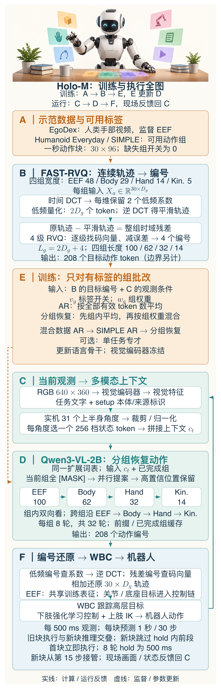

# 全身动作写成208个token，机器人就懂了吗？

> **具身智能的 World**，一起把机器人论文读明白：它看见什么，怎么算，最后为什么这么动。[GitHub 知识库](https://github.com/Zhu-Huixiang/embodied-world)留高清图、公式和解读，也有论文地图、顶会顶刊集锦、一周解读日程。现在再加两栏：**arXiv 新作集锦**帮你找值得追的新论文，**具身榜**把创新、实验和影响力摊开打分。公众号顺着主线讲，仓库让你继续往下挖。

机器人走到桌边拿杯子，手腕伸过去，腰要转，脚还得站稳。人说“拿杯子”，三个字就完事；机器人：等等，我这几十个关节找谁商量？

地平线 Holo-M 想把这段全身动作写成语言模型能生成的 token。它在挑战 π0、Ψ0 等连续动作专家路线里的一个分工：**视觉语言模型都理解任务了，动作还非得转交另一个模型？** Holo-M 要把动作也塞进同一个词表，用同一个序列骨干生成。<!-- evidence:C01 -->

听着很爽，带着三个问题算账：

1. **一秒全身动作，怎样压成208个token，又怎样还原？**
2. **人的手部视频与机器人的全身示范，怎样用同一个目标训练？**
3. **同一个语言模型怎样并行生成动作，并赶上控制时钟？**

> **论文信息**  
> Humanoid Loco-Manipulation With Discrete VLA Model（Holo-M）  
> Wenxin Shao、Siqi Chai、Kun Li、Kerou Zhang、Xinzhou Jiang、Wei Xu、Qiang Liu；Horizon Robotics（地平线）。  
> 2026 年 9 月 28 日公开，本文阅读 arXiv v1。  
> [论文原文](https://arxiv.org/abs/2609.35709v1) · [官方项目与演示](https://horizonrobotics.github.io/gail/Holo-M/)

**阅读目录｜沿原文 §1–§5 往下走**

- §1 引言：麻烦为什么从手蔓延到了全身？
- §2 相关工作：动作专家、FAST、全身控制和离散扩散。
- §3 方法：3.1 动作编码 → 3.2 视觉语言输入 → 3.3 分组恢复 → 3.4 训练。
- §4 实验：4.1 评测 → 4.2 通才 → 4.3 专才 → 4.4 数据消融 → 4.5 实机。
- §5 结论：把三个问题收回来，再追一个更难的问题。

**先认路：全文架构图**

本图由 [DrawPaper skill](https://github.com/Zhu-Huixiang/ReadPaper/tree/main/drawpaper) 指挥 Codex，使用内置生图制作。

别急着啃图里的小字，先抓两条路。**训练走 A→B→E，E 更新 D；机器人运行走 C→D→F，再从现场回到 C。** 一个在教模型，一个在让身体动。

A 收人类视频、机器人示范和仿真数据；B 把一秒连续轨迹变成四组、共 208 个动作 token。C 收当前画面、指令、本体标识与关节状态，交给 D；D 用这些条件恢复动作编号。E 拿 B 的正确答案监督 D，有哪组标签就学哪组。F 再把编号还原成轨迹，接上全身控制器和执行时钟。

目录怎么对图？§1–§2 解释这几块为何要这样接；3.1 拆 B，3.2 拆 C，3.3 拆 D，3.4 拆 E。实验 4.2–4.3 看整条路线做事怎样，4.4 回查 A 的数据，4.5 专门盯 F 的时钟。读着读着迷路了，就回来找这个字母。

## §1 引言：一只手会动，整个身体就开始加戏

机械臂输出手腕位姿和夹爪开合，已经够忙。换成人形机器人，躯干、双臂、手指和底座都得配合。把每个时刻、每个维度逐个分箱写成 token，长度蹭蹭上涨；手指的小动作和身体的大挪步，编码精度又很难一把尺子量到底。

再看 A 区的数据。人类视频里有手腕、指尖的轨迹，却没有机器人腿部的关节目标。机器人示范有另一套标签。硬拼成“全身答案”，缺的部分凭空造出来，模型就要跟着学错。

时间还在旁边催：动作要是顺序生成几百次，身体总不能等模型打完这篇小作文。Holo-M 因此分身体部位编码，只监督现有标签，再把每组内部的生成改成并行。

<blockquote class="primer">
<strong>基础扫盲｜VLA、VLM 和 token</strong> VLM 是看图读文字的模型；VLA 多了一项，把任务落到动作。token 是词表里的离散编号，可以代表文字，也可以代表量化后的动作。“模型懂动作”具体落在这些编号能否还原成好用的轨迹上。
</blockquote>

看论文自己的 Fig. 1。它比开头的图更概括，接下来逐层把它和 A–F 对上。<!-- evidence:C02 -->

论文 Fig. 1。上半部准备训练答案，下半部从观测一路走到机器人。

顶部三支箭头是遥操作、人类数据、仿真数据，进橙色 **Unified Action Tokenizer**，对应 A→B。它把样本拆成 EEF、Body、Hand、Kinematics，分别编码；四组宽度是 48、29、14、5，每组输出 100、62、32、14 个 token。

灰虚线下方的 Image + Language + Proprio 对应 C：画面、语言、本体关节状态进入绿色视觉语言骨干，视觉特征与文本、状态 token 拼接，给动作预测提供上下文。这里用 Qwen3-VL-2B，并扩充动作词表。

红色 **Grouped Discrete Diffusion** 是 D 的生成方式。每组上面的回环表示多轮恢复；左右箭头表示 EEF 完成后才轮到 Body，再 Hand、Kinematics。一轮内部能同时猜多个位置，组与组之间还要排队。

底部紫色 **Whole-Body Controller** 是 F：动作编号先还原为连续目标，再交给 WBC 跟踪。EEF 提供共享的任务空间训练表征；关节目标与底座指令进入实际控制链。WBC 把强化学习的下肢控制和逆运动学的上肢控制接起来，最终驱动机器人。顺着图看下来，语言模型负责生成高层目标，控制器还得负责把身体稳稳接住。<!-- evidence:C18 -->

## §2 相关工作：Holo-M 借来的几把扳手

原文先比较动作解码。π0、Ψ0 用连续动作专家生成轨迹，Holo-M 选择扩展词表，把动作预测放进同一个序列骨干。作者关心的是联合训练时，动作梯度怎样影响原有语义表征；共享词表是他们给出的架构选择。它干活到底怎样，留到实验看。

第二把扳手是 FAST。轨迹相邻时刻很像，没必要每一帧都重新“报数”。FAST 先把时间轨迹变成频率系数，再压缩。Holo-M 沿用这个方向，却把动作组长度固定下来：后面的 D 区要并行填空，得先知道一共有几个空。

第三把是 WBC，开头图的 F。想象导航告诉你“往桌边走”，身体还得决定抬哪只脚、怎么站稳。这里高层模型给目标，下肢强化学习控制器和上肢逆运动学各接一段。

<blockquote class="primer">
<strong>基础扫盲｜逆运动学 IK</strong> 正着算，是给关节角求手腕位置；反着算，就是给一个手腕目标，求关节该转多少。像知道手要够到哪儿，再倒推胳膊怎么摆。强化学习则用任务回报训练策略，让它逐步学会合适的动作。
</blockquote>

最后是离散扩散。别急着脑补图像里那团高斯噪声：这篇的具体操作是把 token 遮住，再逐轮填回来。Holo-M 把它改成分组版本，沿用前面的上下文和词表，改变当前组的注意力与恢复节奏。<!-- evidence:C09 -->

## §3 方法：顺着 B→C→D，再看 E 怎样把它教会

### 3.1 统一动作编码：208究竟怎么算出来的？

先拆 B。一次输出一秒动作，采样 30 Hz，等于 30 个时刻。用 At 表示从时刻 t 开始的动作块；“∥”把四组沿列拼接，“∈”表示属于，ℝ 是实数集合。于是 At 是 30×96 的实数矩阵。<!-- evidence:C04 -->

动作矩阵：行是时间，列是四组动作表示（原文 Eq. 1–3）。

Xg 是单独拿出的第 g 组，形状 30×Dg；Dg 是该组每个时刻的维度。g 从有顺序的四组里选：

| 组 | 每个时刻装什么 |
| --- | --- |
| EEF，48维 | 双手手腕位置、6D 旋转、指尖位置 |
| Body，29维 | 身体关节目标，按硬件关节顺序排 |
| Hand，14维 | 手部关节目标 |
| Kinematics，5维 | 底座速度、高度、偏航角速度指令 |

EEF 是 end effector，末端执行器，这里盯着双手。位置用相机坐标系；6D 旋转用六个数描述三维朝向，通常可理解为两根三维方向向量，避开某些角度表示的跳变。48 维任务空间描述与关节描述有重叠，所以这 96 维是表示宽度。**EEF 是共享训练接口**：人的手和机器人的手能在这里说上话。<!-- evidence:C23 -->

接下来，B 里面还藏着两个小模块：DCT 写走势，RVQ 补细节。

<blockquote class="primer">
<strong>基础扫盲｜DCT，给轨迹换一种记法</strong> 离散余弦变换把“每一帧在哪儿”改写成“由哪些快慢波形组成”。低频像手缓缓伸过去，高频像途中小幅修正。IDCT 是逆变换，负责把系数变回逐帧轨迹。
</blockquote>

每列独立沿 30 个时刻做 DCT，输入、系数矩阵都是 30×Dg。PN 是 30×30 的对角矩阵：diag 表示把这些数放在对角线上，前 N 个位置为 1，其余为 0。它乘上系数矩阵，相当于留下前 N 个低频，后面的直接关掉。本文取 N=2。<!-- evidence:C08 -->

低频近似与残差：PN 保留前 N 个时间系数，其余置零（原文 Eq. 4–5）。

帽子 X̂g,N 是逆变换后的平滑近似，还是 30×Dg；Rg,N 是原轨迹 Xg 减去近似后的残差，同样大。图中最内层先 DCT，中间乘 PN，外层 IDCT，最后做减法。看着套了三层壳，其实就四步，拆开便不吓人了。

只留两个系数，动作细节当然得找补。RVQ，残差向量量化，做的是“先补一刀，再补剩下的”。一组完整残差拉成长度 30Dg 的向量，去第一本码本挑最接近的补丁，减掉；第二本继续补误差。Holo-M 每组做四级，码本用 k-means 拟合。k-means 就是把相似的轨迹残差聚成堆，用中心向量代表一堆。<!-- evidence:C19 -->

这段很容易被“量化一下”四个字糊过去，展开看才知道解码要加什么：

RVQ 的教学展开：r(0) 是整组时域残差，e(q) 是第 q 级选中的码向量；对应原文 §3.1 的四级量化描述。

r(q) 是补完第 q 级后剩下的误差，q=1…4；ek(q) 是第 q 本码本里的第 k 个向量，k 是码本索引。公式里的残差与码向量均按 30×Dg 的块理解，计算距离时展开。argmin 选使误差最小的索引，‖·‖22 把各项差的平方加起来，kq 就是选中的编号。模型只要生成编号，解码器就能查到对应补丁。

最下面的波浪 X̃g 是最终重建：低频近似加上四个码向量，Σ 表示逐级相加。注意，**四个残差码补的是整组轨迹**。把它误读成“每个维度再加四个码”，208 就算飞了。

用 Lg 表示组长，Q 表示 RVQ 级数，这里 Q=4。低频部分每维 N=2 个系数，各写成一个 token；加上整组四个残差编号：

固定长度计算：每维两个低频系数，每组四个残差码（原文 Eq. 6–8）。

Laction 是四组动作 token 总长，Σg 就是把四组长度相加。手部算一遍：30×14=420 个连续值，编码后 2×14+4=32 个 token；四组得到 100、62、32、14，合起来 208。组边界与状态 token 另计。

第一个问题到这里有了答案：**低频系数写趋势，四级残差码补细节**，解码时逆 DCT，再加回补丁。回到开头 B：30×96→四组固定编号；F 再反着还原。压缩省事，细节丢多少、怎样传到身体，后面还得用实验看。

### 3.2 VLM 骨干：C区到底往模型里塞了什么？

动作有写法了，模型还得知道眼前发生了啥。C 区把输入按图像→任务→setup→状态排列：图像回答“在哪儿”，任务回答“做什么”，setup 标识本体与数据来源，状态报当前关节位置。图像走视觉编码器，剩下的变成离散 token，然后一起进 D 区的 Qwen3-VL-2B。<!-- evidence:C22 -->

条件序列与自回归分解：先前组、当前组先前 token 都进入条件（原文 Eq. 9–10）。

上半行：vt 是时刻 t 的视觉嵌入；qtask、qsetup、qstate,t 分别是任务、本体/来源标识和状态的 token 序列；ct 是拼接好的上下文。嵌入可以当成模型内部读得懂的特征表示，好比把照片翻译成它自己的速记。

关节角裁到 [−π,π]，除以 π 归一化到 [−1,1]，再均匀分成 256 档。π 是圆周率，弧度 π 对应 180°。角度靠近同一档的，会写成相同状态编号；状态边界标记把这段和任务文字隔开。

下半行写的是自回归 AR：yt 是当前动作 token 序列，yt,jg 是第 g 组第 j 个编号；j=1…Lg，𝒢 是 EEF、Body、Hand、Kinematics 的有序组集合。pθ 是参数为 θ 的模型给出的概率，“|”后面是预测条件，Π 表示把这些概率连乘。

yt&lt;g 包含先前已完成的组；yt,&lt;jg 包含本组 j 之前的 token。它们连同 ct，决定下一个编号的概率。说白了，就是模型看着已经写好的前文往下续。连乘把一串局部预测拼成整段动作的概率。

问题也来了：208 个编号，一个接一个写。等它慢悠悠敲完，杯子还愿不愿意待在原地？

### 3.3 分组离散扩散：D区从打字改成填空

Holo-M 把当前组改成“大家一起猜”。训练先挖一些空，模型看着可见位置和前面的组，把空补回来。用 pg 表示随机遮盖概率，Mg 是本次被遮住的有效位置集合，Ng 是该组有效 token 数。这里 Ng 数 token，上一节 N=2 数低频系数，别串台。<!-- evidence:C20 -->

当前组的恢复目标：只对被 mask 的有效位置计算交叉熵（原文 Eq. 11–12）。

第一行的分段式规定：j 属于 Mg 就换成 [MASK] 这个空位标记，j 不属于就保留正确编号；波浪 ỹtg 是挖完空的整组序列。“∈ / ∉”就是属于 / 不属于。第二行 ℓg 是这组的恢复损失，Σj∈Mᵍ 把被遮位置的损失加起来。

条件里的 ct、yt&lt;g 与上节相同，多出的 ỹtg 让模型读到本组左右两边的可见编号。log 是自然对数，正确编号的概率越高，前面加负号后的惩罚越小。分母 pgNg 是预期遮盖数：手部 32 个位置、pg=0.5，平均挖 16 个空，就除以 16；每次真挖多少，随机抽样决定。

<blockquote class="primer">
<strong>基础扫盲｜交叉熵、双向注意力</strong> 交叉熵在这里像批改填空：给正确答案的概率 0.9，扣分小；只给 0.1，扣分大。双向注意力表示一个位置能参考左右两边已有的信息，像看完整句再填空。AR 则只能参考前文，像边听边接话。
</blockquote>

组内能双向看，跨组还保留 EEF→Body→Hand→Kinematics 的顺序。Body 看已完成的 EEF，EEF 生成时后面的组还没完成。因此开头 D 区那些横向箭头，表达的是条件依赖，别当成四组同时开跑。

推理时当前组一开始全是 [MASK]。一轮给所有空位提案，用提案概率衡量置信度；先留下较有把握的，剩下的下轮再猜。完成组与条件前缀会缓存，避免反复计算。每组八轮、四组共 32 轮，208/32=6.5，是顺序生成深度的比例；真实一轮要算多少，还得看延迟表。<!-- evidence:C10 -->

这个顺序还有个挺有意思的偏好：先定手的任务空间轨迹，再让身体、手部和底座参考它。移动抓取时，要是把底座放前面，会不会更好？原来“身体协调”这种听起来很玄的词，在 D 区变成了一个能改、能试的排列。

### 3.4 四阶段训练：E区让缺标签的数据也能上桌

第二个问题终于轮到了。人的手部视频怎么参与训练？给每组一个开关 vg，标签存在取 1，缺失取 0。EgoDex 只有 EEF，开关就是 (1,0,0,0)。Body、Hand、Kinematics 的损失直接乘零，省掉编假答案。<!-- evidence:C05 -->

多来源数据的损失：vg 决定哪些组参与，wg 决定组间权重（原文 Eq. 13）。

ℒdiff 是总扩散训练损失，ℓg 是上一节的单组损失；wg 是该组训练权重，Σg∈𝒢 对四组求和，{0,1} 是开关可取的两个值。这儿 vg 是有效开关，vt 是视觉嵌入，下标不同，别看一个 v 就认亲。

只有 EEF 的样本，分子剩 wEEFℓEEF，分母剩 wEEF，约掉权重，结果就是 EEF 的损失。**只对已有标签的组计算损失**，人的手就能教同一个骨干；腿和躯干怎么配合，机器人数据接着教。回到图，A 提供什么标签，E 就打开什么开关。

训练分四站，倒也不是作者非要把事情整复杂，每一站换一个任务：<!-- evidence:C06 -->

1. EgoDex + Humanoid Everyday 做 AR 预训练，先学人的操作与人形动作。
2. SIMPLE 上继续 AR 训练，把动作对齐到目标人形任务。
3. 改为分组 mask 恢复，得到 generalist，也就是同一模型兼顾多任务的“通才”。
4. 再用某个任务的示范适配 specialist，“专才”，需要时才做。

视觉编码器冻结，语言骨干更新，各阶段沿用 Qwen3-VL-2B 与动作词表。开头图 E→D 的虚线就是参数更新，跟运行时 C→D 的输入箭头分开。

AR 阶段也有有效开关，但它的平均方式不一样：<!-- evidence:C21 -->

AR 训练目标：分母是当前样本全部有效动作 token 的数量（原文 Eq. 14）。

ℒAR 是自回归总损失，vg、Lg、j、𝒢、pθ 和条件序列都沿用前面的定义。“·”表示相乘；两层求和先遍历组，再遍历该组的位置。分母 ΣvgLg 数当前样本全部有效 token。

卧槽，连“求个平均”都得看两遍。AR 按全部有效 token 平均；扩散先按组算平均，再按组权重混合。EEF 有 100 个 token，Kinematics 只有 14 个。扩散若取相同组权重，两组整体份额相同；AR 则给较长的组更多 token 份额。模型更用力地学哪部分身体，藏在这些看似平平无奇的分母里。

## §4 实验：D算得快，F干得好吗？

### 4.1 先把评测的单位讲清楚

generalist 一个 checkpoint，在 SIMPLE 的 24 个任务上联合训练，评估六个代表任务。每项三个随机化等级，每格十次，6×3×10=180。specialist 则按任务分别适配。前者问“一个模型能顾几摊事”，后者问“专练这一摊能到哪儿”。<!-- evidence:C11 -->

checkpoint 是保存下来的模型参数，像一个可继续训练、也可拿来测试的存档。随机化等级改变任务条件，下面总分和难格子要一起看。

### 4.2 Generalist：总分涨了，这格怎么掉了？

| 方法 | 成功次数 / 成功率 |
| --- | --- |
| Ψ0 | 114/180 · 63.3% |
| Holo-M AR | 138/180 · 76.7% |
| Holo-M | 143/180 · 79.4% |

Table 3，从 AR 到分组扩散多五次成功；AR 相比 Ψ0 已多 24 次。我会先追 B 的表示和 A/E 的预训练，再看 D 的生成节奏。整条链路换了好几处，先把账拆开才有东西聊。

适配数据相同，训练方式各有选择：Ψ0、π0.5 微调动作头，DreamZero 用 LoRA，Holo-M 更新语言骨干，初始化来源也不同。LoRA 是给大模型添一小组可训练参数，像外挂一块可调补片，适配时少改原有参数。<!-- evidence:C12 -->

最抓眼的是 XMovePick Level 2：Holo-M 3/10，AR 8/10，Ψ0 9/10。嗯？总分涨了，难格子却退步这么多。轨迹压缩丢了细节，还是 D 区组间配合出了岔子？这格失败轨迹比“总分领先”四个字有意思多了。<!-- evidence:C13 -->

### 4.3 Specialist：专门练之后，移动抓取怎样？

按任务适配，Holo-M 合计 163/180，Ψ0 154/180；MobileP&P 移动拾取与放置是 25/30 对 18/30。Table 4 的基线值沿用 SIMPLE 报告。移动和操作得同时在线，F 区的全身控制终于有了值得细追的改善。<!-- evidence:C14 -->

### 4.4 数据消融：A区那批人的手，帮了多少忙？

Table 5 固定 AR 骨干与动作组顺序，换动作预训练数据。所有设置都从预训练 VLM 出发，“无”指跳过动作数据预训练。<!-- evidence:C07 -->

| 动作预训练来源 | 成功次数 |
| --- | --- |
| 无 | 53/180 |
| Humanoid Everyday | 119/180 |
| EgoDex + Humanoid Everyday | 138/180 |

先加人形数据，多成功 66 次；再加人类 EgoDex，多 19 次。回看 A→B→E，那条只提供 EEF 的支路确实帮上了忙。接下来固定数据量，拿掉 EEF 共享组或换 tokenizer，看看哪项任务先掉：能把“多看了动作”与“共享表示好用”进一步拆开。

### 4.5 实机部署：F区，时钟开始较真了

实机是 G1-comp、两只 Dex3 手、头部 RealSense 相机，单张 RTX 5090 推理。RGB 图像 640×360，相机 30 Hz；策略每 500 ms 取一份观测。输入关节状态是 31 个上半身角度：14 手部、14 手臂、腰部三个转角，每个角度选一个 256 档状态 token。下肢状态交给控制栈，策略按画面、这些角度与任务指令预测一秒动作。<!-- evidence:C15 -->

第三个问题要在 F 答完：**组内并行减少生成轮次，旧动作块与新推理交叠**，身体才一直有目标可执行。

先读完整 Fig. 3，再放大接管处。想象一边播放旧歌单，一边下载下一段，关键是下载完成后从哪一秒接上。

论文 Fig. 3。横轴是控制 tick；每 500 ms 更新观测，下一块动作的推理与当前块的执行交叠。

横轴每个 tick 对应 30 Hz 下的一步，约 33.3 ms。上方黑点 observation 是采观测的时刻；黄色 inference 条计算新的 30 步动作块。与此同时，旧块继续往 WBC 发连续目标。看左侧首块：机器人开始动之前就先算好它，算完立刻从第一步执行。

往右看，后续观测隔 15 个 tick，等于 500 ms。新块预测的是从观测时刻起的一秒，然而算答案也要时间。等它来接班，前面那截预测已经过时，干脆跳过：图里的 hold，就是留给这次推理的固定等待预算。

论文 Fig. 3 局部放大。从上到下是旧块 k、新块 k+1、实际发送的动作。紫色表示等待时沿用旧动作或初始姿态，蓝色为发出的动作；0.5 s 处，新块从第 15 步接管。

这里 k 是动作块编号，k+1 是下一块，别和 RVQ 的码本索引 k 混了。格子里的数字是零起点步索引。八轮设置的 hold=500 ms，等于 15 步：新块 [0…14] 跳过，从 [15] 开始发送，最后蓝色一行显示真正交给控制器的序列。黑竖线标接管点，灰格是旧块不再发送的尾段；黑框蓝格标下一次采观测时发出的步。轨迹一秒、观测间隔半秒，分开记。

| 每组去 mask 轮数 | 推理延迟 / hold |
| --- | --- |
| 2 | 175.8 ± 11.5 ms / 233 ms |
| 4 | 275.7 ± 9.3 ms / 333 ms |
| 8 | 476.8 ± 16.9 ms / 500 ms |

Table 6 的“±”是延迟标准差，表示测试中的波动。八轮平均耗时距 500 ms 预算只剩约 23 ms，有点贴着线跑了。超出 hold，系统会回到先前姿态。少算几轮确实提早结束；各轮成功率放在旁边，才知道省时间换来了什么。<!-- evidence:C16 -->

实机两项任务，各收 100 条遥操作示范做专才适配，各试十次：桌面抓取 10/10，移动抓取 8/10。<!-- evidence:C17 -->

现在回到开头 F→C 的环：新画面进来，D 算新编号，F 还原并等接管时刻。假如杯子在 hold 里滑了一点，纠正信号要等下一份观测，再走过这条链，身体才收到变化。“会生成动作”跟“来得及改动作”之间，隔着一个实打实的时钟。

## §5 结论：208个token省了什么，又把麻烦留在哪儿？

第一问看 B：96 维轨迹，每维两个低频系数、每组四个残差码，得到 208 个动作 token。F 逆变换、加补丁，把编号还原成连续目标。

第二问看 A→E：缺标签的组关掉损失，EEF 让人类手部数据参与训练，机器人数据教关节与底座。EgoDex 带来的那 19 次额外成功，值得沿着数据支路继续追。

第三问走 C→D→F：把逐个打字改成组内填空，再用旧块执行与新块推理交叠来接管。论文结论还提出，未来可以交错输出推理文本与动作；同一词表为这个方向留下了接口。<!-- evidence:C03 -->

我想看的下一项实验很具体：固定模型、动作块和 WBC，只改恢复轮数与观测间隔，中途给动作加扰动，同时量成功率、纠偏时间、超预算次数。模型少等的那几轮，能不能变成身体更早的一次纠正？这个问题比把机器人夸得更聪明，有嚼头。

继续读：[ReadPaper skill](https://github.com/Zhu-Huixiang/ReadPaper/tree/main/readpaper) 拆原文、追问题；[DrawPaper skill](https://github.com/Zhu-Huixiang/ReadPaper/tree/main/drawpaper) 画方法图。点底部“阅读原文”到 GitHub，拿高清图和公式源文件，也能继续看论文地图、新作集锦与具身榜。

---

公众号版由管理员在后台手动公开发表；永久文章链接待发表后补充。

关注公众号 **具身智能的 World**：

[原论文](https://arxiv.org/abs/2609.35709v1) · [证据索引](evidence.json)
