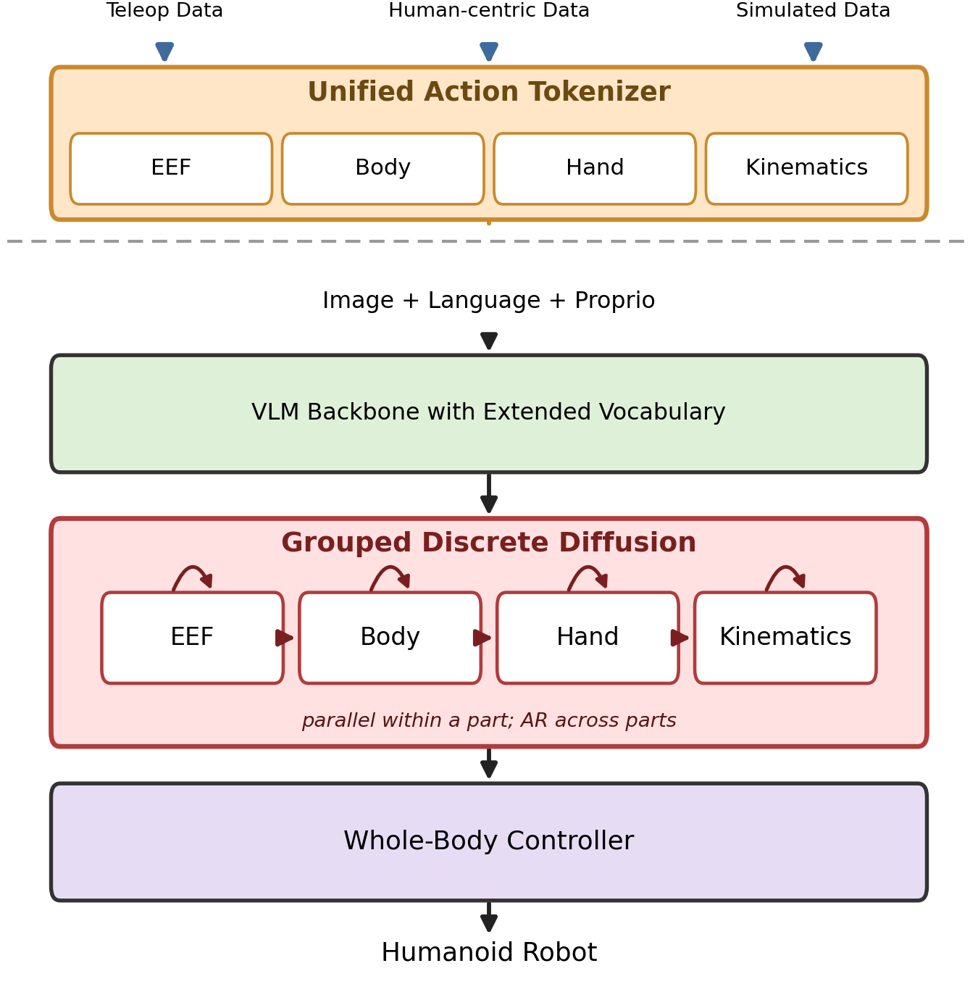
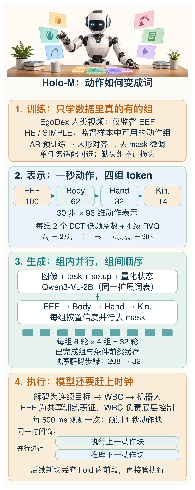
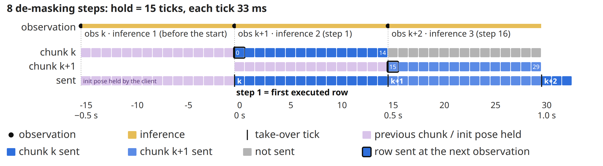
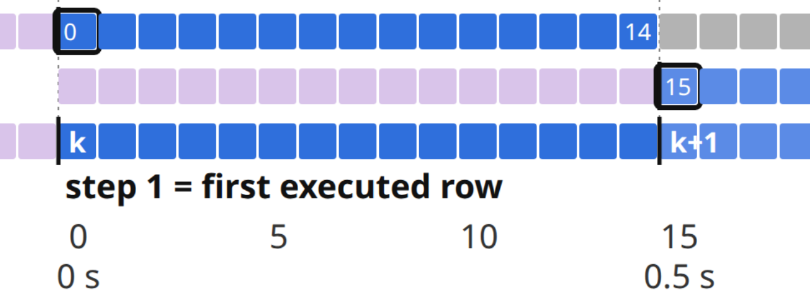

# 全身动作写成208个token，机器人就懂了吗？

设想一个人形机器人要去桌边拿杯子。手伸到了，脚却没跟上；身体再往前倾一点，抓取就变成了失衡。

对机械臂来说，动作可以是手腕位置加一个夹爪开合。换成全身，腿、腰、双臂和手指都要参与。这里多出来的，既是维度，也是彼此牵制的关系。

地平线的 Holo-M 把问题推向了一个有争议的选择：**语言模型看懂任务之后，动作还要不要交给另一个模型？**

它在挑战的，是 π0、Ψ0 等路线里的分工：视觉语言模型提供上下文，另一个连续动作专家负责生成轨迹。Holo-M 想让动作进入语言模型自己的词表，用同一个序列模型输出全身动作。作者认为，这能避开独立动作专家与语言骨干之间的知识隔离问题。<!-- evidence:C01 -->

这个愿望并不难理解。难的是下一步：你给机器人增加了一门“动作语言”，它会不会还在组织词句，杯子已经被碰倒了？

带着三个问题往下读：

1. **全身动作为什么要进入语言模型的词表？**
2. **人类视频没有机器人的腿部标签，怎么一起训练？**
3. **208个动作token，怎样赶上机器人的控制时钟？**

> **论文信息**  
> Humanoid Loco-Manipulation With Discrete VLA Model（Holo-M）  
> 作者：Wenxin Shao、Siqi Chai、Kun Li、Kerou Zhang、Xinzhou Jiang、Wei Xu、Qiang Liu；机构：Horizon Robotics（地平线）。  
> 2026 年 9 月 28 日公开，arXiv v1。  
> [论文原文](https://arxiv.org/abs/2609.35709v1) · [官方项目与演示](https://horizonrobotics.github.io/gail/Holo-M/)

## 先把“懂了”和“做了”之间的接口找出来

连续动作专家的价值很实在：它擅长输出数值轨迹。一个预训练语言模型，未必天然擅长回答“接下来手腕移动几厘米”。让两个模块各做所长，是合理的设计。

Holo-M 换了一个接口。输入图像、任务指令、机器人设置与状态之后，Qwen3-VL-2B 直接预测扩展词表里的动作 token；再把 token 解回连续目标，交给全身控制器 WBC。图里最该看的，是 VLM 到动作生成这一段，以及底部仍然存在的控制器。<!-- evidence:C02 -->

论文 Fig. 1。沿着箭头往下看：模型生成动作目标，Whole-Body Controller 负责把它变成全身控制。

所以，“全身动作为什么要进入语言模型的词表？”的答案首先是一种建模选择：**动作成为这个序列模型直接学习的输出，而非另一个连续专家的输出。**

这篇的重心落在“动作怎么写、怎么生成”。作者还想往前走一步，让模型交错输出推理文本和动作：边想边做。这会是另一个值得看的实验。<!-- evidence:C03 -->

接口接通了，只完成了第一步。接下来要解决一个更朴素的问题：人的动作和机器人的动作，究竟有没有共同的写法？

## 人类的手，能教会机器人的腿什么？

第一视角视频能提供人的手腕、指尖怎样移动。到了机器人这里，还得知道腿和躯干的关节目标。人的视频与机器人的示范，标签并不对齐。

如果要求每份数据都带着完整全身标签，大量人类操作数据就会被挡在训练集外。

Holo-M 把动作拆成四组，共 96 维。它同时记录任务空间的位姿和关节目标：同一只手，既写“去哪里”，也写“关节怎么动”。<!-- evidence:C04 -->

| 动作组 | 表示 / token数 |
| --- | --- |
| EEF | 手腕、指尖位姿 / 100 |
| Body | 身体关节目标 / 62 |
| Hand | 手部关节目标 / 32 |
| Kinematics | 底座运动指令 / 14 |

EEF 提供共享的任务空间表征，论文将它用于训练中的跨数据对齐。人的手和机器人的手都能描述成“朝什么位置、什么姿态移动”，不必先拥有同一套关节结构。

这就是“人类视频没有机器人的腿部标签，怎么一起训练？”的回答：**只对这份样本实际拥有的组计算损失。** EgoDex 的人类样本监督 EEF，另外三组留空；机器人数据提供身体、手部关节和底座运动的监督。<!-- evidence:C05 -->

于是，人类的手部轨迹有了训练入口，腿怎么配合仍由机器人数据来教。换一种本体，身体和手的关节顺序也要跟着对应。

先混合 EgoDex 与 Humanoid Everyday 做自回归预训练，再用 SIMPLE 做人形任务对齐，之后改为分组去 mask 的训练方式；若需要单任务 specialist，最后才做对应任务适配。同一骨干与词表贯穿这些阶段，视觉编码器冻结，语言骨干继续优化。<!-- evidence:C06 -->

这套办法有没有实际帮忙？论文有一组比总榜更值得看的数据。

## 我更想看的是：把数据拿掉，成绩会怎样？

Table 5 保持 Qwen3-VL 骨干与动作组顺序不变，考察 Holo-M AR 的预训练数据来源。在 SIMPLE 闭环评估中，每种设置都是六个任务、三个随机化等级、每格十次，共 180 次。<!-- evidence:C07 -->

| 预训练来源 | 成功次数 |
| --- | --- |
| 无动作预训练 | 53/180 |
| Humanoid Everyday | 119/180 |
| EgoDex + Humanoid Everyday | 138/180 |

三种设置都从预训练 VLM 开始，“无动作预训练”省去的是后续的动作数据预训练。

先加入人形机器人数据，多了 66 次成功；再加入人类 EgoDex，多了 19 次。只有手部标签的人类数据，在这里也帮上了忙。

接下来我更想看一个对照：保持数据量不变，拿掉 EEF 共享组，或者换一种 tokenizer。这样才能分清，收益有多少来自多看了人的动作，有多少来自这套共同写法。

现在，还有第三个问题没过关。数据可以慢慢收，机器人执行时却等不了。

## 208个token，不必一个个等它说完

Holo-M 处理的是一秒动作块：30 Hz 下的 30 个时间步。每组先用 DCT 保留每个维度的两个低频系数，再用四级残差向量量化 RVQ 编码剩余误差。这样得到固定长度的四组 token，总计 208 个，不包含组边界等结构 token。<!-- evidence:C08 -->

可以把它理解成：先写出轨迹的大致走势，再用残差补回被低频近似抹去的变化。

固定长度还有一个工程用途：每组的位置和边界明确，方便同时恢复被遮住的 token。

它的离散扩散是对 token 去 mask。当前组里的位置并行预测，置信度较高的位置先确定；这一组完成后，下一组再读取前面的结果。因此，**组内并行，组间仍按 EEF、Body、Hand、Kinematics 的顺序生成**。前缀和已完成组会缓存。<!-- evidence:C09 -->

本图由 [DrawPaper skill](https://github.com/Zhu-Huixiang/ReadPaper/tree/main/drawpaper) 指挥 Codex，使用内置生图制作。

每组八轮、四组共 32 次顺序解码步骤，相比逐 token 自回归的 208 次，顺序深度缩短了 6.5 倍。并行计算的每一步也有成本，实际耗时要看后面的部署数据。<!-- evidence:C10 -->

后面的组仍要等前面的组，也因此能参考已经生成的动作。EEF 排在最前面，等于先确定手要去哪里，再让身体、手部关节和底座接着生成。换个顺序，协调会更好还是更差？这是这套设计留下的一个问题。

## 快一点之后，任务到底好了多少？

先看 generalist：一个 checkpoint 在 SIMPLE 的 24 个任务上联合训练，再评估其中六个代表任务，不做逐任务适配。三种随机化等级各十次，仍是每个方法 180 次。<!-- evidence:C11 -->

| Generalist 方法 | 成功次数 |
| --- | --- |
| Ψ0 | 114/180（63.3%） |
| Holo-M AR | 138/180（76.7%） |
| Holo-M | 143/180（79.4%） |

从 AR 到分组离散扩散，多成功五次。而 AR 相比 Ψ0 已经多了 24 次成功。读到这里，我会把注意力更多放在动作表示和训练数据上；扩散解码最直接的作用，是缩短生成过程。

这张表比较的是各自的训练配置：适配数据相同，Ψ0、π0.5 微调动作头，DreamZero 用 LoRA，Holo-M 优化语言骨干，初始化模型也各有不同。训练方式本身，是读这些分数时要放在一起看的条件。<!-- evidence:C12 -->

总分还藏着一个明显的退步。XMovePick 的 Level 2，Holo-M 是 3/10，AR 是 8/10，Ψ0 是 9/10。每格十次试验里，这个差距很扎眼。我更想看失败轨迹：是手的位置偏了，身体配合慢了，还是动作在生成时丢了细节？<!-- evidence:C13 -->

如果为每个任务单独适配，specialist 的成绩是 Holo-M 163/180，Ψ0 154/180；这张表的基线取自 SIMPLE 原有报告。专门练一个任务与一个模型兼顾多个任务，回答的是两个问题。<!-- evidence:C14 -->

## 真正紧张的地方，是下一段动作接管前

“208个动作token，怎样赶上机器人的控制时钟？”还需要执行系统来回答。

实机用 G1-comp、两只 Dex3 手和头部 RealSense 相机，模型跑在单张 RTX 5090 上。每次预测一秒动作，但每 500 ms 就采一份新观测：推理下一块时，机器人继续执行上一块。<!-- evidence:C15 -->

先看原图里的两条动作块。它们覆盖的预测时间有重叠，新块会跳过等待期间的前段，从接管时刻对应的位置开始执行。

论文 Fig. 3。横轴是控制 tick；每 500 ms 更新观测，下一块动作的推理与当前块的执行交叠。

把接管的那一段放大来看：

论文 Fig. 3 局部放大。从上到下是旧块 k、新块 k+1、实际发送的动作。紫色是等待期间跳过的前段，蓝色是发出的动作；0.5 s 处，新块从第 15 步接管。

八轮去 mask 时，每个 30 步动作块的推理延迟为 **476.8 ± 16.9 ms**，固定 hold 预算为 **500 ms**。二轮、四轮的均值分别是 175.8、275.7 ms。轮数越少，越早算完，动作质量会付出多少代价？要回答这个问题，还得把各轮数的实机成功率放在延迟旁边。<!-- evidence:C16 -->

平均只剩约 23 ms 的余量。更让人在意的是等待期间：杯子滑了一点，或者身体被碰了一下，机器人还在执行上一块动作。生成速度这时就变成了一个很具体的问题：新的纠正要等多久才能接手？

论文展示了两项实机任务：各用在部署场景采集的 100 条遥操作数据做 specialist 适配，再各试十次。Tabletop Grasp 为 10/10，Move Pick 为 8/10。从这里继续往下看，我想知道的就是它被打断之后的反应。<!-- evidence:C17 -->

## 回到这三个问题，剩下哪一问最值得追？

第一个问题，动作进入词表，让同一个序列模型直接学习动作。接下来值得看的是，作者设想的“边推理边生成动作”会怎样用上这个接口。

第二个问题，样本有什么标签，就训练对应的组。人的手部轨迹因此能补充机器人的全身数据，消融里多出的 19 次成功值得继续追。

第三个问题，208 个 token 通过组内并行去 mask 缩短顺序深度，再借助动作块重叠执行赶上固定时钟。真正落地靠的是模型、控制器和调度一起配合。

我更想追问的是：**如果场景在动作块中途变了，这套“更快地生成整块动作”能否真的更快纠正？**

一个可检验的实验，是固定 checkpoint、动作块长度与控制器，只改去 mask 轮数和观测更新间隔；分别记录任务成功率、扰动后的纠偏时间与超预算次数。这样才知道，省下来的计算究竟变成了反应能力，还是只让原来的动作更快进入队列。

Holo-M 给出了一条值得继续读的路线。下一份证据，我想看它如何处理动作被现实打断的那一刻。

---

公众号版由管理员在后台手动公开发表；永久文章链接待发表后补充。

关注公众号 **具身智能的 World**：

[原论文](https://arxiv.org/abs/2609.35709v1) · [证据索引](evidence.json)
