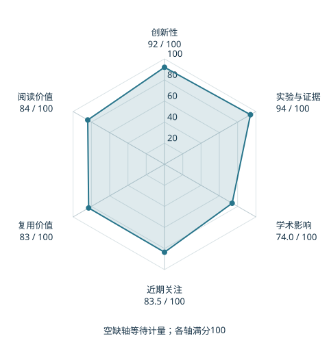

# Learning high-speed flight in the wild

本版阅读优先顺序：9；综合分：86.4 / 100；已评分权重：100%。

[原文](https://www.science.org/doi/10.1126/scirobotics.abg5810) · [PDF](https://arxiv.org/pdf/2110.05113) · [阅读卡片](../../../library/agile-flight.md)

## 机制简析

利用仿真专家监督视觉导航策略，再转移到高速野外飞行，连接感知、轨迹规划与实际反应。

带着这个问题读：高速运动中的视觉规划，怎样跨越仿真与真实环境？

初读判断：真实高速闭环有阅读价值；任务是飞行，与操作基准分别比较。

## 六维评分

| 维度 | 分数 / 100 | 权重 |
| --- | --- | --- |
| 创新性 | 92 | 25% |
| 实验与证据 | 94 | 25% |
| 学术影响 | 74.0 | 20% |
| 近期关注 | 83.5 | 10% |
| 复用价值 | 83 | 10% |
| 阅读价值 | 84 | 10% |

编辑深度：选题初读；评分记录：2026-10-09T18:35:28+08:00。

计量版本：正式刊会版本；OpenAlex题目：Learning high-speed flight in the wild。累计被引 372，2025–2026 被引 179；快照：2026-10-09T18:35:28+08:00。

[指标记录](https://api.openalex.org/works/W3202883604) · [文献计量条目](https://openalex.org/W3202883604)

[评分说明](../../methodology.md) · [返回具身榜](../../README.md) · [论文地图](../../../paper-map/README.md)
