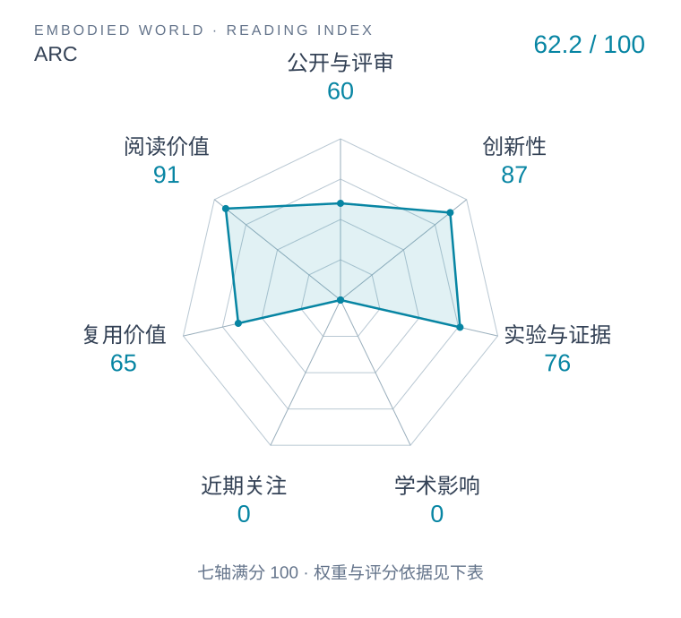

# ARC: A Reasoning Recipe for Robot Foundation Models

本版阅读优先顺序：33；综合分：56.4–86.4 / 100；已评分权重：70%。

[原文](https://arxiv.org/abs/2610.12386v1) · [PDF](https://arxiv.org/pdf/2610.12386v1) · [阅读卡片](../../../library/arc.md)

## 机制简析

给现有示范自动添“下一动作为什么合适、会造成什么”的推理轨迹，再按 VLA/WAM 架构适配推理与动作输出。

带着这个问题读：推理文字怎样成为动作条件，而不是另一段好看的解说？

初读判断：推理与控制的明确接口；初读关注自动标注质量、不同基础策略的匹配训练和零样本条件。

## 六维评分

| 维度 | 分数 / 100 | 权重 |
| --- | --- | --- |
| 创新性 | 87 | 25% |
| 实验与证据 | 76 | 25% |
| 学术影响 | 待计量 | 20% |
| 近期关注 | 待计量 | 10% |
| 复用价值 | 65 | 10% |
| 阅读价值 | 91 | 10% |

编辑深度：选题初读；评分记录：2026-10-09T18:35:28+08:00。

计量状态：等待可确认对应的记录；两项计量维度保留空白。

[评分说明](../../methodology.md) · [返回具身榜](../../README.md) · [论文地图](../../../paper-map/README.md)
