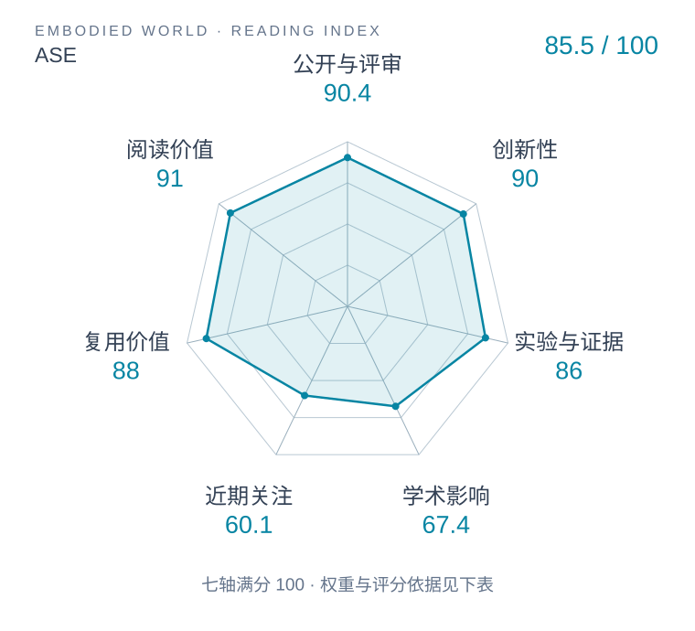

# ASE: Large-Scale Reusable Adversarial Skill Embeddings for Physically Simulated Characters

本版阅读优先顺序：26；综合分：61.9–91.9 / 100；已评分权重：70%。

[原文](https://xbpeng.github.io/projects/ASE/) · [PDF](https://xbpeng.github.io/projects/ASE/ASE_2022.pdf) · [阅读卡片](../../../library/ase.md)

## 机制简析

将潜技能条件与对抗动作先验联合训练，再让高层策略选择可复用的技能嵌入。

带着这个问题读：连续技能潜变量怎样组织可重复使用的动作？

初读判断：可复用技能接口值得与机器人动作latent比较；初读分清训练奖励和高层控制。

## 六维评分

| 维度 | 分数 / 100 | 权重 |
| --- | --- | --- |
| 创新性 | 90 | 25% |
| 实验与证据 | 86 | 25% |
| 学术影响 | 待计量 | 20% |
| 近期关注 | 待计量 | 10% |
| 复用价值 | 88 | 10% |
| 阅读价值 | 91 | 10% |

编辑深度：选题初读；评分记录：2026-10-09T18:35:28+08:00。

计量状态：等待可确认对应的记录；两项计量维度保留空白。

[评分说明](../../methodology.md) · [返回具身榜](../../README.md) · [论文地图](../../../paper-map/README.md)
