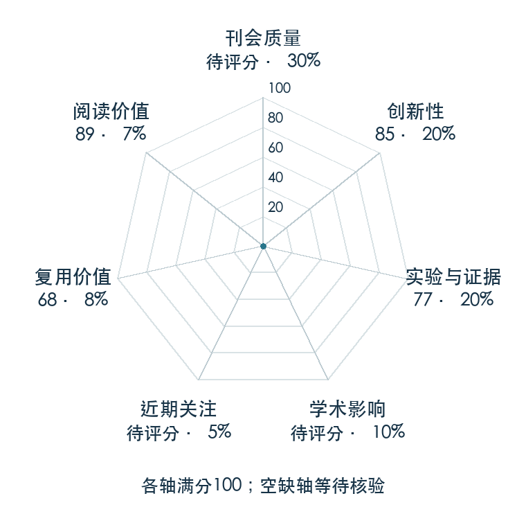

# A Balanced Data Diet: Addressing the Exploration Bottleneck in Mega-Scale RL for Robot Control

**Balanced Data Diet** · arXiv 2026 · 本版排名 114 · 综合分 **62.1 / 100**

[解读导读](../../../library/balanced-data-diet.md) · [Locomotion 与运动适应](../../../paper-map/README.md#track-locomotion) · [arXiv集锦](../../../arxiv/README.md#paper-balanced-data-diet)

[原文](https://arxiv.org/abs/2610.12465v1) · [PDF](https://arxiv.org/pdf/2610.12465v1) · [阅读卡片](../../../library/balanced-data-diet.md)

论文出处：[**Octi Zhang**](../../origins/papers/balanced-data-diet.md) [华盛顿大学 / 英伟达](../../origins/papers/balanced-data-diet.md)

## 机制简析

Success Guided Sampling 根据当前成功率把重置分布推向能力边缘，减少超简单或暂时学不会的采样，再蒸馏视觉操作策略转实机。

带着这个问题读：并行环境堆到很大以后，为什么探索还会卡住？

初读判断：华盛顿大学/英伟达署名；跨地形和接触操作的明确探索问题，需核对采样公平性和训练预算。

## 七维评分

<picture>
  <source media="(prefers-color-scheme: dark)" srcset="radar-dark.gif">
  
</picture>

[透明静态图](radar.svg) · [深色静态图](radar-dark.svg)

| 维度 | 分数 / 100 | 权重 |
| --- | --- | --- |
| 公开与评审 | 60 | 30% |
| 创新性 | 85 | 20% |
| 实验与证据 | 77 | 20% |
| 学术影响 | 0 | 10% |
| 近期关注 | 0 | 5% |
| 复用价值 | 68 | 8% |
| 阅读价值 | 89 | 7% |

公开与评审依据：完整论文已公开，作者、日期与版本/固定论文身份可追溯，公开材料阶段计60。；当前阶段为预印本公开。

编辑深度：选题初读；评分记录：2026-10-10。

计量来源：Semantic Scholar；原研究arXiv ID索引记录（版本合并）；匹配题目：A Balanced Data Diet: Addressing the Exploration Bottleneck in Mega-Scale RL for Robot Control。累计被引 **0**，2025–2026 被引 **0**；快照：2026-10-10。

[指标记录](https://api.semanticscholar.org/graph/v1/paper/ARXIV:2610.12465) · [文献计量条目](https://www.semanticscholar.org/paper/eabed5e5fcc76cab14dc0afc5254a005f710622a)

### 影响与关注的计算依据

- **学术影响 0**：本次已定位的独立采用/讨论证据处于量表起点；引用与专属仓库关注另算，取最高已核信号。 [依据1](https://arxiv.org/abs/2610.12465v1) · [依据2](https://github.com/Zhu-Huixiang/embodied-world/blob/main/leaderboard/selection-2026-10-10.md)
- **近期关注 0**：本次已定位的独立采用/讨论证据处于量表起点；引用与专属仓库关注另算，取最高已核信号。 [依据1](https://arxiv.org/abs/2610.12465v1) · [依据2](https://github.com/Zhu-Huixiang/embodied-world/blob/main/leaderboard/selection-2026-10-10.md)

零分表示本次快照已定位的信号处在量表起点；创新和实验两轴分别评价方法。

[其他计量来源快照](../../metrics.json)分别保留，不相加；本版按登记的身份匹配顺序选源。

### 论文公开入口与传播快照

| 平台 / 入口 | 公开计量 | 统计范围 | 快照 |
| --- | --- | --- | --- |

[传播数据与采用依据](../../social-signals.json)保留归属、统计窗口与计分信号。
[评分说明](../../methodology.md) · [返回具身榜](../../README.md) · [论文地图](../../../paper-map/README.md)
