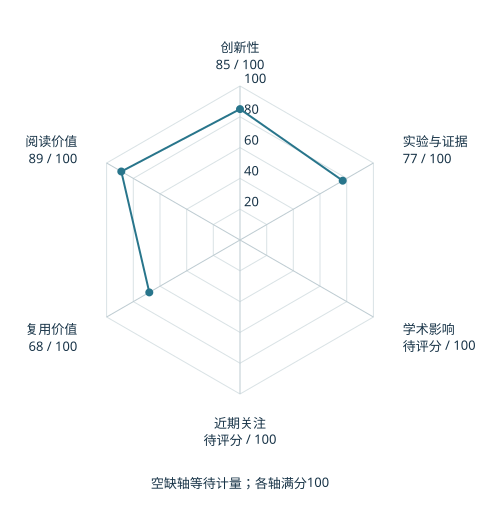

# A Balanced Data Diet: Addressing the Exploration Bottleneck in Mega-Scale RL for Robot Control

本版阅读优先顺序：35；综合分：56.2–86.2 / 100；已评分权重：70%。

[原文](https://arxiv.org/abs/2610.12465v1) · [PDF](https://arxiv.org/pdf/2610.12465v1) · [阅读卡片](../../../library/balanced-data-diet.md)

## 机制简析

Success Guided Sampling 根据当前成功率把重置分布推向能力边缘，减少超简单或暂时学不会的采样，再蒸馏视觉操作策略转实机。

带着这个问题读：并行环境堆到很大以后，为什么探索还会卡住？

初读判断：华盛顿大学/英伟达署名；跨地形和接触操作的明确探索问题，需核对采样公平性和训练预算。

## 六维评分

| 维度 | 分数 / 100 | 权重 |
| --- | --- | --- |
| 创新性 | 85 | 25% |
| 实验与证据 | 77 | 25% |
| 学术影响 | 待计量 | 20% |
| 近期关注 | 待计量 | 10% |
| 复用价值 | 68 | 10% |
| 阅读价值 | 89 | 10% |

编辑深度：选题初读；评分记录：2026-10-09T18:35:28+08:00。

计量状态：等待可确认对应的记录；两项计量维度保留空白。

[评分说明](../../methodology.md) · [返回具身榜](../../README.md) · [论文地图](../../../paper-map/README.md)
