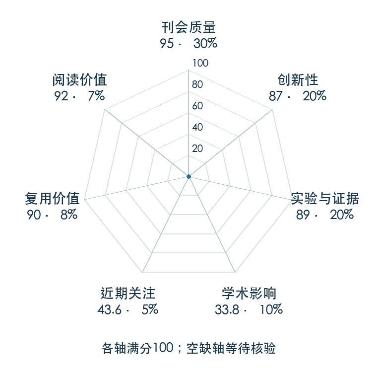

# Cal-QL: Calibrated Offline RL Pre-Training for Efficient Online Fine-Tuning

**Cal-QL** · NeurIPS 2023 · 本版排名 86 · 综合分 **82.1 / 100**

[解读导读](../../../library/cal-ql.md) · [强化学习与离线决策](../../../paper-map/README.md#track-reinforcement-learning) · [NeurIPS集锦](../../../venues/NeurIPS/README.md)

[原文](https://proceedings.neurips.cc/paper_files/paper/2023/hash/c44a04289beaf0a7d968a94066a1d696-Abstract-Conference.html) · [PDF](https://proceedings.neurips.cc/paper_files/paper/2023/file/c44a04289beaf0a7d968a94066a1d696-Paper-Conference.pdf) · [阅读卡片](../../../library/cal-ql.md)

论文出处：[**Mitsuhiko Nakamoto / Yuexiang Zhai**](../../origins/papers/cal-ql.md) [加州大学伯克利分校 / 斯坦福大学](../../origins/papers/cal-ql.md)

## 机制简析

Cal-QL 保留 CQL 的保守价值学习，同时把学习策略的价值锚定在一个可估计参考策略的价值之上。这样在线新数据进入时，低估的旧 Q 不至于诱导策略先丢掉离线技能。原文分别分析初期遗忘、价值尺度变化，并在导航、操作和图像输入微调任务上比较。

带着这个问题读：离线训练把 Q 压得太低，为什么一上真环境反而会先忘掉已有技能？

初读判断：先诊断再设计算法，含多个离线到在线域、理论条件、基线和校准消融，适合作为机器人预训练后的 RL 入门。

## 七维评分

<picture>
  <source media="(prefers-color-scheme: dark)" srcset="radar-dark.gif">
  
</picture>

[透明静态图](radar.svg) · [深色静态图](radar-dark.svg)

| 维度 | 分数 / 100 | 权重 |
| --- | --- | --- |
| 公开与评审 | 95.0 | 30% |
| 创新性 | 87 | 20% |
| 实验与证据 | 89 | 20% |
| 学术影响 | 33.8 | 10% |
| 近期关注 | 28.2 | 5% |
| 复用价值 | 90 | 8% |
| 阅读价值 | 92 | 7% |

刊会依据：[NeurIPS 2023](../../../venues/NeurIPS/README.md)，正式出处见[出版/原文记录](https://proceedings.neurips.cc/paper_files/paper/2023/hash/c44a04289beaf0a7d968a94066a1d696-Abstract-Conference.html)；采用2026-10-10刊会快照。

公开与评审依据：完整论文已公开，作者、日期与版本/固定论文身份可追溯，公开材料阶段计60。；正式刊会按登记量表计分，取较高阶段。

编辑深度：原文摘要/方法与实验初读；评分记录：2026-10-10。

计量来源：OpenAlex；正式刊会版本；匹配题目：Cal-QL: Calibrated Offline RL Pre-Training for Efficient Online Fine-Tuning。累计被引 **14**，2025–2026 被引 **14**；快照：2026-10-10T09:51:57+08:00。

[指标记录](https://api.openalex.org/works/W7133245541) · [文献计量条目](https://openalex.org/W7133245541)

### 影响与关注的计算依据

- **学术影响 33.8**：身份匹配的累计引用C=14，对数压缩上限3000。 [依据1](https://api.openalex.org/works/W7133245541)
- **近期关注 28.2**：近期已定位引用R=14；数量与每月引用速度各占一半，有效观察期21.2567个月。 [依据1](https://api.openalex.org/works/W7133245541)

### 论文公开入口与传播快照

| 平台 / 入口 | 公开计量 | 统计范围 | 快照 |
| --- | --- | --- | --- |
| [github](https://github.com/nakamotoo/Cal-QL) | GitHub Star 124；GitHub Watch订阅 3；GitHub Fork 8 | 单篇论文仓库；截至2026-10-10的累计快照 | 2026-10-10 |

[传播数据与采用依据](../../social-signals.json)保留归属、统计窗口与计分信号。
[评分说明](../../methodology.md) · [返回具身榜](../../README.md) · [论文地图](../../../paper-map/README.md)
