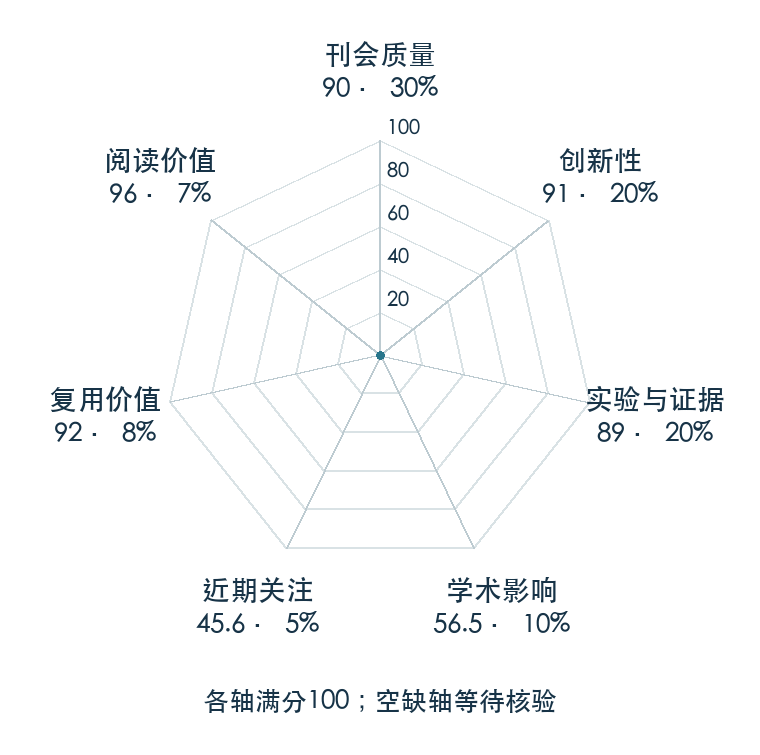

# CLIPort: What and Where Pathways for Robotic Manipulation

**CLIPort** · CoRL 2021 · 本版排名 68 · 综合分 **84.2 / 100**

[解读导读](../../../library/cliport.md) · [操作与动作块](../../../paper-map/README.md#track-manipulation) · [CoRL集锦](../../../venues/CoRL/README.md)

[原文](https://proceedings.mlr.press/v164/shridhar22a.html) · [PDF](https://proceedings.mlr.press/v164/shridhar22a/shridhar22a.pdf) · [阅读卡片](../../../library/cliport.md)

论文出处：[Mohit Shridhar · University of Washington Robotics and State Estimation Lab（RSE） / University of Washington 等3个出处](../../origins/papers/cliport.md)

## 机制简析

语义支路用 CLIP 提取 RGB 与指令概念，空间支路从 RGB-D 学习保持位置结构的特征；两路信息进入 Transporter 的拾取与放置预测。拾取位置先决定裁出哪块特征，再用互相关找到合适的放置区域。原文在多任务仿真和真实桌面上检验新物体、语义概念与少量示范。

带着这个问题读：CLIP 知道是什么，但不知道手该落在哪里；语义和几何怎样配合？

初读判断：PMLR 正式版与作者项目提供双流结构、语义泛化以及真实多任务评估，公开代码支持复用；主题冲突具体且容易讲清。

## 七维评分

<picture>
  <source media="(prefers-color-scheme: dark)" srcset="radar-dark.gif">
  
</picture>

[透明静态图](radar.svg) · [深色静态图](radar-dark.svg)

| 维度 | 分数 / 100 | 权重 |
| --- | --- | --- |
| 公开与评审 | 90.0 | 30% |
| 创新性 | 91 | 20% |
| 实验与证据 | 89 | 20% |
| 学术影响 | 56.5 | 10% |
| 近期关注 | 30.0 | 5% |
| 复用价值 | 92 | 8% |
| 阅读价值 | 96 | 7% |

刊会依据：[CoRL 2021](../../../venues/CoRL/README.md)，正式出处见[出版/原文记录](https://proceedings.mlr.press/v164/shridhar22a.html)；采用2026-10-10刊会快照。

公开与评审依据：完整论文已公开，作者、日期与版本/固定论文身份可追溯，公开材料阶段计60。；正式刊会按登记量表计分，取较高阶段。

编辑深度：原文摘要/方法与实验初读；评分记录：2026-10-10。

计量来源：OpenAlex；作者预印本/原研究索引记录；匹配题目：CLIPort: What and Where Pathways for Robotic Manipulation。累计被引 **91**，2025–2026 被引 **16**；快照：2026-10-10T09:50:37+08:00。

[指标记录](https://api.openalex.org/works/W3203511201) · [文献计量条目](https://openalex.org/W3203511201)

### 影响与关注的计算依据

- **学术影响 56.5**：身份匹配的累计引用C=91，对数压缩上限3000。 [依据1](https://api.openalex.org/works/W3203511201)
- **近期关注 30.0**：近期已定位引用R=16；数量与每月引用速度各占一半，有效观察期21.2567个月。 [依据1](https://api.openalex.org/works/W3203511201)

### 论文公开入口与传播快照

| 平台 / 入口 | 公开计量 | 统计范围 | 快照 |
| --- | --- | --- | --- |
| [github](https://github.com/cliport/cliport) | GitHub Star 548；GitHub Watch订阅 6；GitHub Fork 97 | 单篇论文仓库；截至2026-10-10的累计快照 | 2026-10-10 |
| [huggingface](https://huggingface.co/papers/2109.12098) | HF 论文累计点赞 0 | 按精确arXiv ID核对的单篇论文页；截至2026-10-10的累计快照 | 2026-10-10 |

[传播数据与采用依据](../../social-signals.json)保留归属、统计窗口与计分信号。
[评分说明](../../methodology.md) · [返回具身榜](../../README.md) · [论文地图](../../../paper-map/README.md)
