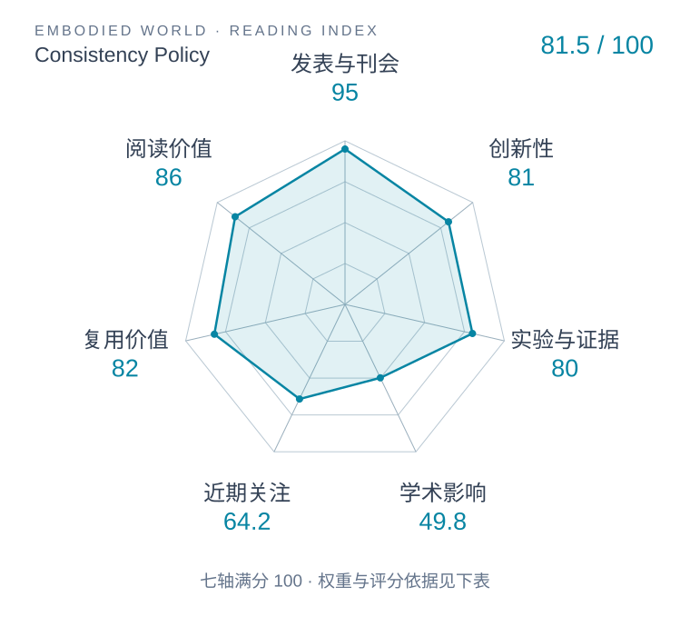

# Consistency Policy: Accelerated Visuomotor Policies via Consistency Distillation

本版阅读优先顺序：21；综合分：73.4 / 100；已评分权重：100%。

[原文](https://www.roboticsproceedings.org/rss20/p071.html) · [PDF](https://www.roboticsproceedings.org/rss20/p071.pdf) · [阅读卡片](../../../library/consistency-policy.md)

## 机制简析

将多步扩散动作策略蒸馏为较少步的一致性策略，以减少推理步骤保留动作分布。

带着这个问题读：蒸馏怎样减少去噪步骤，保留怎样的动作分布？

初读判断：速度/成功率取舍明确；作为控制时钟的对照非常合适。

## 六维评分

| 维度 | 分数 / 100 | 权重 |
| --- | --- | --- |
| 创新性 | 81 | 25% |
| 实验与证据 | 80 | 25% |
| 学术影响 | 49.8 | 20% |
| 近期关注 | 64.2 | 10% |
| 复用价值 | 82 | 10% |
| 阅读价值 | 86 | 10% |

编辑深度：选题初读；评分记录：2026-10-09T18:35:28+08:00。

计量版本：正式刊会版本；OpenAlex题目：Consistency Policy: Accelerated Visuomotor Policies via Consistency Distillation。累计被引 53，2025–2026 被引 53；快照：2026-10-09T18:35:28+08:00。

[指标记录](https://api.openalex.org/works/W4402354007) · [文献计量条目](https://openalex.org/W4402354007)

[评分说明](../../methodology.md) · [返回具身榜](../../README.md) · [论文地图](../../../paper-map/README.md)
