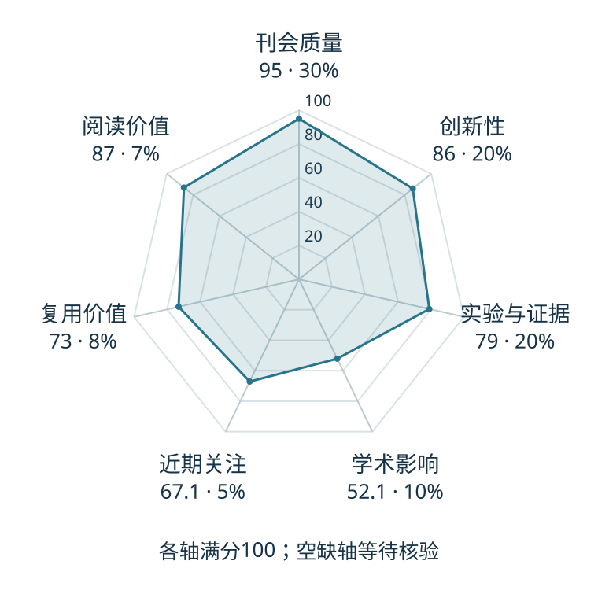

# CoT-VLA: Visual Chain-of-Thought Reasoning for Vision-Language-Action Models

本版阅读优先顺序：19；综合分：74.4 / 100；已评分权重：100%。

[原文](https://openaccess.thecvf.com/content/CVPR2025/html/Zhao_CoT-VLA_Visual_Chain-of-Thought_Reasoning_for_Vision-Language-Action_Models_CVPR_2025_paper.html) · [PDF](https://openaccess.thecvf.com/content/CVPR2025/papers/Zhao_CoT-VLA_Visual_Chain-of-Thought_Reasoning_for_Vision-Language-Action_Models_CVPR_2025_paper.pdf) · [阅读卡片](../../../library/cot-vla.md)

## 机制简析

先预测具有任务意图的未来视觉子目标，再以它为条件生成动作，把视觉推理接入控制。

带着这个问题读：预测未来图像作为目标，怎样帮助随后的一小段动作？

初读判断：未来图像作为中间目标的机制值得看；初读应追图像预测与动作性能的消融。

## 六维评分

| 维度 | 分数 / 100 | 权重 |
| --- | --- | --- |
| 创新性 | 86 | 25% |
| 实验与证据 | 79 | 25% |
| 学术影响 | 52.1 | 20% |
| 近期关注 | 67.1 | 10% |
| 复用价值 | 73 | 10% |
| 阅读价值 | 87 | 10% |

编辑深度：选题初读；评分记录：2026-10-09T18:35:28+08:00。

计量版本：正式刊会版本；OpenAlex题目：CoT-VLA: Visual Chain-of-Thought Reasoning for Vision-Language-Action Models。累计被引 64，2025–2026 被引 64；快照：2026-10-09T18:35:28+08:00。

[指标记录](https://api.openalex.org/works/W4413156213) · [文献计量条目](https://openalex.org/W4413156213)

[评分说明](../../methodology.md) · [返回具身榜](../../README.md) · [论文地图](../../../paper-map/README.md)
