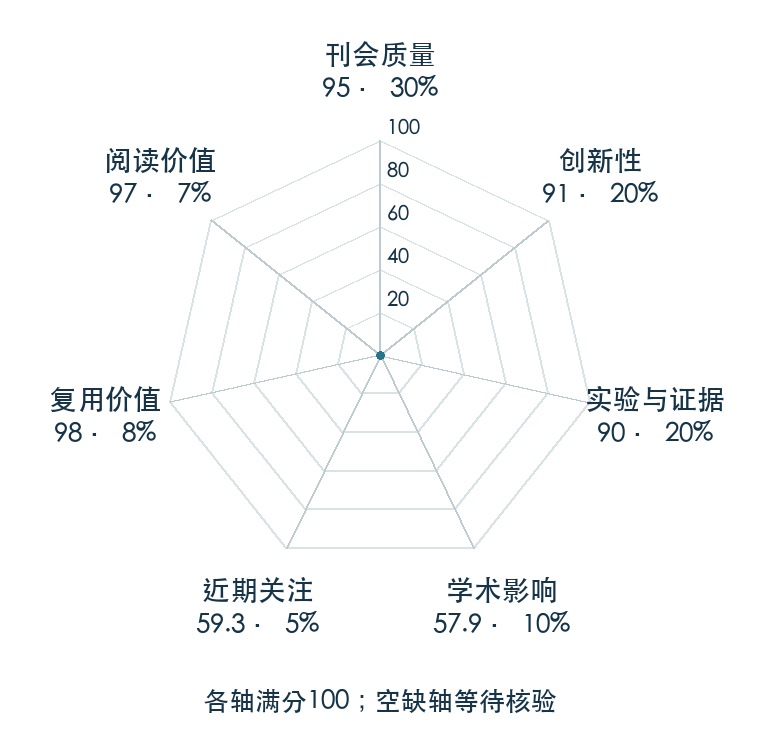

# Denoising Diffusion Implicit Models

**DDIM** · ICLR 2021 · 本版排名 40 · 综合分 **87.3 / 100**

[解读导读](../../../library/ddim.md) · [Diffusion / Transformer 基础](../../../paper-map/README.md#track-diffusion-transformer) · [ICLR集锦](../../../venues/ICLR/README.md)

[原文](https://iclr.cc/virtual/2021/poster/2804) · [PDF](https://openreview.net/pdf?id=St1giarCHLP) · [阅读卡片](../../../library/ddim.md)

论文出处：[Jiaming Song · Stanford University](../../origins/papers/ddim.md)

## 机制简析

构造共享相同加噪边缘分布的非马尔可夫过程，使训练仍然使用 DDPM 的噪声预测目标。推理则选择子时间序列和相应更新规则，确定性情形可以少步从噪声映射到数据。原文比较不同步数的生成速度、质量、插值和重建，揭示采样器改动无需等同于重新训练模型。

带着这个问题读：去噪训练目标不变，为什么推理时能跳步，延迟与样本质量该怎样交换？

初读判断：采样与训练的解耦具有明确算法价值，速度质量曲线和重建实验具体，公开实现很适合具身推理教程。

## 七维评分

<picture>
  <source media="(prefers-color-scheme: dark)" srcset="radar-dark.gif">
  
</picture>

[透明静态图](radar.svg) · [深色静态图](radar-dark.svg)

| 维度 | 分数 / 100 | 权重 |
| --- | --- | --- |
| 公开与评审 | 95.0 | 30% |
| 创新性 | 91 | 20% |
| 实验与证据 | 90 | 20% |
| 学术影响 | 57.9 | 10% |
| 近期关注 | 42.9 | 5% |
| 复用价值 | 98 | 8% |
| 阅读价值 | 97 | 7% |

刊会依据：[ICLR 2021](../../../venues/ICLR/README.md)，正式出处见[出版/原文记录](https://iclr.cc/virtual/2021/poster/2804)；采用2026-10-10刊会快照。

公开与评审依据：完整论文已公开，作者、日期与版本/固定论文身份可追溯，公开材料阶段计60。；正式刊会按登记量表计分，取较高阶段。

编辑深度：原文摘要/方法与实验初读；评分记录：2026-10-10。

计量来源：OpenAlex；作者预印本/原研究索引记录；匹配题目：Denoising Diffusion Implicit Models。累计被引 **102**，2025–2026 被引 **39**；快照：2026-10-10T09:50:37+08:00。

[指标记录](https://api.openalex.org/works/W3092442149) · [文献计量条目](https://openalex.org/W3092442149)

### 影响与关注的计算依据

- **学术影响 57.9**：身份匹配的累计引用C=102，对数压缩上限3000。 [依据1](https://api.openalex.org/works/W3092442149)
- **近期关注 42.9**：近期已定位引用R=39；数量与每月引用速度各占一半，有效观察期21.2567个月。 [依据1](https://api.openalex.org/works/W3092442149)

### 论文公开入口与传播快照

| 平台 / 入口 | 公开计量 | 统计范围 | 快照 |
| --- | --- | --- | --- |
| [github](https://github.com/ermongroup/ddim) | GitHub Star 1850；GitHub Watch订阅 9；GitHub Fork 228 | 单篇论文仓库；截至2026-10-10的累计快照 | 2026-10-10 |
| [huggingface](https://huggingface.co/papers/2010.02502) | HF 论文累计点赞 4 | 按精确arXiv ID核对的单篇论文页；截至2026-10-10的累计快照 | 2026-10-10 |

[传播数据与采用依据](../../social-signals.json)保留归属、统计窗口与计分信号。
[评分说明](../../methodology.md) · [返回具身榜](../../README.md) · [论文地图](../../../paper-map/README.md)
