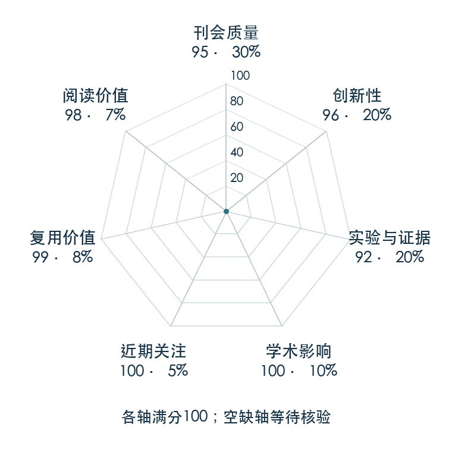

# Denoising Diffusion Probabilistic Models

**DDPM** · NeurIPS 2020 · 本版排名 2 · 综合分 **95.9 / 100**

[解读导读](../../../library/ddpm.md) · [Diffusion / Transformer 基础](../../../paper-map/README.md#track-diffusion-transformer) · [NeurIPS集锦](../../../venues/NeurIPS/README.md)

[原文](https://proceedings.neurips.cc/paper/2020/hash/4c5bcfec8584af0d967f1ab10179ca4b-Abstract.html) · [PDF](https://proceedings.neurips.cc/paper/2020/file/4c5bcfec8584af0d967f1ab10179ca4b-Paper.pdf) · [阅读卡片](../../../library/ddpm.md)

## 机制简析

正向过程逐步给数据加高斯噪声，训练时随机抽噪声时刻，让网络预测混入的噪声。反向生成从纯噪声开始，多步使用网络估计均值并采样，得到图像或换成动作序列后的条件样本。原文给出变分目标与简化去噪目标的联系，在 CIFAR-10 和 LSUN 评估图像生成质量。

带着这个问题读：加噪声再预测噪声的训练目标，怎样变成一段机器人动作的采样算法？

初读判断：概率建模与易训练目标的连接清楚，生成基准与目标消融可读，官方代码公开；其动作建模继承关系直接。

## 七维评分

<picture>
  <source media="(prefers-color-scheme: dark)" srcset="radar-dark.gif">
  
</picture>

[透明静态图](radar.svg) · [深色静态图](radar-dark.svg)

| 维度 | 分数 / 100 | 权重 |
| --- | --- | --- |
| 发表与刊会 | 95.0 | 30% |
| 创新性 | 96 | 20% |
| 实验与证据 | 92 | 20% |
| 学术影响 | 100 | 10% |
| 近期关注 | 100 | 5% |
| 复用价值 | 99 | 8% |
| 阅读价值 | 98 | 7% |

刊会依据：[NeurIPS 2020](../../../venues/NeurIPS/README.md)，正式出处见[出版/原文记录](https://proceedings.neurips.cc/paper/2020/hash/4c5bcfec8584af0d967f1ab10179ca4b-Abstract.html)；采用2026-10-10刊会快照。

编辑深度：原文摘要/方法与实验初读；评分记录：2026-10-10。

计量版本：作者预印本/原研究索引记录；OpenAlex题目：Denoising Diffusion Probabilistic Models。累计被引 5512，2025–2026 被引 1716；快照：2026-10-10T09:50:37+08:00。

[指标记录](https://api.openalex.org/works/W3036167779) · [文献计量条目](https://openalex.org/W3036167779)

[评分说明](../../methodology.md) · [返回具身榜](../../README.md) · [论文地图](../../../paper-map/README.md)
