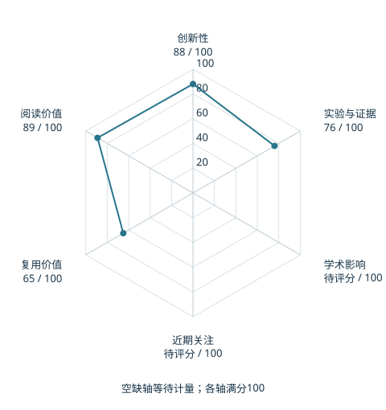

# Dex-One2Many: Learning Dexterous Manipulation from a Single Human Demonstration

本版阅读优先顺序：34；综合分：56.4–86.4 / 100；已评分权重：70%。

[原文](https://arxiv.org/abs/2610.12470v1) · [PDF](https://arxiv.org/pdf/2610.12470v1) · [阅读卡片](../../../library/dex-one2many.md)

## 机制简析

把单视频压成顺序场景关系图，以图约束重置状态、阶段奖励，指导 RL 搜索更广的抓取与物体配置。

带着这个问题读：场景图怎样同时提供探索引导与不锁死姿态的泛化？

初读判断：单视频灵巧操作；摘要给出五项任务、对照与实机转移；优先检查重置采样和奖励消融。

## 六维评分

| 维度 | 分数 / 100 | 权重 |
| --- | --- | --- |
| 创新性 | 88 | 25% |
| 实验与证据 | 76 | 25% |
| 学术影响 | 待计量 | 20% |
| 近期关注 | 待计量 | 10% |
| 复用价值 | 65 | 10% |
| 阅读价值 | 89 | 10% |

编辑深度：选题初读；评分记录：2026-10-09T18:35:28+08:00。

计量状态：等待可确认对应的记录；两项计量维度保留空白。

[评分说明](../../methodology.md) · [返回具身榜](../../README.md) · [论文地图](../../../paper-map/README.md)
