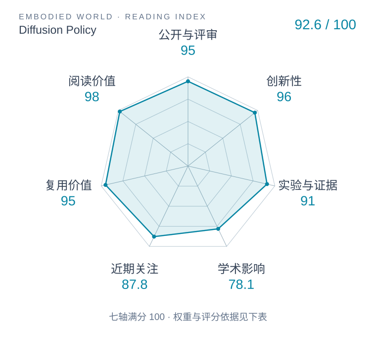

# Diffusion Policy: Visuomotor Policy Learning via Action Diffusion

本版阅读优先顺序：2；综合分：91.3 / 100；已评分权重：100%。

[原文](https://www.roboticsproceedings.org/rss19/p026.html) · [PDF](https://www.roboticsproceedings.org/rss19/p026.pdf) · [阅读卡片](../../../library/diffusion-policy.md)

## 机制简析

对多步动作条件去噪，用视觉观测约束动作分布，滚动执行一段后再次观测与重规划。

带着这个问题读：为什么要对一段动作分布去噪，再滚动执行？

初读判断：动作分布与闭环执行的清楚范式；丰富任务对照和可复用代码是阅读优势。

## 六维评分

| 维度 | 分数 / 100 | 权重 |
| --- | --- | --- |
| 创新性 | 96 | 25% |
| 实验与证据 | 91 | 25% |
| 学术影响 | 78.1 | 20% |
| 近期关注 | 96.6 | 10% |
| 复用价值 | 95 | 10% |
| 阅读价值 | 98 | 10% |

编辑深度：选题初读；评分记录：2026-10-09T18:35:28+08:00。

计量版本：正式刊会版本；OpenAlex题目：Diffusion Policy: Visuomotor Policy Learning via Action Diffusion。累计被引 517，2025–2026 被引 405；快照：2026-10-09T18:35:28+08:00。

[指标记录](https://api.openalex.org/works/W4385403811) · [文献计量条目](https://openalex.org/W4385403811)

[评分说明](../../methodology.md) · [返回具身榜](../../README.md) · [论文地图](../../../paper-map/README.md)
