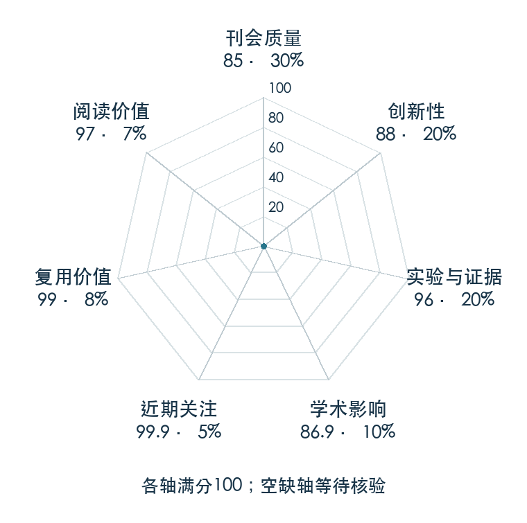

# DINOv2: Learning Robust Visual Features without Supervision

**DINOv2** · TMLR 2024 · 本版排名 19 · 综合分 **90.7 / 100**

[解读导读](../../../library/dinov2.md) · [具身感知与场景表示](../../../paper-map/README.md#track-embodied-perception) · [TMLR集锦](../../../venues/TMLR/README.md)

[原文](https://openreview.net/forum?id=a68SUt6zFt) · [PDF](https://openreview.net/pdf?id=a68SUt6zFt) · [阅读卡片](../../../library/dinov2.md)

论文出处：[**Maxime Oquab / Timothée Darcet 等3位**](../../origins/papers/dinov2.md) [Meta FAIR 研究院 / 法国 Inria 研究所 · 另2个机构](../../origins/papers/dinov2.md)

## 机制简析

在大规模筛选图像上扩展图像级与 patch 级自监督学习，再把大 ViT 教师蒸馏为不同尺寸的编码器。下游可以冻结 backbone，用轻量预测头读取分类、分割或深度相关信息。原文比较多种图像与像素任务；OpenVLA 的视觉输入实际将 DINOv2 特征与 SigLIP 特征拼接后映射给语言模型。

带着这个问题读：机器人视觉编码器冻结以后，哪些几何和语义信息还能留在 patch 特征里？

初读判断：广泛冻结特征评估、数据与规模设计及开放权重形成很强复用价值；与机器人策略的连接由 OpenVLA 原文确认。

## 七维评分

<picture>
  <source media="(prefers-color-scheme: dark)" srcset="radar-dark.gif">
  
</picture>

[透明静态图](radar.svg) · [深色静态图](radar-dark.svg)

| 维度 | 分数 / 100 | 权重 |
| --- | --- | --- |
| 公开与评审 | 85.0 | 30% |
| 创新性 | 88 | 20% |
| 实验与证据 | 96 | 20% |
| 学术影响 | 86.9 | 10% |
| 近期关注 | 100 | 5% |
| 复用价值 | 99 | 8% |
| 阅读价值 | 97 | 7% |

刊会依据：[TMLR 2024](../../../venues/TMLR/README.md)，正式出处见[出版/原文记录](https://openreview.net/forum?id=a68SUt6zFt)；采用2026-10-10刊会快照。

公开与评审依据：完整论文已公开，作者、日期与版本/固定论文身份可追溯，公开材料阶段计60。；正式刊会按登记量表计分，取较高阶段。

编辑深度：原文摘要/方法与实验初读；评分记录：2026-10-10。

计量来源：OpenAlex；作者预印本/原研究索引记录；匹配题目：DINOv2: Learning Robust Visual Features without Supervision。累计被引 **1054**，2025–2026 被引 **496**；快照：2026-10-10T09:50:37+08:00。

[指标记录](https://api.openalex.org/works/W4366208220) · [文献计量条目](https://openalex.org/W4366208220)

### 影响与关注的计算依据

- **学术影响 86.9**：身份匹配的累计引用C=1054，对数压缩上限3000。 [依据1](https://api.openalex.org/works/W4366208220)
- **近期关注 100**：huggingface 的论文专属入口：HF 最近30天下载=2947912；按100000上限对数压缩。 [依据1](https://huggingface.co/api/models/facebook/dinov2-base) · [依据2](https://huggingface.co/facebook/dinov2-base/raw/main/README.md) · [依据3](https://huggingface.co/facebook/dinov2-base)

### 论文公开入口与传播快照

| 平台 / 入口 | 公开计量 | 统计范围 | 快照 |
| --- | --- | --- | --- |
| [github](https://github.com/facebookresearch/dinov2) | GitHub Star 13403；GitHub Watch订阅 104；GitHub Fork 1276 | 多论文/多模型共享仓库；截至2026-10-10的累计快照 | 2026-10-10 |
| [huggingface](https://huggingface.co/facebook/dinov2-base) | HF 最近30天下载 2947912；HF 仓库累计点赞 204 | 单篇原研究权重的HF转换版，按此仓库统计；2026-09-11 至 2026-10-10（API最近30天；含首尾的日期标签，实际滚动边界未公开） / 截至2026-10-10的累计快照 | 2026-10-10 |
| [huggingface](https://huggingface.co/papers/2304.07193) | HF 论文累计点赞 11 | 按精确arXiv ID核对的单篇论文页；截至2026-10-10的累计快照 | 2026-10-10 |

[传播数据与采用依据](../../social-signals.json)保留归属、统计窗口与计分信号。
[评分说明](../../methodology.md) · [返回具身榜](../../README.md) · [论文地图](../../../paper-map/README.md)
