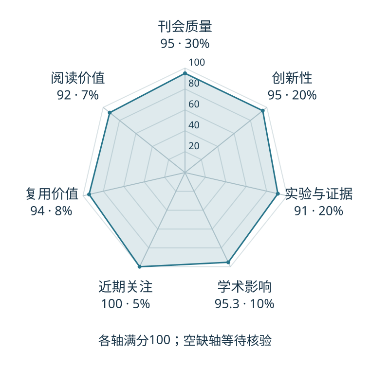

# Scalable Diffusion Models with Transformers

本版阅读优先顺序：1；综合分：94.2 / 100；已评分权重：100%。

[原文](https://openaccess.thecvf.com/content/ICCV2023/html/Peebles_Scalable_Diffusion_Models_with_Transformers_ICCV_2023_paper.html) · [PDF](https://openaccess.thecvf.com/content/ICCV2023/papers/Peebles_Scalable_Diffusion_Models_with_Transformers_ICCV_2023_paper.pdf) · [阅读卡片](../../../library/dit.md)

## 机制简析

在图像潜表示的patch序列上用Transformer做扩散去噪，考察计算规模和条件注入。

带着这个问题读：Transformer 怎样在潜空间去噪，条件又怎样进入各层？

初读判断：生成架构影响力和实现复用突出；作为视频/动作模型前置，保留图像任务范围。

## 六维评分

| 维度 | 分数 / 100 | 权重 |
| --- | --- | --- |
| 创新性 | 95 | 25% |
| 实验与证据 | 91 | 25% |
| 学术影响 | 95.3 | 20% |
| 近期关注 | 100 | 10% |
| 复用价值 | 94 | 10% |
| 阅读价值 | 92 | 10% |

编辑深度：选题初读；评分记录：2026-10-09T18:35:28+08:00。

计量版本：正式刊会版本；OpenAlex题目：Scalable Diffusion Models with Transformers。累计被引 2065，2025–2026 被引 1742；快照：2026-10-09T18:35:28+08:00。

[指标记录](https://api.openalex.org/works/W4390872297) · [文献计量条目](https://openalex.org/W4390872297)

[评分说明](../../methodology.md) · [返回具身榜](../../README.md) · [论文地图](../../../paper-map/README.md)
