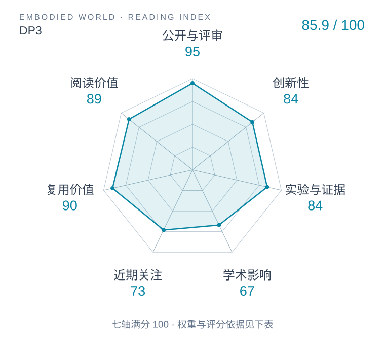

# 3D Diffusion Policy: Generalizable Visuomotor Policy Learning via Simple 3D Representations

本版阅读优先顺序：11；综合分：81.9 / 100；已评分权重：100%。

[原文](https://www.roboticsproceedings.org/rss20/p067.html) · [PDF](https://www.roboticsproceedings.org/rss20/p067.pdf) · [阅读卡片](../../../library/dp3.md)

## 机制简析

以简洁点云编码器提供三维条件，用扩散生成动作，观察几何表示对泛化的影响。

带着这个问题读：简洁点云表示怎样改变操作策略的泛化？

初读判断：三维条件表示与动作生成分工容易拆；任务、点云处理与泛化协议需一起读。

## 六维评分

| 维度 | 分数 / 100 | 权重 |
| --- | --- | --- |
| 创新性 | 84 | 25% |
| 实验与证据 | 84 | 25% |
| 学术影响 | 67.0 | 20% |
| 近期关注 | 85.7 | 10% |
| 复用价值 | 90 | 10% |
| 阅读价值 | 89 | 10% |

编辑深度：选题初读；评分记录：2026-10-09T18:35:28+08:00。

计量版本：正式刊会版本；OpenAlex题目：3D Diffusion Policy: Generalizable Visuomotor Policy Learning via Simple 3D Representations。累计被引 213，2025–2026 被引 205；快照：2026-10-09T18:35:28+08:00。

[指标记录](https://api.openalex.org/works/W4402354045) · [文献计量条目](https://openalex.org/W4402354045)

[评分说明](../../methodology.md) · [返回具身榜](../../README.md) · [论文地图](../../../paper-map/README.md)
