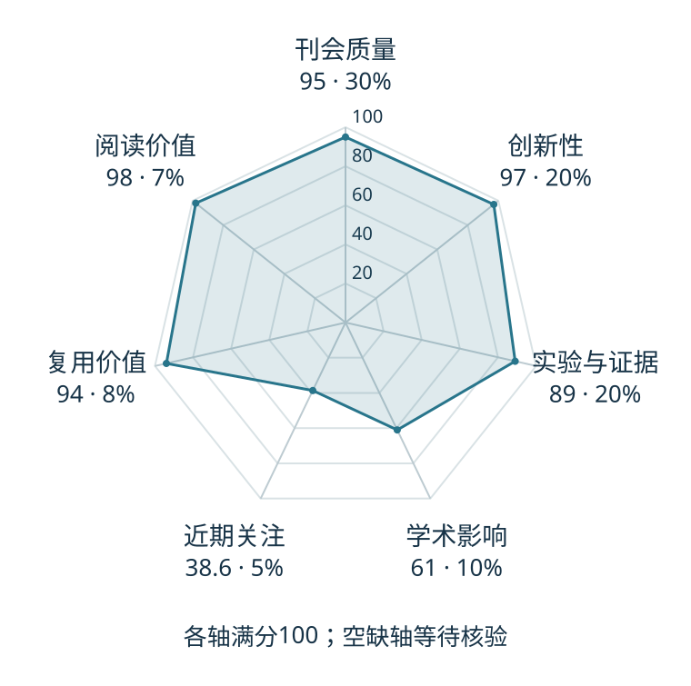

# Dream to Control: Learning Behaviors by Latent Imagination

本版阅读优先顺序：12；综合分：81.8 / 100；已评分权重：100%。

[原文](https://research.google/pubs/dream-to-control-learning-behaviors-by-latent-imagination/) · [PDF](https://arxiv.org/pdf/1912.01603) · [阅读卡片](../../../library/dreamer.md)

## 机制简析

学习潜动力学世界模型，在想象轨迹里以价值反馈优化actor，把像素预测转成决策训练信号。

带着这个问题读：RSSM 如何从观测和动作建模未来，actor 又怎样在潜空间学习？

初读判断：潜空间想象连接模型与策略的基础工作；代码和后续路线利于复用。

## 六维评分

| 维度 | 分数 / 100 | 权重 |
| --- | --- | --- |
| 创新性 | 97 | 25% |
| 实验与证据 | 89 | 25% |
| 学术影响 | 61.0 | 20% |
| 近期关注 | 38.6 | 10% |
| 复用价值 | 94 | 10% |
| 阅读价值 | 98 | 10% |

编辑深度：选题初读；评分记录：2026-10-09T18:35:28+08:00。

计量版本：作者预印本；OpenAlex题目：Dream to Control: Learning Behaviors by Latent Imagination。累计被引 131，2025–2026 被引 10；快照：2026-10-09T18:35:28+08:00。

[指标记录](https://api.openalex.org/works/W2992977009) · [文献计量条目](https://openalex.org/W2992977009)

[评分说明](../../methodology.md) · [返回具身榜](../../README.md) · [论文地图](../../../paper-map/README.md)
