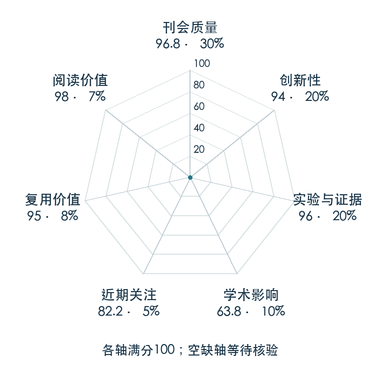

# Mastering diverse control tasks through world models

本版阅读优先顺序：3；综合分：92.0 / 100；已评分权重：100%。

[原文](https://www.nature.com/articles/s41586-025-08744-2) · [PDF](https://arxiv.org/pdf/2301.04104) · [阅读卡片](../../../library/dreamerv3.md)

## 机制简析

以统一的世界模型、奖励价值尺度处理和优化设计覆盖多类控制任务，减少逐任务调参。

带着这个问题读：跨任务尺度变化时，表征、价值和优化怎样保持可用？

初读判断：跨域控制证据充分，代码与训练配方利于复用；正式Nature版本单独计量。

## 七维评分

打开时从中心展开一次，结束后保持最终形状。[直接查看静态图](radar.svg)。加载与再次打开的播放时机取决于浏览器缓存。

| 维度 | 分数 / 100 | 权重 |
| --- | --- | --- |
| 刊会质量 | 96.8 | 30% |
| 创新性 | 94 | 20% |
| 实验与证据 | 96 | 20% |
| 学术影响 | 63.8 | 10% |
| 近期关注 | 82.2 | 5% |
| 复用价值 | 95 | 8% |
| 阅读价值 | 98 | 7% |

刊会依据：[Nature 2025](../../../venues/Nature/README.md)，正式出处见[出版/原文记录](https://www.nature.com/articles/s41586-025-08744-2)；采用2026-10-09刊会快照。

编辑深度：选题初读；评分记录：2026-10-09T18:35:28+08:00。

计量版本：正式刊会版本；OpenAlex题目：Mastering diverse control tasks through world models。累计被引 165，2025–2026 被引 165；快照：2026-10-09T18:35:28+08:00。

[指标记录](https://api.openalex.org/works/W4409147637) · [文献计量条目](https://openalex.org/W4409147637)

[评分说明](../../methodology.md) · [返回具身榜](../../README.md) · [论文地图](../../../paper-map/README.md)
