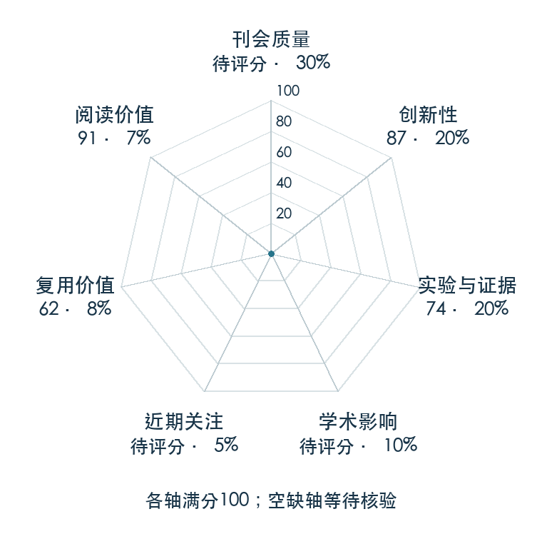

# DreamTrue: Action-Faithful Robot World Model with Counterfactual Post-Training

**DreamTrue** · arXiv 2026 · 本版排名 108 · 综合分 **64.1 / 100**

[解读导读](../../../library/dreamtrue.md) · [世界模型与模型强化学习](../../../paper-map/README.md#track-world-model) · [arXiv集锦](../../../arxiv/README.md#paper-dreamtrue)

[原文](https://arxiv.org/abs/2610.12468v1) · [PDF](https://arxiv.org/pdf/2610.12468v1) · [阅读卡片](../../../library/dreamtrue.md)

论文出处：[Junyan Li · NLPR, Institute of Automation, Chinese Academy of Sciences / Amap, Alibaba Group](../../origins/papers/dreamtrue.md)

## 机制简析

将动作轨迹渲染进图像条件并校准，改变轨迹生成反事实未来，再用人标视频缺陷训练奖励模型指导后训练。

带着这个问题读：模型怎样避免把每次接触都预测成成功？

初读判断：动作忠实性与失败覆盖形成清楚分歧；初读优先看校准、反事实和奖励各自的对照。

## 七维评分

<picture>
  <source media="(prefers-color-scheme: dark)" srcset="radar-dark.gif">
  
</picture>

[透明静态图](radar.svg) · [深色静态图](radar-dark.svg)

| 维度 | 分数 / 100 | 权重 |
| --- | --- | --- |
| 公开与评审 | 60 | 30% |
| 创新性 | 87 | 20% |
| 实验与证据 | 74 | 20% |
| 学术影响 | 0 | 10% |
| 近期关注 | 51.5 | 5% |
| 复用价值 | 62 | 8% |
| 阅读价值 | 91 | 7% |

公开与评审依据：完整论文已公开，作者、日期与版本/固定论文身份可追溯，公开材料阶段计60。；当前阶段为预印本公开。

编辑深度：选题初读；评分记录：2026-10-10。

计量来源：Semantic Scholar；原研究arXiv ID索引记录（版本合并）；匹配题目：DreamTrue: Action-Faithful Robot World Model with Counterfactual Post-Training。累计被引 **0**，2025–2026 被引 **0**；快照：2026-10-10。

[指标记录](https://api.semanticscholar.org/graph/v1/paper/ARXIV:2610.12468) · [文献计量条目](https://www.semanticscholar.org/paper/7f2dac6dd12a66fd3596bbb1b3b04996b255eaa3)

### 影响与关注的计算依据

- **学术影响 0**：本次已定位的独立采用/讨论证据处于量表起点；引用与专属仓库关注另算，取最高已核信号。 [依据1](https://arxiv.org/abs/2610.12468v1) · [依据2](https://github.com/Zhu-Huixiang/embodied-world/blob/main/leaderboard/selection-2026-10-10.md)
- **近期关注 51.5**：huggingface 的论文专属入口：HF 论文累计点赞=34；按1000上限对数压缩。 [依据1](https://huggingface.co/api/papers/2610.12468) · [依据2](https://arxiv.org/abs/2610.12468v1) · [依据3](https://huggingface.co/papers/2610.12468)

零分表示本次快照已定位的信号处在量表起点；创新和实验两轴分别评价方法。

[其他计量来源快照](../../metrics.json)分别保留，不相加；本版按登记的身份匹配顺序选源。

### 论文公开入口与传播快照

| 平台 / 入口 | 公开计量 | 统计范围 | 快照 |
| --- | --- | --- | --- |
| [github](https://github.com/brave-eai/DreamTrue) | GitHub Star 5；GitHub Watch订阅 0；GitHub Fork 0 | 单篇论文仓库；截至2026-10-10的累计快照 | 2026-10-10 |
| [huggingface](https://huggingface.co/papers/2610.12468) | HF 论文累计点赞 34 | 按精确arXiv ID核对的单篇论文页；截至2026-10-10的累计快照 | 2026-10-10 |

[传播数据与采用依据](../../social-signals.json)保留归属、统计窗口与计分信号。
[评分说明](../../methodology.md) · [返回具身榜](../../README.md) · [论文地图](../../../paper-map/README.md)
