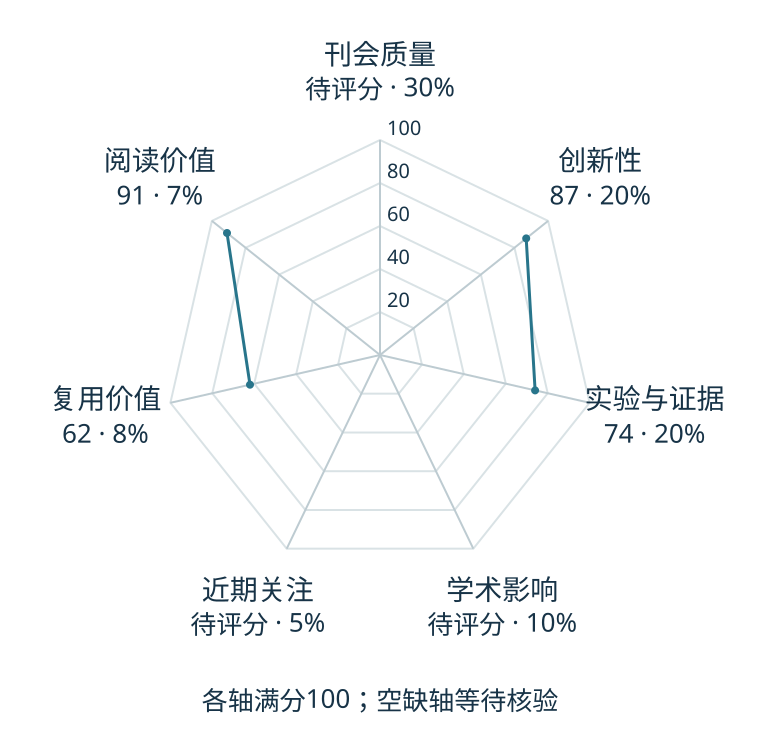

# DreamTrue: Action-Faithful Robot World Model with Counterfactual Post-Training

本版阅读优先顺序：36；综合分：55.6–85.6 / 100；已评分权重：70%。

[原文](https://arxiv.org/abs/2610.12468v1) · [PDF](https://arxiv.org/pdf/2610.12468v1) · [阅读卡片](../../../library/dreamtrue.md)

## 机制简析

将动作轨迹渲染进图像条件并校准，改变轨迹生成反事实未来，再用人标视频缺陷训练奖励模型指导后训练。

带着这个问题读：模型怎样避免把每次接触都预测成成功？

初读判断：动作忠实性与失败覆盖形成清楚分歧；初读优先看校准、反事实和奖励各自的对照。

## 六维评分

| 维度 | 分数 / 100 | 权重 |
| --- | --- | --- |
| 创新性 | 87 | 25% |
| 实验与证据 | 74 | 25% |
| 学术影响 | 待计量 | 20% |
| 近期关注 | 待计量 | 10% |
| 复用价值 | 62 | 10% |
| 阅读价值 | 91 | 10% |

编辑深度：选题初读；评分记录：2026-10-09T18:35:28+08:00。

计量状态：等待可确认对应的记录；两项计量维度保留空白。

[评分说明](../../methodology.md) · [返回具身榜](../../README.md) · [论文地图](../../../paper-map/README.md)
