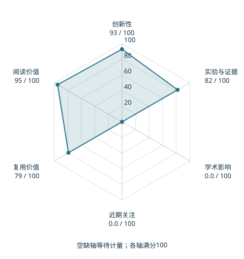

# World Action Models are Zero-shot Policies

本版阅读优先顺序：27；综合分：61.2 / 100；已评分权重：100%。

[原文](https://arxiv.org/abs/2602.15922) · [PDF](https://arxiv.org/pdf/2602.15922) · [阅读卡片](../../../library/dreamzero.md)

## 机制简析

联合建模未来视频与动作，将大规模视觉动态先验用于未见任务的闭环策略。

带着这个问题读：视频与动作共同预测，怎样支持未见任务中的控制？

初读判断：WAM零样本任务分歧清楚；初读仍要按数据、未见任务划分和控制时钟拆证据。

## 六维评分

| 维度 | 分数 / 100 | 权重 |
| --- | --- | --- |
| 创新性 | 93 | 25% |
| 实验与证据 | 82 | 25% |
| 学术影响 | 0.0 | 20% |
| 近期关注 | 0.0 | 10% |
| 复用价值 | 79 | 10% |
| 阅读价值 | 95 | 10% |

编辑深度：选题初读；评分记录：2026-10-09T18:35:28+08:00。

计量版本：作者预印本；OpenAlex题目：World Action Models are Zero-shot Policies。累计被引 0，2025–2026 被引 0；快照：2026-10-09T18:35:28+08:00。

[指标记录](https://api.openalex.org/works/W7130552073) · [文献计量条目](https://openalex.org/W7130552073)

[评分说明](../../methodology.md) · [返回具身榜](../../README.md) · [论文地图](../../../paper-map/README.md)
