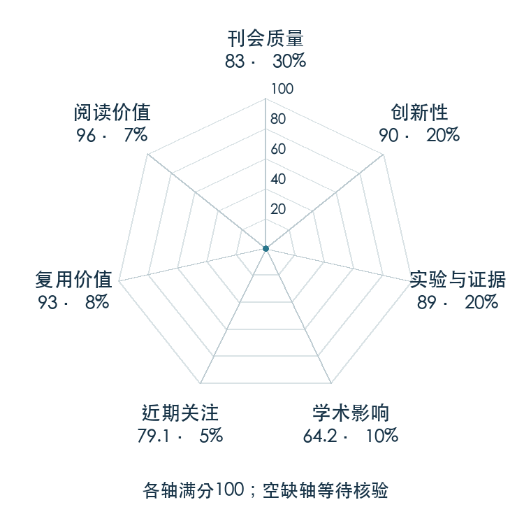

# Extreme Parkour with Legged Robots

**Extreme Parkour** · ICRA 2024 · 本版排名 62 · 综合分 **84.5 / 100**

[解读导读](../../../library/extreme-parkour.md) · [Locomotion 与运动适应](../../../paper-map/README.md#track-locomotion) · [ICRA集锦](../../../venues/ICRA/README.md)

[原文](https://ieeexplore.ieee.org/document/10610200) · [PDF](https://extreme-parkour.github.io/resources/parkour.pdf) · [阅读卡片](../../../library/extreme-parkour.md)

论文出处：[**Xuxin Cheng / Kexin Shi**](../../origins/papers/extreme-parkour.md) [卡内基梅隆大学](../../origins/papers/extreme-parkour.md)

## 机制简析

先在模拟中用特权地形训练策略，再把运动控制和行进方向一起蒸馏到深度图像学生。统一奖励让不同障碍上的动作自行形成，深度网络给策略提供地形潜变量与目标方向，本体策略输出关节命令。实机验证跨沟、上箱、斜坡等任务，并消融方向蒸馏与净空奖励。

带着这个问题读：低频深度相机和不精确电机，怎样还能触发踩点精确的跳跃？

初读判断：闭环视觉到关节控制、实机障碍课程和关键组件消融具备扎实证据；正式 ICRA 与公开项目支持追读。

## 七维评分

<picture>
  <source media="(prefers-color-scheme: dark)" srcset="radar-dark.gif">
  
</picture>

[透明静态图](radar.svg) · [深色静态图](radar-dark.svg)

| 维度 | 分数 / 100 | 权重 |
| --- | --- | --- |
| 公开与评审 | 83.0 | 30% |
| 创新性 | 90 | 20% |
| 实验与证据 | 89 | 20% |
| 学术影响 | 64.2 | 10% |
| 近期关注 | 65.0 | 5% |
| 复用价值 | 93 | 8% |
| 阅读价值 | 96 | 7% |

刊会依据：[ICRA 2024](../../../venues/ICRA/README.md)，正式出处见[出版/原文记录](https://ieeexplore.ieee.org/document/10610200)；采用2026-10-10刊会快照。

公开与评审依据：完整论文已公开，作者、日期与版本/固定论文身份可追溯，公开材料阶段计60。；正式刊会按登记量表计分，取较高阶段。

编辑深度：原文摘要/方法与实验初读；评分记录：2026-10-10。

计量来源：OpenAlex；正式刊会版本；匹配题目：Extreme Parkour with Legged Robots。累计被引 **170**，2025–2026 被引 **136**；快照：2026-10-10T09:51:57+08:00。

[指标记录](https://api.openalex.org/works/W4401415792) · [文献计量条目](https://openalex.org/W4401415792)

### 影响与关注的计算依据

- **学术影响 64.2**：身份匹配的累计引用C=170，对数压缩上限3000。 [依据1](https://api.openalex.org/works/W4401415792)
- **近期关注 65.0**：近期已定位引用R=136；数量与每月引用速度各占一半，有效观察期21.2567个月。 [依据1](https://api.openalex.org/works/W4401415792)

### 论文公开入口与传播快照

| 平台 / 入口 | 公开计量 | 统计范围 | 快照 |
| --- | --- | --- | --- |
| [github](https://github.com/chengxuxin/extreme-parkour) | GitHub Star 1184；GitHub Watch订阅 11；GitHub Fork 179 | 单篇论文仓库；截至2026-10-10的累计快照 | 2026-10-10 |
| [huggingface](https://huggingface.co/papers/2309.14341) | HF 论文累计点赞 0 | 按精确arXiv ID核对的单篇论文页；截至2026-10-10的累计快照 | 2026-10-10 |

[传播数据与采用依据](../../social-signals.json)保留归属、统计窗口与计分信号。
[评分说明](../../methodology.md) · [返回具身榜](../../README.md) · [论文地图](../../../paper-map/README.md)
