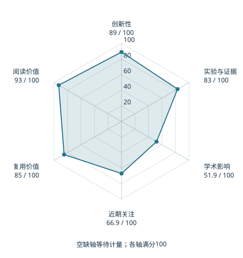

# FAST: Efficient Action Tokenization for Vision-Language-Action Models

本版阅读优先顺序：16；综合分：77.9 / 100；已评分权重：100%。

[原文](https://www.roboticsproceedings.org/rss21/p012.html) · [PDF](https://www.roboticsproceedings.org/rss21/p012.pdf) · [阅读卡片](../../../library/fast.md)

## 机制简析

时间 DCT 提取动作频率系数，再量化和字节对编码，减少高频轨迹逐时刻离散产生的长序列。

带着这个问题读：为什么在时间频率域压缩，比逐时刻分箱更适合高频动作？

初读判断：压缩动作的表示选择清楚，跨策略应用与效率值得读；是Holo-M的直接前置。

## 六维评分

| 维度 | 分数 / 100 | 权重 |
| --- | --- | --- |
| 创新性 | 89 | 25% |
| 实验与证据 | 83 | 25% |
| 学术影响 | 51.9 | 20% |
| 近期关注 | 66.9 | 10% |
| 复用价值 | 85 | 10% |
| 阅读价值 | 93 | 10% |

编辑深度：选题初读；评分记录：2026-10-09T18:35:28+08:00。

计量版本：正式刊会版本；OpenAlex题目：FAST: Efficient Action Tokenization for Vision-Language-Action Models。累计被引 63，2025–2026 被引 63；快照：2026-10-09T18:35:28+08:00。

[指标记录](https://api.openalex.org/works/W4414051084) · [文献计量条目](https://openalex.org/W4414051084)

[评分说明](../../methodology.md) · [返回具身榜](../../README.md) · [论文地图](../../../paper-map/README.md)
