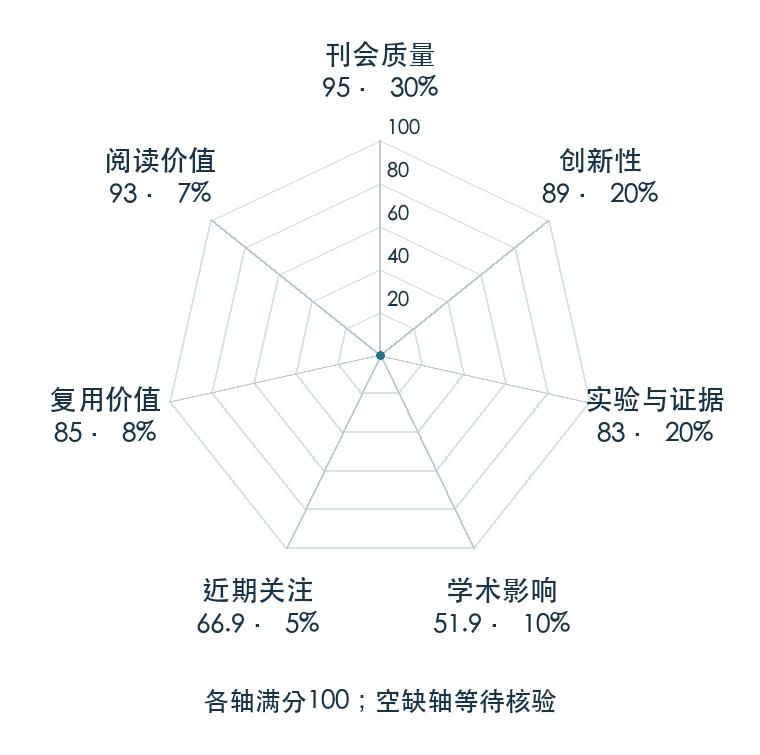

# FAST: Efficient Action Tokenization for Vision-Language-Action Models

**FAST** · RSS 2025 · 本版排名 55 · 综合分 **85.2 / 100**

[解读导读](../../../library/fast.md) · [视觉语言动作模型 VLA](../../../paper-map/README.md#track-vla) · [RSS集锦](../../../venues/RSS/README.md)

[原文](https://www.roboticsproceedings.org/rss21/p012.html) · [PDF](https://www.roboticsproceedings.org/rss21/p012.pdf) · [阅读卡片](../../../library/fast.md)

论文出处：[**Karl Pertsch**](../../origins/papers/fast.md) [Physical Intelligence / 加州大学伯克利分校 · 另1个机构](../../origins/papers/fast.md)

## 机制简析

时间 DCT 提取动作频率系数，再量化和字节对编码，减少高频轨迹逐时刻离散产生的长序列。

带着这个问题读：为什么在时间频率域压缩，比逐时刻分箱更适合高频动作？

初读判断：压缩动作的表示选择清楚，跨策略应用与效率值得读；是Holo-M的直接前置。

## 七维评分

<picture>
  <source media="(prefers-color-scheme: dark)" srcset="radar-dark.gif">
  
</picture>

[透明静态图](radar.svg) · [深色静态图](radar-dark.svg)

| 维度 | 分数 / 100 | 权重 |
| --- | --- | --- |
| 公开与评审 | 95.0 | 30% |
| 创新性 | 89 | 20% |
| 实验与证据 | 83 | 20% |
| 学术影响 | 51.9 | 10% |
| 近期关注 | 75.9 | 5% |
| 复用价值 | 85 | 8% |
| 阅读价值 | 93 | 7% |

刊会依据：[RSS 2025](../../../venues/RSS/README.md)，正式出处见[出版/原文记录](https://www.roboticsproceedings.org/rss21/p012.html)；采用2026-10-10刊会快照。

公开与评审依据：完整论文已公开，作者、日期与版本/固定论文身份可追溯，公开材料阶段计60。；正式刊会按登记量表计分，取较高阶段。

编辑深度：选题初读；评分记录：2026-10-10。

计量来源：OpenAlex；正式刊会版本；匹配题目：FAST: Efficient Action Tokenization for Vision-Language-Action Models。累计被引 **63**，2025–2026 被引 **63**；快照：2026-10-09T18:35:28+08:00。

[指标记录](https://api.openalex.org/works/W4414051084) · [文献计量条目](https://openalex.org/W4414051084)

### 影响与关注的计算依据

- **学术影响 51.9**：身份匹配的累计引用C=63，对数压缩上限3000。 [依据1](https://api.openalex.org/works/W4414051084)
- **近期关注 75.9**：huggingface 的论文专属入口：HF 仓库累计点赞=189；按1000上限对数压缩。 [依据1](https://huggingface.co/api/models/physical-intelligence/fast) · [依据2](https://huggingface.co/physical-intelligence/fast/raw/main/README.md) · [依据3](https://huggingface.co/physical-intelligence/fast)

### 论文公开入口与传播快照

| 平台 / 入口 | 公开计量 | 统计范围 | 快照 |
| --- | --- | --- | --- |
| [github](https://github.com/Physical-Intelligence/openpi) | GitHub Star 14155；GitHub Watch订阅 99；GitHub Fork 2536 | 多论文/多模型共享仓库；截至2026-10-10的累计快照 | 2026-10-10 |
| [huggingface](https://huggingface.co/papers/2501.09747) | HF 论文累计点赞 28 | 按精确arXiv ID核对的单篇论文页；截至2026-10-10的累计快照 | 2026-10-10 |
| [huggingface](https://huggingface.co/physical-intelligence/fast) | HF 最近30天下载 0；HF 仓库累计点赞 189 | 单篇论文的作者发布资产；2026-09-11 至 2026-10-10（API最近30天；含首尾的日期标签，实际滚动边界未公开） / 截至2026-10-10的累计快照 | 2026-10-10 |

[传播数据与采用依据](../../social-signals.json)保留归属、统计窗口与计分信号。
[评分说明](../../methodology.md) · [返回具身榜](../../README.md) · [论文地图](../../../paper-map/README.md)
