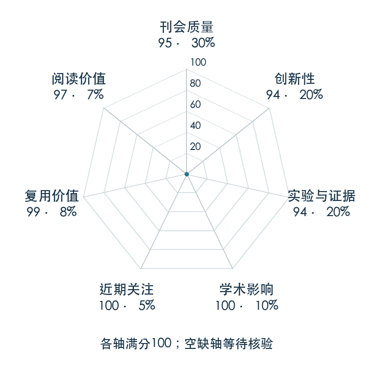

# High-Resolution Image Synthesis with Latent Diffusion Models

**Latent Diffusion** · CVPR 2022 · 本版排名 3 · 综合分 **95.8 / 100**

[解读导读](../../../library/latent-diffusion.md) · [Diffusion / Transformer 基础](../../../paper-map/README.md#track-diffusion-transformer) · [CVPR集锦](../../../venues/CVPR/README.md)

[原文](https://openaccess.thecvf.com/content/CVPR2022/html/Rombach_High-Resolution_Image_Synthesis_With_Latent_Diffusion_Models_CVPR_2022_paper.html) · [PDF](https://openaccess.thecvf.com/content/CVPR2022/papers/Rombach_High-Resolution_Image_Synthesis_With_Latent_Diffusion_Models_CVPR_2022_paper.pdf) · [阅读卡片](../../../library/latent-diffusion.md)

论文出处：[**Robin Rombach / Andreas Blattmann**](../../origins/papers/latent-diffusion.md) [慕尼黑大学 CompVis 实验室 / 海德堡大学 IWR 研究中心 · 另1个机构](../../origins/papers/latent-diffusion.md)

## 机制简析

先训练自动编码器，把高分辨率图像压成空间 latent；再在 latent 上训练扩散网络，最后解码为图像。文本或布局由条件编码器产生 token，并通过交叉注意力进入去噪网络。原文比较压缩程度、图像质量和计算成本，并评估文生图、修复与超分辨率。

带着这个问题读：为什么视频或图像模型常先压到 latent 空间，压缩省掉什么、又可能丢掉什么？

初读判断：表示压缩与生成训练拆得清楚，跨任务和压缩消融丰富，官方代码及权重可用；能帮助读者分析潜空间生成世界模型。

## 七维评分

<picture>
  <source media="(prefers-color-scheme: dark)" srcset="radar-dark.gif">
  
</picture>

[透明静态图](radar.svg) · [深色静态图](radar-dark.svg)

| 维度 | 分数 / 100 | 权重 |
| --- | --- | --- |
| 公开与评审 | 95.0 | 30% |
| 创新性 | 94 | 20% |
| 实验与证据 | 94 | 20% |
| 学术影响 | 100 | 10% |
| 近期关注 | 100.0 | 5% |
| 复用价值 | 99 | 8% |
| 阅读价值 | 97 | 7% |

刊会依据：[CVPR 2022](../../../venues/CVPR/README.md)，正式出处见[出版/原文记录](https://openaccess.thecvf.com/content/CVPR2022/html/Rombach_High-Resolution_Image_Synthesis_With_Latent_Diffusion_Models_CVPR_2022_paper.html)；采用2026-10-10刊会快照。

公开与评审依据：完整论文已公开，作者、日期与版本/固定论文身份可追溯，公开材料阶段计60。；正式刊会按登记量表计分，取较高阶段。

编辑深度：原文摘要/方法与实验初读；评分记录：2026-10-10。

计量来源：OpenAlex；正式刊会版本；匹配题目：High-Resolution Image Synthesis with Latent Diffusion Models。累计被引 **15913**，2025–2026 被引 **9591**；快照：2026-10-10T09:50:37+08:00。

[指标记录](https://api.openalex.org/works/W4312933868) · [文献计量条目](https://openalex.org/W4312933868)

### 影响与关注的计算依据

- **学术影响 100**：身份匹配的累计引用C=15913，对数压缩上限3000。 [依据1](https://api.openalex.org/works/W4312933868)
- **近期关注 100.0**：近期已定位引用R=9591；数量与每月引用速度各占一半，有效观察期21.2567个月。 [依据1](https://api.openalex.org/works/W4312933868)

### 论文公开入口与传播快照

| 平台 / 入口 | 公开计量 | 统计范围 | 快照 |
| --- | --- | --- | --- |
| [github](https://github.com/CompVis/latent-diffusion) | GitHub Star 14168；GitHub Watch订阅 97；GitHub Fork 1733 | 多论文/多模型共享仓库；截至2026-10-10的累计快照 | 2026-10-10 |
| [huggingface](https://huggingface.co/CompVis/ldm-text2im-large-256) | HF 最近30天下载 468；HF 仓库累计点赞 37 | 单篇原研究权重的HF转换版，按此仓库统计；2026-09-11 至 2026-10-10（API最近30天；含首尾的日期标签，实际滚动边界未公开） / 截至2026-10-10的累计快照 | 2026-10-10 |
| [huggingface](https://huggingface.co/papers/2112.10752) | HF 论文累计点赞 17 | 按精确arXiv ID核对的单篇论文页；截至2026-10-10的累计快照 | 2026-10-10 |

[传播数据与采用依据](../../social-signals.json)保留归属、统计窗口与计分信号。
[评分说明](../../methodology.md) · [返回具身榜](../../README.md) · [论文地图](../../../paper-map/README.md)
