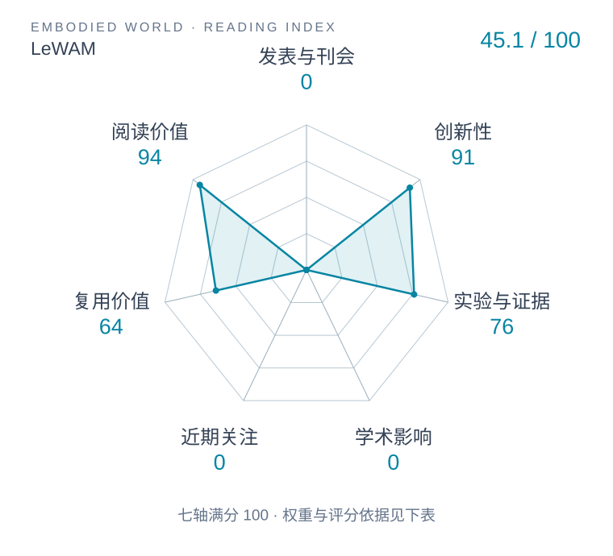

# LeWAM: A JEPA World Action Model with Diffusion-Steering-Based MPC

本版阅读优先顺序：31；综合分：57.6–87.6 / 100；已评分权重：70%。

[原文](https://arxiv.org/abs/2610.12407v1) · [PDF](https://arxiv.org/pdf/2610.12407v1) · [阅读卡片](../../../library/lewam.md)

## 机制简析

在不重建图像的 JEPA 表征上联合学前向、后向、逆动力学和策略；MPC 在策略噪声空间采样，降低规划钻动力学模型空子的机会。

带着这个问题读：联合表征怎样支持预测、动作生成和闭环规划？

初读判断：潜世界动作模型与噪声空间规划贴合本仓路线；有同编码器/规模对照线索，优先追规划消融。

## 六维评分

| 维度 | 分数 / 100 | 权重 |
| --- | --- | --- |
| 创新性 | 91 | 25% |
| 实验与证据 | 76 | 25% |
| 学术影响 | 待计量 | 20% |
| 近期关注 | 待计量 | 10% |
| 复用价值 | 64 | 10% |
| 阅读价值 | 94 | 10% |

编辑深度：选题初读；评分记录：2026-10-09T18:35:28+08:00。

计量状态：等待可确认对应的记录；两项计量维度保留空白。

[评分说明](../../methodology.md) · [返回具身榜](../../README.md) · [论文地图](../../../paper-map/README.md)
