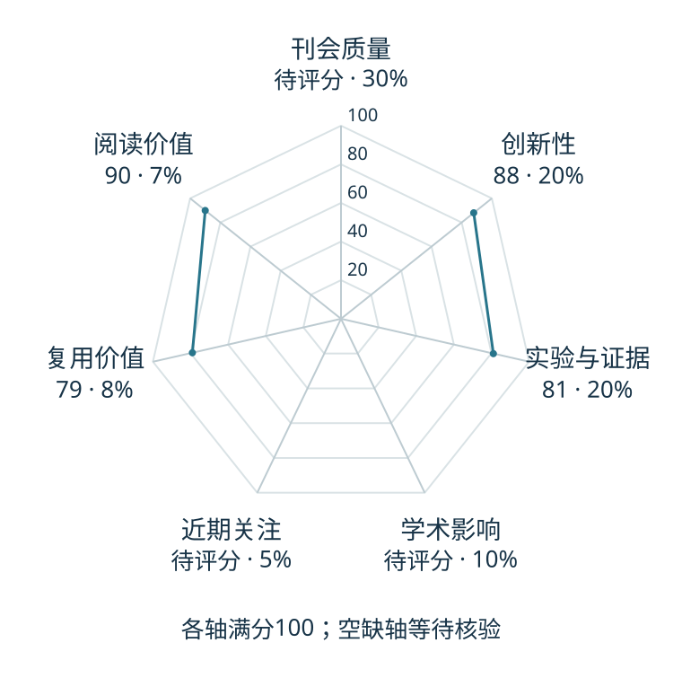

# Causal World Modeling for Robot Control

本版阅读优先顺序：29；综合分：59.2–89.2 / 100；已评分权重：70%。

[原文](https://arxiv.org/abs/2601.21998) · [PDF](https://arxiv.org/pdf/2601.21998) · [阅读卡片](../../../library/lingbot-va.md)

## 机制简析

用因果式视频与动作建模支持闭环控制，使滚动生成的条件更接近实际部署。

带着这个问题读：因果式视频与动作生成怎样缩小训练和闭环执行的差距？

初读判断：因果时序和视频动作联合预测形成清楚问题；初读重点是滚动误差与延迟。

## 六维评分

| 维度 | 分数 / 100 | 权重 |
| --- | --- | --- |
| 创新性 | 88 | 25% |
| 实验与证据 | 81 | 25% |
| 学术影响 | 待计量 | 20% |
| 近期关注 | 待计量 | 10% |
| 复用价值 | 79 | 10% |
| 阅读价值 | 90 | 10% |

编辑深度：选题初读；评分记录：2026-10-09T18:35:28+08:00。

计量状态：等待可确认对应的记录；两项计量维度保留空白。

[评分说明](../../methodology.md) · [返回具身榜](../../README.md) · [论文地图](../../../paper-map/README.md)
