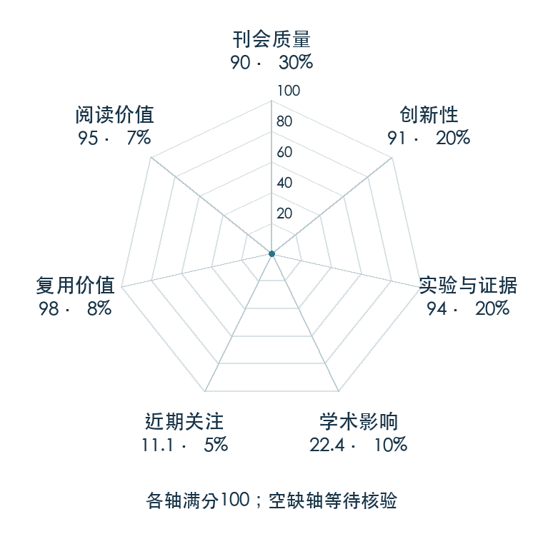

# MimicGen: A Data Generation System for Scalable Robot Learning using Human Demonstrations

**MimicGen** · CoRL 2023 · 本版排名 63 · 综合分 **84.5 / 100**

[解读导读](../../../library/mimicgen.md) · [操作与动作块](../../../paper-map/README.md#track-manipulation) · [CoRL集锦](../../../venues/CoRL/README.md)

[原文](https://proceedings.mlr.press/v229/mandlekar23a.html) · [PDF](https://proceedings.mlr.press/v229/mandlekar23a/mandlekar23a.pdf) · [阅读卡片](../../../library/mimicgen.md)

论文出处：[Ajay Mandlekar · NVIDIA / The University of Texas at Austin](../../origins/papers/mimicgen.md)

## 机制简析

源示范按对象中心子任务切段；新场景中选择源段，按对象的新位姿变换末端轨迹，再拼接并实际执行。执行成功才把状态和动作加入生成数据，而不是只复制一组数学坐标。原文逐步扩大初始状态分布、替换物体与机械臂，并比较生成示范和追加同量人类示范的策略表现。

带着这个问题读：把十条示范扩成上千条，什么时候是有用的新数据，什么时候只是机械复制？

初读判断：CoRL PDF 明确动作和对象假设，提供跨任务/模拟器/硬件生成、初始分布和示范质量研究；项目公开生成代码、数据和环境，复用价值很高。

## 七维评分

<picture>
  <source media="(prefers-color-scheme: dark)" srcset="radar-dark.gif">
  
</picture>

[透明静态图](radar.svg) · [深色静态图](radar-dark.svg)

| 维度 | 分数 / 100 | 权重 |
| --- | --- | --- |
| 公开与评审 | 90.0 | 30% |
| 创新性 | 91 | 20% |
| 实验与证据 | 94 | 20% |
| 学术影响 | 22.4 | 10% |
| 近期关注 | 75.6 | 5% |
| 复用价值 | 98 | 8% |
| 阅读价值 | 95 | 7% |

刊会依据：[CoRL 2023](../../../venues/CoRL/README.md)，正式出处见[出版/原文记录](https://proceedings.mlr.press/v229/mandlekar23a.html)；采用2026-10-10刊会快照。

公开与评审依据：完整论文已公开，作者、日期与版本/固定论文身份可追溯，公开材料阶段计60。；正式刊会按登记量表计分，取较高阶段。

编辑深度：原文摘要/方法与实验初读；评分记录：2026-10-10。

计量来源：OpenAlex；作者预印本/原研究索引记录；匹配题目：MimicGen: A Data Generation System for Scalable Robot Learning using Human Demonstrations。累计被引 **5**，2025–2026 被引 **1**；快照：2026-10-10T09:50:37+08:00。

[指标记录](https://api.openalex.org/works/W4387994700) · [文献计量条目](https://openalex.org/W4387994700)

### 影响与关注的计算依据

- **学术影响 22.4**：身份匹配的累计引用C=5，对数压缩上限3000。 [依据1](https://api.openalex.org/works/W4387994700)
- **近期关注 75.6**：huggingface 的论文专属入口：HF 最近30天下载=5995；按100000上限对数压缩。 [依据1](https://huggingface.co/api/datasets/amandlek/mimicgen_datasets) · [依据2](https://huggingface.co/datasets/amandlek/mimicgen_datasets/raw/main/README.md) · [依据3](https://huggingface.co/datasets/amandlek/mimicgen_datasets)

### 论文公开入口与传播快照

| 平台 / 入口 | 公开计量 | 统计范围 | 快照 |
| --- | --- | --- | --- |
| [github](https://github.com/NVlabs/mimicgen) | GitHub Star 651；GitHub Watch订阅 11；GitHub Fork 118 | 单篇论文仓库；截至2026-10-10的累计快照 | 2026-10-10 |
| [huggingface](https://huggingface.co/datasets/amandlek/mimicgen_datasets) | HF 最近30天下载 5995；HF 仓库累计点赞 9 | 单篇论文的作者发布资产；2026-09-11 至 2026-10-10（API最近30天；含首尾的日期标签，实际滚动边界未公开） / 截至2026-10-10的累计快照 | 2026-10-10 |
| [huggingface](https://huggingface.co/papers/2310.17596) | HF 论文累计点赞 0 | 按精确arXiv ID核对的单篇论文页；截至2026-10-10的累计快照 | 2026-10-10 |

[传播数据与采用依据](../../social-signals.json)保留归属、统计窗口与计分信号。
[评分说明](../../methodology.md) · [返回具身榜](../../README.md) · [论文地图](../../../paper-map/README.md)
