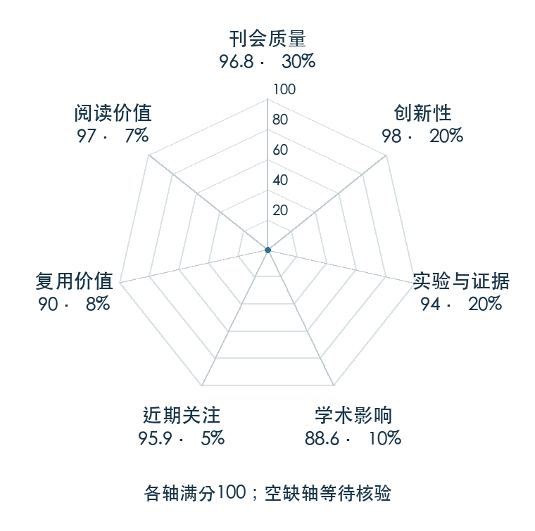

# Mastering Atari, Go, chess and shogi by planning with a learned model

**MuZero** · Nature 2020 · 本版排名 7 · 综合分 **94.6 / 100**

[解读导读](../../../library/muzero.md) · [世界模型与模型强化学习](../../../paper-map/README.md#track-world-model) · [Nature集锦](../../../venues/Nature/README.md)

[原文](https://www.nature.com/articles/s41586-020-03051-4) · [PDF](https://arxiv.org/pdf/1911.08265) · [阅读卡片](../../../library/muzero.md)

论文出处：[Julian Schrittwieser · Google DeepMind / University College London](../../origins/papers/muzero.md)

## 机制简析

表示网络从观测历史得到潜状态，动力学网络在动作条件下预测下一潜状态和奖励，预测网络给出策略先验和值。MCTS 在这些潜状态里展开候选动作，搜索产生的策略和值再监督网络。Nature 论文比较棋类与 Atari；这里关注的是规划表征，而不是实机机器人结论。

带着这个问题读：用于规划的世界模型，为什么可以只预测奖励、价值和策略，而不重建下一帧？

初读判断：Nature 正式论文、跨棋类和 Atari 的完整实验、公开伪代码；EfficientZero 的直接继承为路线影响提供可核实依据。

## 七维评分

<picture>
  <source media="(prefers-color-scheme: dark)" srcset="radar-dark.gif">
  
</picture>

[透明静态图](radar.svg) · [深色静态图](radar-dark.svg)

| 维度 | 分数 / 100 | 权重 |
| --- | --- | --- |
| 公开与评审 | 96.8 | 30% |
| 创新性 | 98 | 20% |
| 实验与证据 | 94 | 20% |
| 学术影响 | 88.6 | 10% |
| 近期关注 | 85.6 | 5% |
| 复用价值 | 90 | 8% |
| 阅读价值 | 97 | 7% |

刊会依据：[Nature 2020](../../../venues/Nature/README.md)，正式出处见[出版/原文记录](https://www.nature.com/articles/s41586-020-03051-4)；采用2026-10-10刊会快照。

公开与评审依据：完整论文已公开，作者、日期与版本/固定论文身份可追溯，公开材料阶段计60。；正式刊会按登记量表计分，取较高阶段。

编辑深度：原文摘要/方法与实验初读；评分记录：2026-10-10。

计量来源：OpenAlex；正式刊会版本；匹配题目：Mastering Atari, Go, chess and shogi by planning with a learned model。累计被引 **1204**，2025–2026 被引 **388**；快照：2026-10-10T09:51:57+08:00。

[指标记录](https://api.openalex.org/works/W2989847975) · [文献计量条目](https://openalex.org/W2989847975)

### 影响与关注的计算依据

- **学术影响 88.6**：身份匹配的累计引用C=1204，对数压缩上限3000。 [依据1](https://api.openalex.org/works/W2989847975)
- **近期关注 85.6**：近期已定位引用R=388；数量与每月引用速度各占一半，有效观察期21.2567个月。 [依据1](https://api.openalex.org/works/W2989847975)

### 论文公开入口与传播快照

| 平台 / 入口 | 公开计量 | 统计范围 | 快照 |
| --- | --- | --- | --- |
| [huggingface](https://huggingface.co/papers/1911.08265) | HF 论文累计点赞 1 | 按精确arXiv ID核对的单篇论文页；截至2026-10-10的累计快照 | 2026-10-10 |

[传播数据与采用依据](../../social-signals.json)保留归属、统计窗口与计分信号。
[评分说明](../../methodology.md) · [返回具身榜](../../README.md) · [论文地图](../../../paper-map/README.md)
