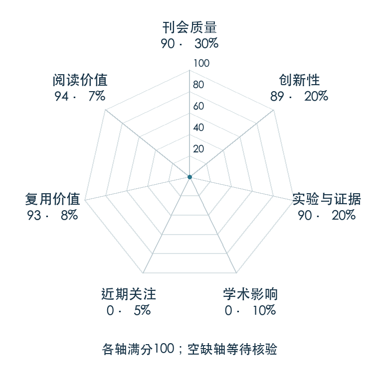

# OmniH2O: Universal and Dexterous Human-to-Humanoid Whole-Body Teleoperation and Learning

**OmniH2O** · CoRL 2024 · 本版排名 104 · 综合分 **76.8 / 100**

[解读导读](../../../library/omnih2o.md) · [Locomotion 与运动适应](../../../paper-map/README.md#track-locomotion) · [CoRL集锦](../../../venues/CoRL/README.md)

[原文](https://proceedings.mlr.press/v270/he25b.html) · [PDF](https://raw.githubusercontent.com/mlresearch/v270/main/assets/he25b/he25b.pdf) · [阅读卡片](../../../library/omnih2o.md)

论文出处：[**Tairan He / Zhengyi Luo 等3位**](../../origins/papers/omnih2o.md) [卡内基梅隆大学 / 上海交通大学](../../origins/papers/omnih2o.md)

## 机制简析

把不同遥操作方式转换成运动学姿态目标，再交给跟踪控制器。特权教师在模拟中学大规模动作，学生用本体历史与稀疏目标通过 DAgger 模仿教师，输出可部署的动作；手部另接姿态到关节控制。原文验证模拟和实机跟踪、不同控制入口及采集示范后的自主技能。

带着这个问题读：只有头和双手目标，为什么还能指挥整个身体并收集自主学习数据？

初读判断：有大规模跟踪、实机指标与 DAgger/历史/目标点消融，统一接口和公开数据支持后续复用。

## 七维评分

<picture>
  <source media="(prefers-color-scheme: dark)" srcset="radar-dark.gif">
  
</picture>

[透明静态图](radar.svg) · [深色静态图](radar-dark.svg)

| 维度 | 分数 / 100 | 权重 |
| --- | --- | --- |
| 公开与评审 | 90.0 | 30% |
| 创新性 | 89 | 20% |
| 实验与证据 | 90 | 20% |
| 学术影响 | 0.0 | 10% |
| 近期关注 | 0.0 | 5% |
| 复用价值 | 93 | 8% |
| 阅读价值 | 94 | 7% |

刊会依据：[CoRL 2024](../../../venues/CoRL/README.md)，正式出处见[出版/原文记录](https://proceedings.mlr.press/v270/he25b.html)；采用2026-10-10刊会快照。

公开与评审依据：完整论文已公开，作者、日期与版本/固定论文身份可追溯，公开材料阶段计60。；正式刊会按登记量表计分，取较高阶段。

编辑深度：原文摘要/方法与实验初读；评分记录：2026-10-10。

计量来源：OpenAlex；作者预印本/原研究索引记录；匹配题目：OmniH2O: Universal and Dexterous Human-to-Humanoid Whole-Body Teleoperation and Learning。累计被引 **0**，2025–2026 被引 **0**；快照：2026-10-10T09:51:57+08:00。

[指标记录](https://api.openalex.org/works/W4399695336) · [文献计量条目](https://openalex.org/W4399695336)

### 影响与关注的计算依据

- **学术影响 0.0**：身份匹配的累计引用C=0，对数压缩上限3000。 [依据1](https://api.openalex.org/works/W4399695336)
- **近期关注 0.0**：近期已定位引用R=0；数量与每月引用速度各占一半，有效观察期21.2567个月。 [依据1](https://api.openalex.org/works/W4399695336)

零分表示本次快照已定位的信号处在量表起点；创新和实验两轴分别评价方法。

### 论文公开入口与传播快照

| 平台 / 入口 | 公开计量 | 统计范围 | 快照 |
| --- | --- | --- | --- |
| [github](https://github.com/LeCAR-Lab/human2humanoid) | GitHub Star 1075；GitHub Watch订阅 9；GitHub Fork 100 | 多论文/多模型共享仓库；截至2026-10-10的累计快照 | 2026-10-10 |

[传播数据与采用依据](../../social-signals.json)保留归属、统计窗口与计分信号。
[评分说明](../../methodology.md) · [返回具身榜](../../README.md) · [论文地图](../../../paper-map/README.md)
