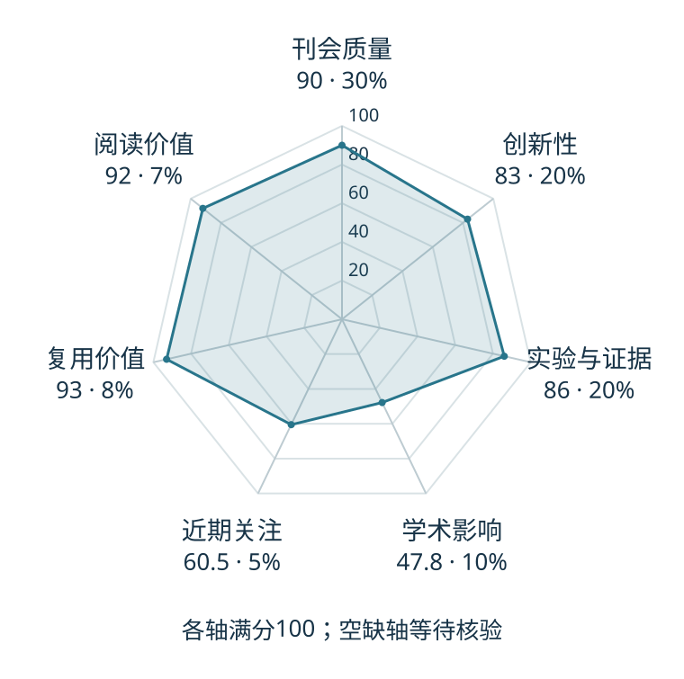

# OpenVLA: An Open-Source Vision-Language-Action Model

本版阅读优先顺序：17；综合分：76.4 / 100；已评分权重：100%。

[原文](https://proceedings.mlr.press/v270/kim25c.html) · [PDF](https://raw.githubusercontent.com/mlresearch/v270/main/assets/kim25c/kim25c.pdf) · [阅读卡片](../../../library/openvla.md)

## 机制简析

把预训练视觉语言骨干适配到机器人示范，输出离散动作编号，并提供高效微调路线。

带着这个问题读：视觉特征融合、动作分箱和高效适配各自解决哪一层问题？

初读判断：公开模型/适配生态便于复用；是离散VLA入门的重要对照。

## 六维评分

| 维度 | 分数 / 100 | 权重 |
| --- | --- | --- |
| 创新性 | 83 | 25% |
| 实验与证据 | 86 | 25% |
| 学术影响 | 47.8 | 20% |
| 近期关注 | 60.5 | 10% |
| 复用价值 | 93 | 10% |
| 阅读价值 | 92 | 10% |

编辑深度：选题初读；评分记录：2026-10-09T18:35:28+08:00。

计量版本：作者预印本；OpenAlex题目：OpenVLA: An Open-Source Vision-Language-Action Model。累计被引 45，2025–2026 被引 42；快照：2026-10-09T18:35:28+08:00。

[指标记录](https://api.openalex.org/works/W4399695759) · [文献计量条目](https://openalex.org/W4399695759)

[评分说明](../../methodology.md) · [返回具身榜](../../README.md) · [论文地图](../../../paper-map/README.md)
