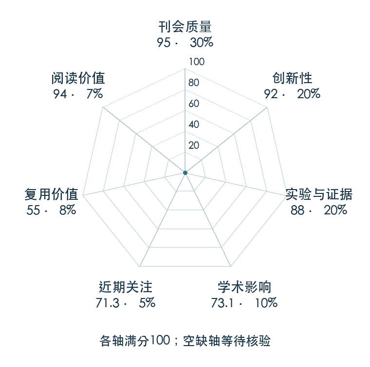

# PaLM-E: An Embodied Multimodal Language Model

**PaLM-E** · ICML 2023 · 本版排名 46 · 综合分 **86.4 / 100**

[解读导读](../../../library/palm-e.md) · [视觉语言动作模型 VLA](../../../paper-map/README.md#track-vla) · [ICML集锦](../../../venues/ICML/README.md)

[原文](https://proceedings.mlr.press/v202/driess23a.html) · [PDF](https://proceedings.mlr.press/v202/driess23a/driess23a.pdf) · [阅读卡片](../../../library/palm-e.md)

## 机制简析

视觉和连续状态由编码器变成与语言 token 等维的向量，和文本交错组成多模态句子，再交给 decoder-only 语言模型生成文字。训练同时覆盖机器人任务、视觉问答和图文任务，以检验知识是否产生正迁移。机器人演示中，文字计划交给底层策略执行，后续视觉反馈再进入模型。

带着这个问题读：把传感器读数塞进语言模型的 embedding 空间，能带来怎样的机器人推理？

初读判断：ICML 原文与项目页包含多种输入模态、多个具身平台、跨任务联合训练及规模研究；完整大模型未提供可直接复现实验的开放训练资源，因此复用分低于 Octo。

## 七维评分

<picture>
  <source media="(prefers-color-scheme: dark)" srcset="radar-dark.gif">
  
</picture>

[透明静态图](radar.svg) · [深色静态图](radar-dark.svg)

| 维度 | 分数 / 100 | 权重 |
| --- | --- | --- |
| 发表与刊会 | 95.0 | 30% |
| 创新性 | 92 | 20% |
| 实验与证据 | 88 | 20% |
| 学术影响 | 73.1 | 10% |
| 近期关注 | 71.3 | 5% |
| 复用价值 | 55 | 8% |
| 阅读价值 | 94 | 7% |

刊会依据：[ICML 2023](../../../venues/ICML/README.md)，正式出处见[出版/原文记录](https://proceedings.mlr.press/v202/driess23a.html)；采用2026-10-10刊会快照。

编辑深度：原文摘要/方法与实验初读；评分记录：2026-10-10。

计量版本：作者预印本/原研究索引记录；OpenAlex题目：PaLM-E: An Embodied Multimodal Language Model。累计被引 348，2025–2026 被引 83；快照：2026-10-10T09:50:37+08:00。

[指标记录](https://api.openalex.org/works/W4323572061) · [文献计量条目](https://openalex.org/W4323572061)

[评分说明](../../methodology.md) · [返回具身榜](../../README.md) · [论文地图](../../../paper-map/README.md)
