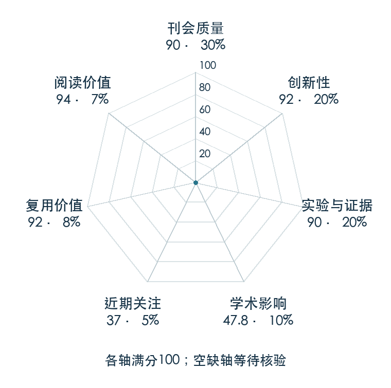

# Perceiver-Actor: A Multi-Task Transformer for Robotic Manipulation

**PerAct** · CoRL 2022 · 本版排名 68 · 综合分 **84.0 / 100**

[原文](https://proceedings.mlr.press/v205/shridhar23a.html) · [PDF](https://proceedings.mlr.press/v205/shridhar23a/shridhar23a.pdf) · [阅读卡片](../../../library/peract.md)

## 机制简析

RGB-D 重建为三维体素网格，体素 patch 与语言向量组成序列；Perceiver 用少量 latent 承接长输入。输出逐体素特征后检测下一关键动作的位置，并预测离散旋转、夹爪及碰撞选项，交由运动规划器执行。网格把观测位置和动作位置对齐，原文再比较图像回归、3D 卷积与多任务少示范性能。

带着这个问题读：把动作当成体素中的检测目标，为什么比从整张图片直接回归动作更省示范？

初读判断：PMLR 正式 PDF 与项目给出完整体素/动作接口、RLBench 和真实平台对照，并有单 GPU 教程；计算成本也形成后续 RVT 的明确研究问题。

## 七维评分

<picture>
  <source media="(prefers-color-scheme: dark)" srcset="radar-dark.gif">
  
</picture>

[透明静态图](radar.svg) · [深色静态图](radar-dark.svg)

| 维度 | 分数 / 100 | 权重 |
| --- | --- | --- |
| 发表与刊会 | 90.0 | 30% |
| 创新性 | 92 | 20% |
| 实验与证据 | 90 | 20% |
| 学术影响 | 47.8 | 10% |
| 近期关注 | 37.0 | 5% |
| 复用价值 | 92 | 8% |
| 阅读价值 | 94 | 7% |

刊会依据：[CoRL 2022](../../../venues/CoRL/README.md)，正式出处见[出版/原文记录](https://proceedings.mlr.press/v205/shridhar23a.html)；采用2026-10-10刊会快照。

编辑深度：原文摘要/方法与实验初读；评分记录：2026-10-10。

计量版本：作者预印本/原研究索引记录；OpenAlex题目：Perceiver-Actor: A Multi-Task Transformer for Robotic Manipulation。累计被引 45，2025–2026 被引 9；快照：2026-10-10T09:50:37+08:00。

[指标记录](https://api.openalex.org/works/W4297812239) · [文献计量条目](https://openalex.org/W4297812239)

[评分说明](../../methodology.md) · [返回具身榜](../../README.md) · [论文地图](../../../paper-map/README.md)
