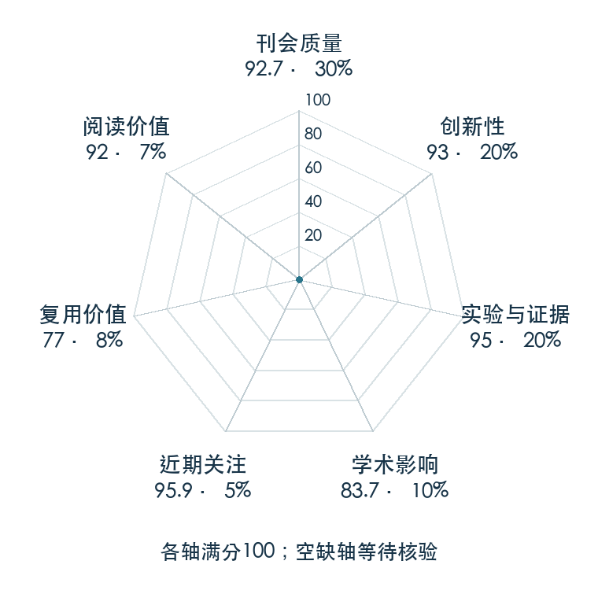

# Learning robust perceptive locomotion for quadrupedal robots in the wild

**Perceptive Locomotion** · Sci. Robot. 2022 · 本版排名 18 · 综合分 **91.2 / 100**

[原文](https://www.science.org/doi/10.1126/scirobotics.abk2822) · [PDF](https://arxiv.org/pdf/2201.08117) · [阅读卡片](../../../library/perceptive-loco.md)

## 机制简析

让地形感知与本体反馈共同支持腿足策略，在复杂户外地形中考察感知失效和控制鲁棒性。

带着这个问题读：感知不可靠时，地形信息和本体反馈怎样共同支持行走？

初读判断：真实环境证据与感知鲁棒性突出；硬件复现成本较高。

## 七维评分

<picture>
  <source media="(prefers-color-scheme: dark)" srcset="radar-dark.gif">
  
</picture>

[透明静态图](radar.svg) · [深色静态图](radar-dark.svg)

| 维度 | 分数 / 100 | 权重 |
| --- | --- | --- |
| 发表与刊会 | 92.7 | 30% |
| 创新性 | 93 | 20% |
| 实验与证据 | 95 | 20% |
| 学术影响 | 83.7 | 10% |
| 近期关注 | 95.9 | 5% |
| 复用价值 | 77 | 8% |
| 阅读价值 | 92 | 7% |

刊会依据：[Sci. Robot. 2022](../../../venues/Science-Robotics/README.md)，正式出处见[出版/原文记录](https://www.science.org/doi/10.1126/scirobotics.abk2822)；采用2026-10-10刊会快照。

编辑深度：选题初读；评分记录：2026-10-10。

计量版本：正式刊会版本；OpenAlex题目：Learning robust perceptive locomotion for quadrupedal robots in the wild。累计被引 812，2025–2026 被引 387；快照：2026-10-09T18:35:28+08:00。

[指标记录](https://api.openalex.org/works/W4205430897) · [文献计量条目](https://openalex.org/W4205430897)

[评分说明](../../methodology.md) · [返回具身榜](../../README.md) · [论文地图](../../../paper-map/README.md)
