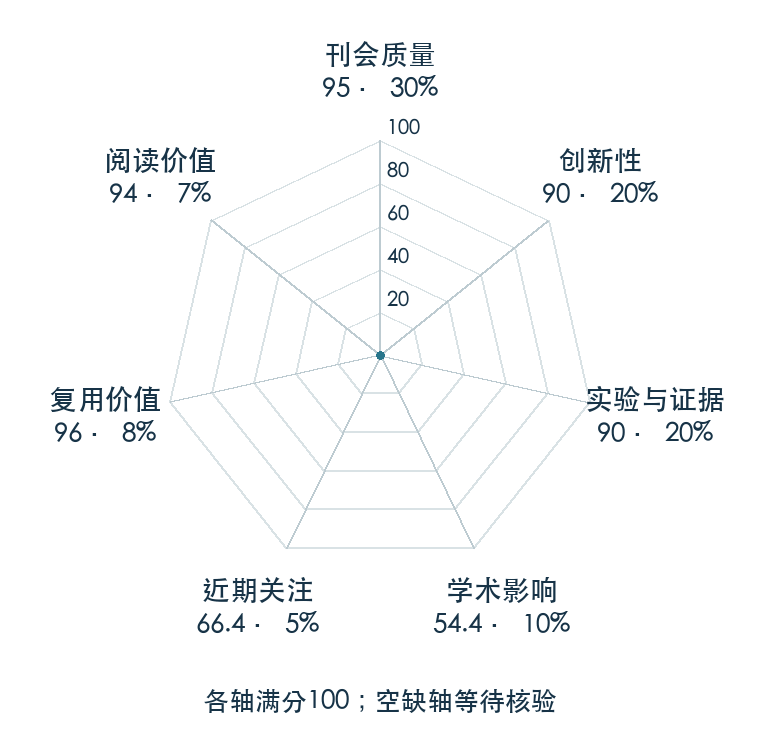

# Perpetual Humanoid Control for Real-time Simulated Avatars

**PHC** · ICCV 2023 · 本版排名 43 · 综合分 **86.7 / 100**

[解读导读](../../../library/phc.md) · [动作先验与全身技能](../../../paper-map/README.md#track-motion-priors) · [ICCV集锦](../../../venues/ICCV/README.md)

[原文](https://openaccess.thecvf.com/content/ICCV2023/html/Luo_Perpetual_Humanoid_Control_for_Real-time_Simulated_Avatars_ICCV_2023_paper.html) · [PDF](https://openaccess.thecvf.com/content/ICCV2023/papers/Luo_Perpetual_Humanoid_Control_for_Real-time_Simulated_Avatars_ICCV_2023_paper.pdf) · [阅读卡片](../../../library/phc.md)

论文出处：[**Zhengyi Luo**](../../origins/papers/phc.md) [Meta Reality Labs 研究团队 / 卡内基梅隆大学](../../origins/papers/phc.md)

## 机制简析

目标条件的物理控制器接收参考姿态或关键点，输出仿真动作以保持平衡并跟踪。渐进乘性策略按难动作扩展容量，保留已有跟踪技能，再加入失败状态恢复，避免新增任务覆盖旧技能。实验对比大规模动作跟踪、噪声姿态与跌倒恢复。

带着这个问题读：动作库越来越大，跟踪控制器怎样扩容、处理噪声并在摔倒后接着跑？

初读判断：正式 ICCV，多数据集、无外部稳定力条件与恢复消融明确；后续人形全身控制继续引用和使用其评测脉络。

## 七维评分

<picture>
  <source media="(prefers-color-scheme: dark)" srcset="radar-dark.gif">
  
</picture>

[透明静态图](radar.svg) · [深色静态图](radar-dark.svg)

| 维度 | 分数 / 100 | 权重 |
| --- | --- | --- |
| 公开与评审 | 95.0 | 30% |
| 创新性 | 90 | 20% |
| 实验与证据 | 90 | 20% |
| 学术影响 | 54.4 | 10% |
| 近期关注 | 50.4 | 5% |
| 复用价值 | 96 | 8% |
| 阅读价值 | 94 | 7% |

刊会依据：[ICCV 2023](../../../venues/ICCV/README.md)，正式出处见[出版/原文记录](https://openaccess.thecvf.com/content/ICCV2023/html/Luo_Perpetual_Humanoid_Control_for_Real-time_Simulated_Avatars_ICCV_2023_paper.html)；采用2026-10-10刊会快照。

公开与评审依据：完整论文已公开，作者、日期与版本/固定论文身份可追溯，公开材料阶段计60。；正式刊会按登记量表计分，取较高阶段。

编辑深度：原文摘要/方法与实验初读；评分记录：2026-10-10。

计量来源：OpenAlex；正式刊会版本；匹配题目：Perpetual Humanoid Control for Real-time Simulated Avatars。累计被引 **77**，2025–2026 被引 **61**；快照：2026-10-10T09:51:57+08:00。

[指标记录](https://api.openalex.org/works/W4390874171) · [文献计量条目](https://openalex.org/W4390874171)

### 影响与关注的计算依据

- **学术影响 54.4**：身份匹配的累计引用C=77，对数压缩上限3000。 [依据1](https://api.openalex.org/works/W4390874171)
- **近期关注 50.4**：近期已定位引用R=61；数量与每月引用速度各占一半，有效观察期21.2567个月。 [依据1](https://api.openalex.org/works/W4390874171)

### 论文公开入口与传播快照

| 平台 / 入口 | 公开计量 | 统计范围 | 快照 |
| --- | --- | --- | --- |
| [github](https://github.com/ZhengyiLuo/PHC) | GitHub Star 1297；GitHub Watch订阅 11；GitHub Fork 128 | 单篇论文仓库；截至2026-10-10的累计快照 | 2026-10-10 |
| [huggingface](https://huggingface.co/papers/2305.06456) | HF 论文累计点赞 1 | 按精确arXiv ID核对的单篇论文页；截至2026-10-10的累计快照 | 2026-10-10 |

[传播数据与采用依据](../../social-signals.json)保留归属、统计窗口与计分信号。
[评分说明](../../methodology.md) · [返回具身榜](../../README.md) · [论文地图](../../../paper-map/README.md)
