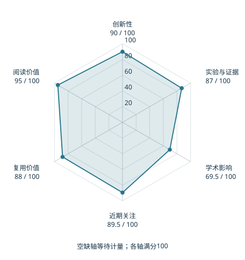

# π₀: A Vision-Language-Action Flow Model for General Robot Control

本版阅读优先顺序：10；综合分：85.4 / 100；已评分权重：100%。

[原文](https://www.roboticsproceedings.org/rss21/p010.html) · [PDF](https://www.roboticsproceedings.org/rss21/p010.pdf) · [阅读卡片](../../../library/pi0.md)

## 机制简析

视觉语言骨干提供语义条件，Flow Matching 动作专家生成连续动作块，再按闭环观测更新。

带着这个问题读：Flow Matching 动作专家怎样接收视觉语言条件？

初读判断：通用VLA与连续动作块的重要接口；适合逐项拆多本体数据和任务协议。

## 六维评分

| 维度 | 分数 / 100 | 权重 |
| --- | --- | --- |
| 创新性 | 90 | 25% |
| 实验与证据 | 87 | 25% |
| 学术影响 | 69.5 | 20% |
| 近期关注 | 89.5 | 10% |
| 复用价值 | 88 | 10% |
| 阅读价值 | 95 | 10% |

编辑深度：选题初读；评分记录：2026-10-09T18:35:28+08:00。

计量版本：正式刊会版本；OpenAlex题目：π₀: A Vision-Language-Action Flow Model for General Robot Control。累计被引 260，2025–2026 被引 260；快照：2026-10-09T18:35:28+08:00。

[指标记录](https://api.openalex.org/works/W4414079054) · [文献计量条目](https://openalex.org/W4414079054)

[评分说明](../../methodology.md) · [返回具身榜](../../README.md) · [论文地图](../../../paper-map/README.md)
