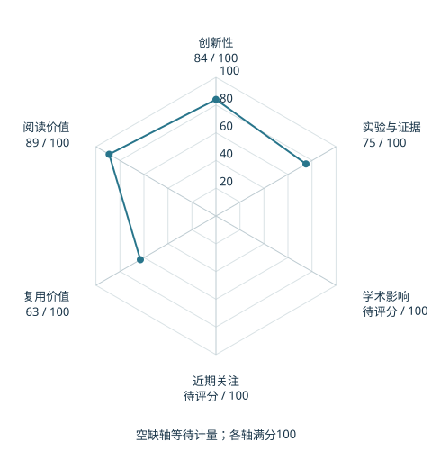

# PLaW-VLA: Predictive Latent World Modeling for Vision-Language-Action Policies

本版阅读优先顺序：37；综合分：55.0–85.0 / 100；已评分权重：70%。

[原文](https://arxiv.org/abs/2610.12285v1) · [PDF](https://arxiv.org/pdf/2610.12285v1) · [阅读卡片](../../../library/plaw-vla.md)

## 机制简析

预测面向任务的未来潜表示，再用结构化因果注意力让动作生成读取历史、任务和未来状态，减少无关像素重建。

带着这个问题读：怎样证明预测的未来表征真的帮助长程动作？

初读判断：有响应式策略与重建表示对照线索；初读优先看长程任务、未来预测和注意力结构消融。

## 六维评分

| 维度 | 分数 / 100 | 权重 |
| --- | --- | --- |
| 创新性 | 84 | 25% |
| 实验与证据 | 75 | 25% |
| 学术影响 | 待计量 | 20% |
| 近期关注 | 待计量 | 10% |
| 复用价值 | 63 | 10% |
| 阅读价值 | 89 | 10% |

编辑深度：选题初读；评分记录：2026-10-09T18:35:28+08:00。

计量状态：等待可确认对应的记录；两项计量维度保留空白。

[评分说明](../../methodology.md) · [返回具身榜](../../README.md) · [论文地图](../../../paper-map/README.md)
