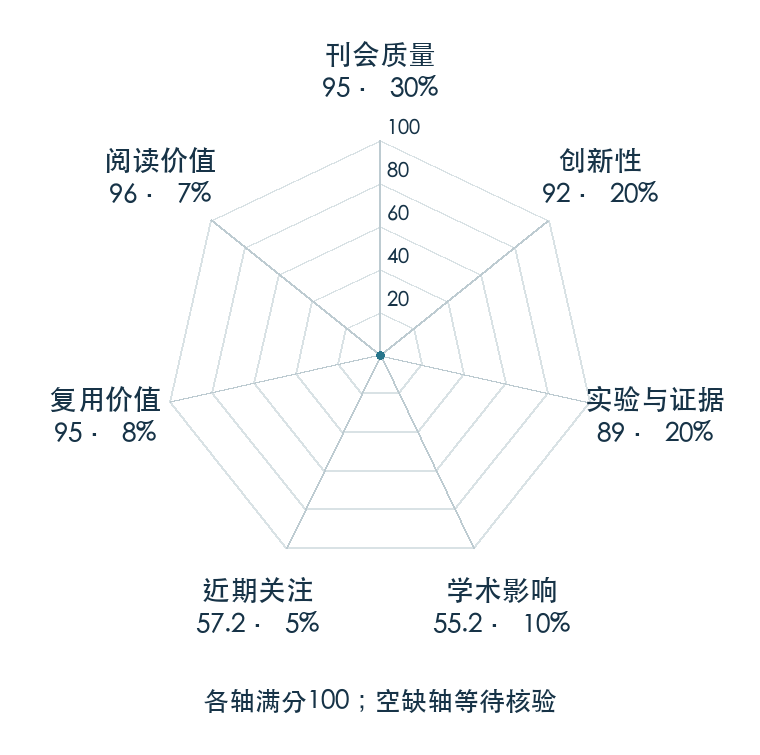

# Flow Straight and Fast: Learning to Generate and Transfer Data with Rectified Flow

**Rectified Flow** · ICLR 2023 · 本版排名 44 · 综合分 **86.6 / 100**

[解读导读](../../../library/rectified-flow.md) · [Diffusion / Transformer 基础](../../../paper-map/README.md#track-diffusion-transformer) · [ICLR集锦](../../../venues/ICLR/README.md)

[原文](https://iclr.cc/virtual/2023/poster/11266) · [PDF](https://openreview.net/pdf?id=gWxpdtQpiYV) · [阅读卡片](../../../library/rectified-flow.md)

论文出处：[Xingchao Liu / Chengyue Gong · The University of Texas at Austin](../../origins/papers/rectified-flow.md)

## 机制简析

从两个分布采样端点，用连接端点的线性插值训练速度场，让网络按当前位置估计路径速度。再用已有流生成配对数据重新训练，逐步减少轨迹弯曲，使粗时间步的数值积分更准确。原文给出传输代价性质，并在图像生成和域迁移中比较一步与多步效果。

带着这个问题读：训练速度场和把轨迹拉直有什么区别，为什么直一点就能少算几步？

初读判断：线性路径、传输性质与反复拉直的机制可单独解释，官方代码公开；适合比较连续动作生成里少步求解的理论和代价。

## 七维评分

<picture>
  <source media="(prefers-color-scheme: dark)" srcset="radar-dark.gif">
  
</picture>

[透明静态图](radar.svg) · [深色静态图](radar-dark.svg)

| 维度 | 分数 / 100 | 权重 |
| --- | --- | --- |
| 公开与评审 | 95.0 | 30% |
| 创新性 | 92 | 20% |
| 实验与证据 | 89 | 20% |
| 学术影响 | 55.2 | 10% |
| 近期关注 | 40.8 | 5% |
| 复用价值 | 95 | 8% |
| 阅读价值 | 96 | 7% |

刊会依据：[ICLR 2023](../../../venues/ICLR/README.md)，正式出处见[出版/原文记录](https://iclr.cc/virtual/2023/poster/11266)；采用2026-10-10刊会快照。

公开与评审依据：完整论文已公开，作者、日期与版本/固定论文身份可追溯，公开材料阶段计60。；正式刊会按登记量表计分，取较高阶段。

编辑深度：原文摘要/方法与实验初读；评分记录：2026-10-10。

计量来源：OpenAlex；作者预印本/原研究索引记录；匹配题目：Flow Straight and Fast: Learning to Generate and Transfer Data with Rectified Flow。累计被引 **82**，2025–2026 被引 **34**；快照：2026-10-10T09:50:37+08:00。

[指标记录](https://api.openalex.org/works/W4297676498) · [文献计量条目](https://openalex.org/W4297676498)

### 影响与关注的计算依据

- **学术影响 55.2**：身份匹配的累计引用C=82，对数压缩上限3000。 [依据1](https://api.openalex.org/works/W4297676498)
- **近期关注 40.8**：近期已定位引用R=34；数量与每月引用速度各占一半，有效观察期21.2567个月。 [依据1](https://api.openalex.org/works/W4297676498)

### 论文公开入口与传播快照

| 平台 / 入口 | 公开计量 | 统计范围 | 快照 |
| --- | --- | --- | --- |
| [github](https://github.com/gnobitab/RectifiedFlow) | GitHub Star 1654；GitHub Watch订阅 12；GitHub Fork 103 | 单篇论文仓库；截至2026-10-10的累计快照 | 2026-10-10 |
| [huggingface](https://huggingface.co/papers/2209.03003) | HF 论文累计点赞 4 | 按精确arXiv ID核对的单篇论文页；截至2026-10-10的累计快照 | 2026-10-10 |

[传播数据与采用依据](../../social-signals.json)保留归属、统计窗口与计分信号。
[评分说明](../../methodology.md) · [返回具身榜](../../README.md) · [论文地图](../../../paper-map/README.md)
