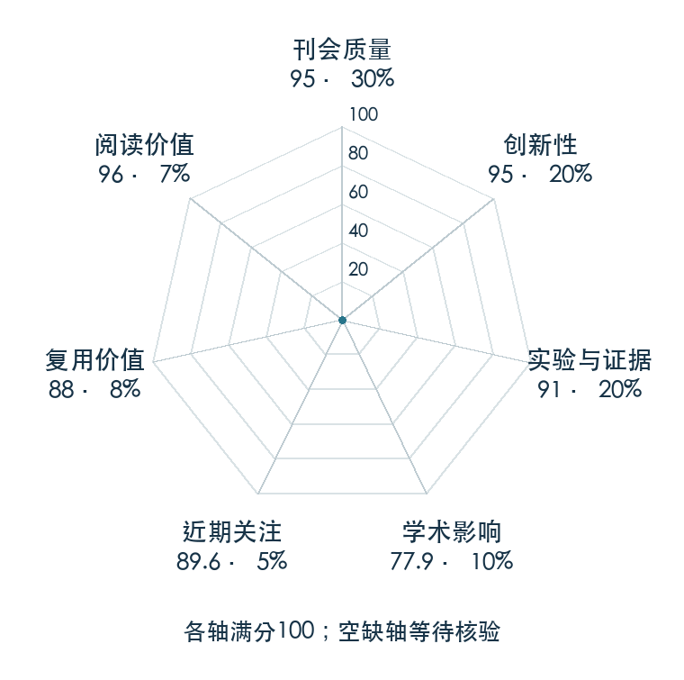

# RMA: Rapid Motor Adaptation for Legged Robots

**RMA** · RSS 2021 · 本版排名 18 · 综合分 **91.1 / 100**

[解读导读](../../../library/rma.md) · [Locomotion 与运动适应](../../../paper-map/README.md#track-locomotion) · [RSS集锦](../../../venues/RSS/README.md)

[原文](https://www.roboticsproceedings.org/rss17/p011.html) · [PDF](https://www.roboticsproceedings.org/rss17/p011.pdf) · [阅读卡片](../../../library/rma.md)

论文出处：[**Ashish Kumar**](../../origins/papers/rma.md) [加州大学伯克利分校 / 卡内基梅隆大学 · 另1个机构](../../origins/papers/rma.md)

## 机制简析

训练利用特权环境信息的基础策略，部署用状态动作历史估计环境编码，在线适配腿足控制。

带着这个问题读：训练时的环境特权信息，怎样通过历史状态在部署时估计？

初读判断：特权信息到历史估计的接口影响大；适合追环境变化与适应延迟。

## 七维评分

<picture>
  <source media="(prefers-color-scheme: dark)" srcset="radar-dark.gif">
  
</picture>

[透明静态图](radar.svg) · [深色静态图](radar-dark.svg)

| 维度 | 分数 / 100 | 权重 |
| --- | --- | --- |
| 公开与评审 | 95.0 | 30% |
| 创新性 | 95 | 20% |
| 实验与证据 | 91 | 20% |
| 学术影响 | 77.9 | 10% |
| 近期关注 | 77.8 | 5% |
| 复用价值 | 88 | 8% |
| 阅读价值 | 96 | 7% |

刊会依据：[RSS 2021](../../../venues/RSS/README.md)，正式出处见[出版/原文记录](https://www.roboticsproceedings.org/rss17/p011.html)；采用2026-10-10刊会快照。

公开与评审依据：完整论文已公开，作者、日期与版本/固定论文身份可追溯，公开材料阶段计60。；正式刊会按登记量表计分，取较高阶段。

编辑深度：选题初读；评分记录：2026-10-10。

计量来源：OpenAlex；正式刊会版本；匹配题目：RMA: Rapid Motor Adaptation for Legged Robots。累计被引 **511**，2025–2026 被引 **262**；快照：2026-10-09T18:35:28+08:00。

[指标记录](https://api.openalex.org/works/W3175254947) · [文献计量条目](https://openalex.org/W3175254947)

### 影响与关注的计算依据

- **学术影响 77.9**：身份匹配的累计引用C=511，对数压缩上限3000。 [依据1](https://api.openalex.org/works/W3175254947)
- **近期关注 77.8**：近期已定位引用R=262；数量与每月引用速度各占一半，有效观察期21.2567个月。 [依据1](https://api.openalex.org/works/W3175254947)

### 论文公开入口与传播快照

| 平台 / 入口 | 公开计量 | 统计范围 | 快照 |
| --- | --- | --- | --- |
| [huggingface](https://huggingface.co/papers/2107.04034) | HF 论文累计点赞 0 | 按精确arXiv ID核对的单篇论文页；截至2026-10-10的累计快照 | 2026-10-10 |

[传播数据与采用依据](../../social-signals.json)保留归属、统计窗口与计分信号。
[评分说明](../../methodology.md) · [返回具身榜](../../README.md) · [论文地图](../../../paper-map/README.md)
