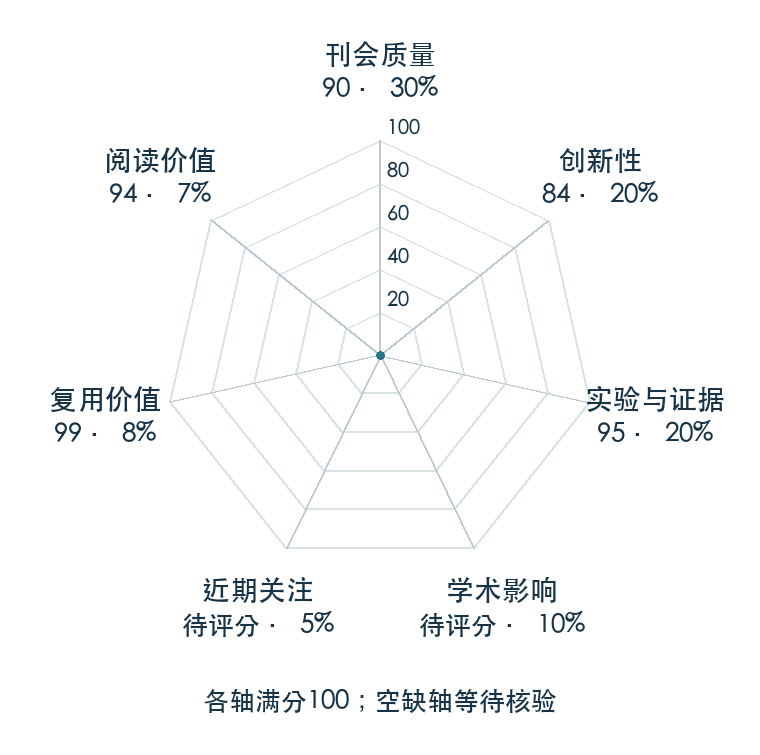

# What Matters in Learning from Offline Human Demonstrations for Robot Manipulation

本版阅读优先顺序：90；综合分：77.3–92.3 / 100；已评分权重：85%。

[原文](https://proceedings.mlr.press/v164/mandlekar22a.html) · [PDF](https://proceedings.mlr.press/v164/mandlekar22a/mandlekar22a.pdf) · [阅读卡片](../../../library/robomimic.md)

## 机制简析

同一组操作任务上更换算法、单人或多人示范、低维或图像观测，并控制训练和评估流程，观察各因素独立造成的差异。带历史的行为克隆能处理人类动作的时序相关性；离线 RL 在机器生成数据上的表现不能直接搬到人类数据。它还检验验证损失与执行成功率不一致时，选模型会发生什么。

带着这个问题读：同样的人类示范，为什么换个观测历史、数据质量或停训方式，结果会差这么多？

初读判断：正式 PDF 给出六类算法、仿真/真实多阶段任务、多随机种子及示范质量研究，开源数据与统一实现支撑公平对照；系统证据价值高于单个新网络模块。

## 七维评分

打开时从中心展开一次，结束后保持最终形状。[直接查看静态图](radar.svg)。加载与再次打开的播放时机取决于浏览器缓存。

| 维度 | 分数 / 100 | 权重 |
| --- | --- | --- |
| 刊会质量 | 90.0 | 30% |
| 创新性 | 84 | 20% |
| 实验与证据 | 95 | 20% |
| 学术影响 | 待核验 | 10% |
| 近期关注 | 待核验 | 5% |
| 复用价值 | 99 | 8% |
| 阅读价值 | 94 | 7% |

刊会依据：[CoRL 2021](../../../venues/CoRL/README.md)，正式出处见[出版/原文记录](https://proceedings.mlr.press/v164/mandlekar22a.html)；采用2026-10-10刊会快照。

编辑深度：原文摘要/方法与实验初读；评分记录：2026-10-10。

计量状态：等待可确认对应的记录；两项计量维度保留空白。

[评分说明](../../methodology.md) · [返回具身榜](../../README.md) · [论文地图](../../../paper-map/README.md)
