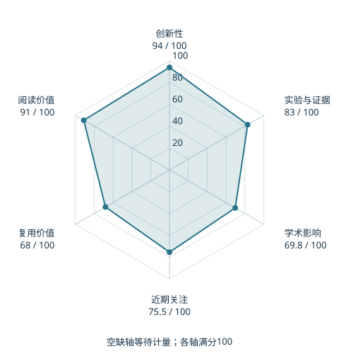

# RT-2: Vision-Language-Action Models Transfer Web Knowledge to Robotic Control

本版阅读优先顺序：13；综合分：81.7 / 100；已评分权重：100%。

[原文](https://proceedings.mlr.press/v229/zitkovich23a.html) · [PDF](https://proceedings.mlr.press/v229/zitkovich23a/zitkovich23a.pdf) · [阅读卡片](../../../library/rt2.md)

## 机制简析

把机器人动作写成语言模型词表内的编号，将机器人示范与视觉语言任务共同训练以迁移网络语义。

带着这个问题读：文字和动作一起训练，网络知识怎样影响一次操作？

初读判断：把网络知识接入动作的早期路线；跨任务结果有启发，实施门槛较高。

## 六维评分

| 维度 | 分数 / 100 | 权重 |
| --- | --- | --- |
| 创新性 | 94 | 25% |
| 实验与证据 | 83 | 25% |
| 学术影响 | 69.8 | 20% |
| 近期关注 | 75.5 | 10% |
| 复用价值 | 68 | 10% |
| 阅读价值 | 91 | 10% |

编辑深度：选题初读；评分记录：2026-10-09T18:35:28+08:00。

计量版本：作者预印本；OpenAlex题目：RT-2: Vision-Language-Action Models Transfer Web Knowledge to Robotic Control。累计被引 267，2025–2026 被引 108；快照：2026-10-09T18:35:28+08:00。

[指标记录](https://api.openalex.org/works/W4385473486) · [文献计量条目](https://openalex.org/W4385473486)

[评分说明](../../methodology.md) · [返回具身榜](../../README.md) · [论文地图](../../../paper-map/README.md)
