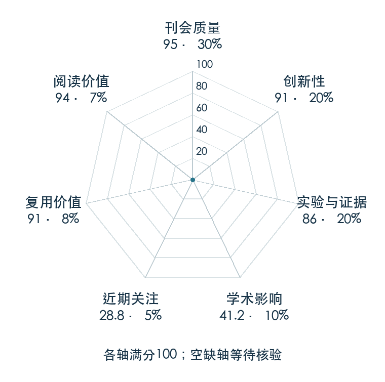

# Temporal Difference Learning for Model Predictive Control

**TD-MPC** · ICML 2022 · 本版排名 79 · 综合分 **82.7 / 100**

[解读导读](../../../library/td-mpc.md) · [世界模型与模型强化学习](../../../paper-map/README.md#track-world-model) · [ICML集锦](../../../venues/ICML/README.md)

[原文](https://proceedings.mlr.press/v162/hansen22a.html) · [PDF](https://proceedings.mlr.press/v162/hansen22a/hansen22a.pdf) · [阅读卡片](../../../library/td-mpc.md)

论文出处：[**Nicklas Hansen**](../../origins/papers/td-mpc.md) [加州大学圣迭戈分校](../../origins/papers/td-mpc.md)

## 机制简析

学习用于奖励和值预测的潜动力学，结合短期模型预测控制与终端价值选择连续动作。

带着这个问题读：怎样学习足够用于控制的潜动力学，而省去图像重建？

初读判断：规划而不重建像素的任务相关表示值得对照Dreamer。

## 七维评分

<picture>
  <source media="(prefers-color-scheme: dark)" srcset="radar-dark.gif">
  
</picture>

[透明静态图](radar.svg) · [深色静态图](radar-dark.svg)

| 维度 | 分数 / 100 | 权重 |
| --- | --- | --- |
| 公开与评审 | 95.0 | 30% |
| 创新性 | 91 | 20% |
| 实验与证据 | 86 | 20% |
| 学术影响 | 41.2 | 10% |
| 近期关注 | 17.1 | 5% |
| 复用价值 | 91 | 8% |
| 阅读价值 | 94 | 7% |

刊会依据：[ICML 2022](../../../venues/ICML/README.md)，正式出处见[出版/原文记录](https://proceedings.mlr.press/v162/hansen22a.html)；采用2026-10-10刊会快照。

公开与评审依据：完整论文已公开，作者、日期与版本/固定论文身份可追溯，公开材料阶段计60。；正式刊会按登记量表计分，取较高阶段。

编辑深度：选题初读；评分记录：2026-10-10。

计量来源：OpenAlex；作者预印本；匹配题目：Temporal Difference Learning for Model Predictive Control。累计被引 **26**，2025–2026 被引 **5**；快照：2026-10-09T18:35:28+08:00。

[指标记录](https://api.openalex.org/works/W4221164079) · [文献计量条目](https://openalex.org/W4221164079)

### 影响与关注的计算依据

- **学术影响 41.2**：身份匹配的累计引用C=26，对数压缩上限3000。 [依据1](https://api.openalex.org/works/W4221164079)
- **近期关注 17.1**：近期已定位引用R=5；数量与每月引用速度各占一半，有效观察期21.2567个月。 [依据1](https://api.openalex.org/works/W4221164079)

### 论文公开入口与传播快照

| 平台 / 入口 | 公开计量 | 统计范围 | 快照 |
| --- | --- | --- | --- |
| [huggingface](https://huggingface.co/papers/2203.04955) | HF 论文累计点赞 4 | 按精确arXiv ID核对的单篇论文页；截至2026-10-10的累计快照 | 2026-10-10 |

[传播数据与采用依据](../../social-signals.json)保留归属、统计窗口与计分信号。
[评分说明](../../methodology.md) · [返回具身榜](../../README.md) · [论文地图](../../../paper-map/README.md)
