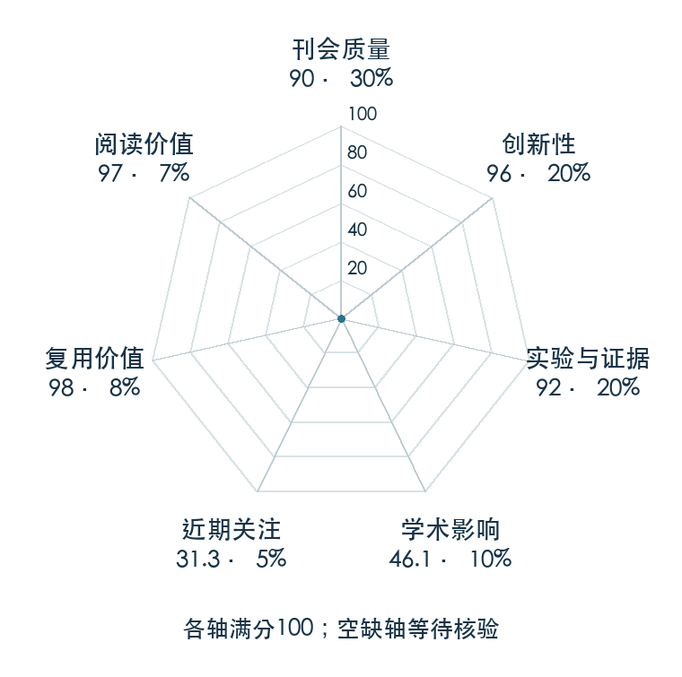

# Transporter Networks: Rearranging the Visual World for Robotic Manipulation

**Transporter** · CoRL 2020 · 本版排名 60 · 综合分 **84.8 / 100**

[解读导读](../../../library/transporter.md) · [操作与动作块](../../../paper-map/README.md#track-manipulation) · [CoRL集锦](../../../venues/CoRL/README.md)

[原文](https://proceedings.mlr.press/v155/zeng21a.html) · [PDF](https://proceedings.mlr.press/v155/zeng21a/zeng21a.pdf) · [阅读卡片](../../../library/transporter.md)

论文出处：[Andy Zeng · Robotics at Google](../../origins/papers/transporter.md)

## 机制简析

网络先在 RGB-D 视觉空间中预测拾取区域，取出局部深层特征，再将它与整幅场景特征互相关来确定放置位置和旋转。动作输出与输入空间对应，平移和旋转结构被模型直接利用，不先构建对象姿态或分割。原文覆盖刚体、绳索和堆物推动，比较样本效率，并扩展到六自由度拾放和真实机器人。

带着这个问题读：操作物体不一定要先识别物体？空间特征之间的匹配怎么直接长出动作？

初读判断：CoRL 正式版给出多种操作任务和真实验证，作者开放 Ravens、数据、模型及代码；CLIPort 原文和项目明确继承这一机制，可追溯的路线影响足以支持年限例外。

## 七维评分

<picture>
  <source media="(prefers-color-scheme: dark)" srcset="radar-dark.gif">
  
</picture>

[透明静态图](radar.svg) · [深色静态图](radar-dark.svg)

| 维度 | 分数 / 100 | 权重 |
| --- | --- | --- |
| 公开与评审 | 90.0 | 30% |
| 创新性 | 96 | 20% |
| 实验与证据 | 92 | 20% |
| 学术影响 | 46.1 | 10% |
| 近期关注 | 18.8 | 5% |
| 复用价值 | 98 | 8% |
| 阅读价值 | 97 | 7% |

刊会依据：[CoRL 2020](../../../venues/CoRL/README.md)，正式出处见[出版/原文记录](https://proceedings.mlr.press/v155/zeng21a.html)；采用2026-10-10刊会快照。

公开与评审依据：完整论文已公开，作者、日期与版本/固定论文身份可追溯，公开材料阶段计60。；正式刊会按登记量表计分，取较高阶段。

编辑深度：原文摘要/方法与实验初读；评分记录：2026-10-10。

计量来源：OpenAlex；作者预印本/原研究索引记录；匹配题目：Transporter Networks: Rearranging the Visual World for Robotic Manipulation。累计被引 **39**，2025–2026 被引 **6**；快照：2026-10-10T09:50:37+08:00。

[指标记录](https://api.openalex.org/works/W3096099141) · [文献计量条目](https://openalex.org/W3096099141)

### 影响与关注的计算依据

- **学术影响 46.1**：身份匹配的累计引用C=39，对数压缩上限3000。 [依据1](https://api.openalex.org/works/W3096099141)
- **近期关注 18.8**：近期已定位引用R=6；数量与每月引用速度各占一半，有效观察期21.2567个月。 [依据1](https://api.openalex.org/works/W3096099141)

### 论文公开入口与传播快照

| 平台 / 入口 | 公开计量 | 统计范围 | 快照 |
| --- | --- | --- | --- |
| [github](https://github.com/google-research/ravens) | GitHub Star 630；GitHub Watch订阅 0；GitHub Fork 108 | 单篇论文仓库；截至2026-10-10的累计快照 | 2026-10-10 |
| [huggingface](https://huggingface.co/papers/2010.14406) | HF 论文累计点赞 0 | 按精确arXiv ID核对的单篇论文页；截至2026-10-10的累计快照 | 2026-10-10 |

[传播数据与采用依据](../../social-signals.json)保留归属、统计窗口与计分信号。
[评分说明](../../methodology.md) · [返回具身榜](../../README.md) · [论文地图](../../../paper-map/README.md)
