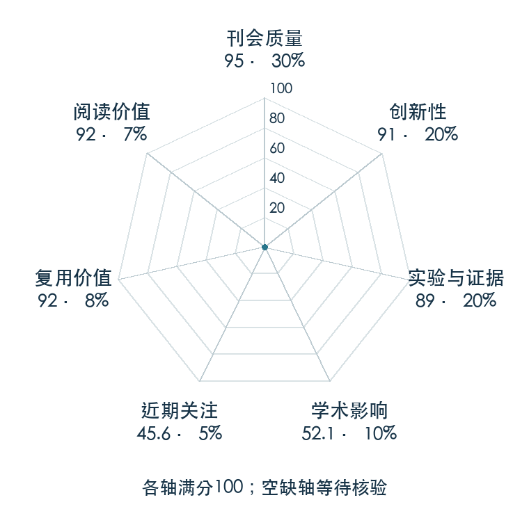

# VIMA: Robot Manipulation with Multimodal Prompts

**VIMA** · ICML 2023 · 本版排名 46 · 综合分 **86.0 / 100**

[解读导读](../../../library/vima.md) · [视觉语言动作模型 VLA](../../../paper-map/README.md#track-vla) · [ICML集锦](../../../venues/ICML/README.md)

[原文](https://proceedings.mlr.press/v202/jiang23b.html) · [PDF](https://proceedings.mlr.press/v202/jiang23b/jiang23b.pdf) · [阅读卡片](../../../library/vima.md)

论文出处：[Yunfan Jiang · Stanford University / Macalester College 等6个出处](../../origins/papers/vima.md)

## 机制简析

对象图像 token 与文字交错构成任务提示，再经 T5 编码；因果 Transformer 通过交叉注意力读取提示，并结合交互历史自回归输出动作。程序化生成任务按不同泛化难度拆开测试，避免只看训练分布平均成功率。原文对对象 tokenizer、提示接入方式、模型规模和数据量分别消融。

带着这个问题读：文字、目标图和示范视频能否作为同一种任务提示交给机器人？

初读判断：ICML 正式版与项目给出四级泛化协议、数据/规模研究和对象 token 消融，公开基准便于后续方法比较；实机证据弱于 RT-1，证据评分体现这一点。

## 七维评分

<picture>
  <source media="(prefers-color-scheme: dark)" srcset="radar-dark.gif">
  
</picture>

[透明静态图](radar.svg) · [深色静态图](radar-dark.svg)

| 维度 | 分数 / 100 | 权重 |
| --- | --- | --- |
| 公开与评审 | 95.0 | 30% |
| 创新性 | 91 | 20% |
| 实验与证据 | 89 | 20% |
| 学术影响 | 52.1 | 10% |
| 近期关注 | 48.8 | 5% |
| 复用价值 | 92 | 8% |
| 阅读价值 | 92 | 7% |

刊会依据：[ICML 2023](../../../venues/ICML/README.md)，正式出处见[出版/原文记录](https://proceedings.mlr.press/v202/jiang23b.html)；采用2026-10-10刊会快照。

公开与评审依据：完整论文已公开，作者、日期与版本/固定论文身份可追溯，公开材料阶段计60。；正式刊会按登记量表计分，取较高阶段。

编辑深度：原文摘要/方法与实验初读；评分记录：2026-10-10。

计量来源：OpenAlex；作者预印本/原研究索引记录；匹配题目：VIMA: General Robot Manipulation with Multimodal Prompts。累计被引 **64**，2025–2026 被引 **16**；快照：2026-10-10T09:50:37+08:00。

[指标记录](https://api.openalex.org/works/W4303648971) · [文献计量条目](https://openalex.org/W4303648971)

### 影响与关注的计算依据

- **学术影响 52.1**：身份匹配的累计引用C=64，对数压缩上限3000。 [依据1](https://api.openalex.org/works/W4303648971)
- **近期关注 48.8**：huggingface 的论文专属入口：HF 最近30天下载=276；按100000上限对数压缩。 [依据1](https://huggingface.co/api/datasets/VIMA/VIMA-Data) · [依据2](https://huggingface.co/datasets/VIMA/VIMA-Data/raw/main/README.md) · [依据3](https://huggingface.co/datasets/VIMA/VIMA-Data)

### 论文公开入口与传播快照

| 平台 / 入口 | 公开计量 | 统计范围 | 快照 |
| --- | --- | --- | --- |
| [github](https://github.com/vimalabs/VIMA) | GitHub Star 859；GitHub Watch订阅 16；GitHub Fork 100 | 单篇论文仓库；截至2026-10-10的累计快照 | 2026-10-10 |
| [github](https://github.com/vimalabs/VimaBench) | GitHub Star 328；GitHub Watch订阅 8；GitHub Fork 39 | 单篇论文仓库；截至2026-10-10的累计快照 | 2026-10-10 |
| [huggingface](https://huggingface.co/VIMA/VIMA) | HF 最近30天下载 0；HF 仓库累计点赞 17 | 单篇论文的作者发布资产；2026-09-11 至 2026-10-10（API最近30天；含首尾的日期标签，实际滚动边界未公开） / 截至2026-10-10的累计快照 | 2026-10-10 |
| [huggingface](https://huggingface.co/datasets/VIMA/VIMA-Data) | HF 最近30天下载 276；HF 仓库累计点赞 29 | 单篇论文的作者发布资产；2026-09-11 至 2026-10-10（API最近30天；含首尾的日期标签，实际滚动边界未公开） / 截至2026-10-10的累计快照 | 2026-10-10 |
| [huggingface](https://huggingface.co/papers/2210.03094) | HF 论文累计点赞 3 | 按精确arXiv ID核对的单篇论文页；截至2026-10-10的累计快照 | 2026-10-10 |

[传播数据与采用依据](../../social-signals.json)保留归属、统计窗口与计分信号。
[评分说明](../../methodology.md) · [返回具身榜](../../README.md) · [论文地图](../../../paper-map/README.md)
