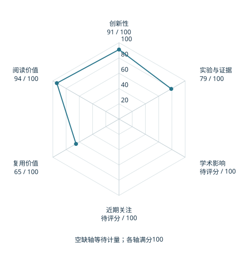

# VioLA: Learning Generalist Humanoid Control Policies from Human Data

本版阅读优先顺序：30；综合分：58.4–88.4 / 100；已评分权重：70%。

[原文](https://arxiv.org/abs/2610.12435v1) · [PDF](https://arxiv.org/pdf/2610.12435v1) · [阅读卡片](../../../library/viola.md)

## 机制简析

VLA 预测身体与手部运动 latent，预训练控制器负责执行；运动编码器把人类示范映射到同一空间，扩大可监督动作池。

带着这个问题读：人类动作怎样先对齐控制器，再教会人形 VLA？

初读判断：跨数据监督和动作空间转换直接对上 Holo-M；初读关注零样本协议、控制器预训练与总数据规模。

## 六维评分

| 维度 | 分数 / 100 | 权重 |
| --- | --- | --- |
| 创新性 | 91 | 25% |
| 实验与证据 | 79 | 25% |
| 学术影响 | 待计量 | 20% |
| 近期关注 | 待计量 | 10% |
| 复用价值 | 65 | 10% |
| 阅读价值 | 94 | 10% |

编辑深度：选题初读；评分记录：2026-10-09T18:35:28+08:00。

计量状态：等待可确认对应的记录；两项计量维度保留空白。

[评分说明](../../methodology.md) · [返回具身榜](../../README.md) · [论文地图](../../../paper-map/README.md)
