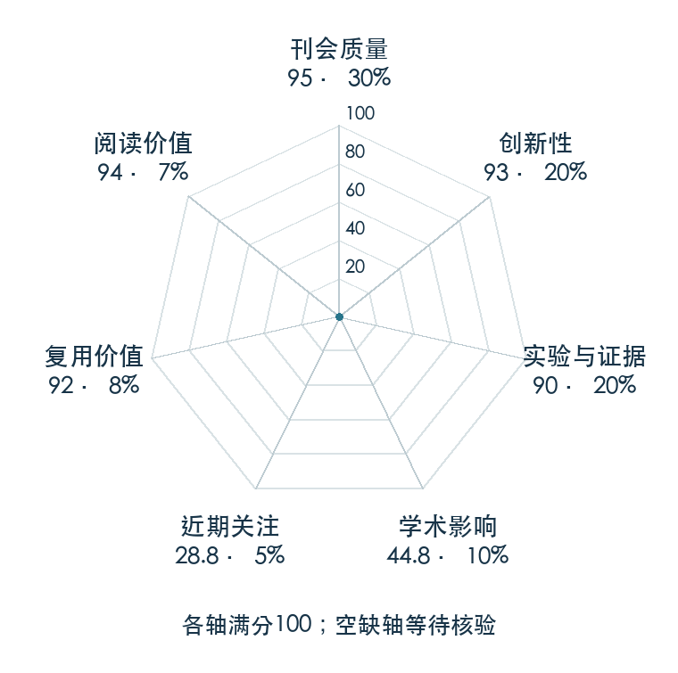

# VIP: Towards Universal Visual Reward and Representation via Value-Implicit Pre-Training

**VIP** · ICLR 2023 · 本版排名 63 · 综合分 **85.0 / 100**

[原文](https://openreview.net/forum?id=YJ7o2wetJ2) · [PDF](https://openreview.net/pdf?id=YJ7o2wetJ2) · [阅读卡片](../../../library/vip.md)

## 机制简析

把无动作视频看成目标条件价值学习，再从离线 RL 的对偶目标导出仅需要画面序列的预训练损失。价值隐式地由当前图像与目标图像的嵌入距离表达，因而距离变化能提供稠密视觉奖励。原文检验轨迹优化、在线 RL 与少量真实轨迹的离线 RL，强调表征和奖励同时影响控制。

带着这个问题读：两张图在 latent 空间的距离，为什么可以变成机器人离目标还有多远的奖励？

初读判断：ICLR 官方页面确认主会，原项目与作者稿提供推导、平滑奖励、控制方法和真实任务对照；代码及 TorchRL 接入给出复用路径。

## 七维评分

<picture>
  <source media="(prefers-color-scheme: dark)" srcset="radar-dark.gif">
  
</picture>

[透明静态图](radar.svg) · [深色静态图](radar-dark.svg)

| 维度 | 分数 / 100 | 权重 |
| --- | --- | --- |
| 发表与刊会 | 95.0 | 30% |
| 创新性 | 93 | 20% |
| 实验与证据 | 90 | 20% |
| 学术影响 | 44.8 | 10% |
| 近期关注 | 28.8 | 5% |
| 复用价值 | 92 | 8% |
| 阅读价值 | 94 | 7% |

刊会依据：[ICLR 2023](../../../venues/ICLR/README.md)，正式出处见[出版/原文记录](https://openreview.net/forum?id=YJ7o2wetJ2)；采用2026-10-10刊会快照。

编辑深度：原文摘要/方法与实验初读；评分记录：2026-10-10。

计量版本：作者预印本/原研究索引记录；OpenAlex题目：VIP: Towards Universal Visual Reward and Representation via Value-Implicit Pre-Training。累计被引 35，2025–2026 被引 5；快照：2026-10-10T09:50:37+08:00。

[指标记录](https://api.openalex.org/works/W4302010007) · [文献计量条目](https://openalex.org/W4302010007)

[评分说明](../../methodology.md) · [返回具身榜](../../README.md) · [论文地图](../../../paper-map/README.md)
