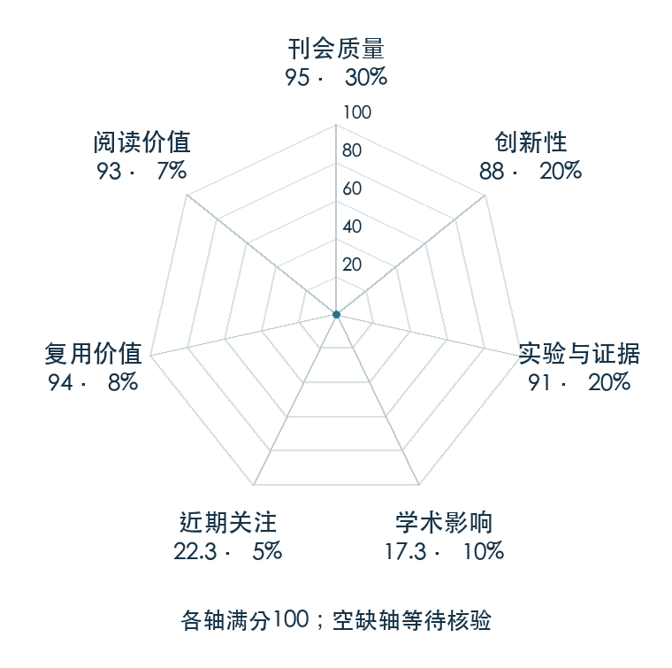

# Behavior Generation with Latent Actions

**VQ-BeT** · ICML 2024 · 本版排名 57 · 综合分 **84.9 / 100**

[解读导读](../../../library/vq-bet.md) · [操作与动作块](../../../paper-map/README.md#track-manipulation) · [ICML集锦](../../../venues/ICML/README.md)

[原文](https://proceedings.mlr.press/v235/lee24y.html) · [PDF](https://raw.githubusercontent.com/mlresearch/v235/main/assets/lee24y/lee24y.pdf) · [阅读卡片](../../../library/vq-bet.md)

论文出处：[Seungjae Lee · New York University / Seoul National University](../../origins/papers/vq-bet.md)

## 机制简析

第一阶段用残差向量量化编码器把连续动作或动作块压成分层码，解码器还原动作；第二阶段 Transformer 根据观测与可选目标预测这些离散码和修正量。一次前向生成替代扩散多步去噪，同时保留行为分布的多种模式。原文比较条件/无条件任务、仿真和真实长程操作，以及推理时延。

带着这个问题读：动作先压成分层离散码，能否保留多种操作方式，同时省掉扩散反复采样？

初读判断：ICML 正式稿与项目提供与 BeT、Diffusion Policy 的多任务和速度对照，真实长程任务与开放实现支撑复用；部分任务没有优势，评分以整体机制和证据覆盖为准。

## 七维评分

<picture>
  <source media="(prefers-color-scheme: dark)" srcset="radar-dark.gif">
  
</picture>

[透明静态图](radar.svg) · [深色静态图](radar-dark.svg)

| 维度 | 分数 / 100 | 权重 |
| --- | --- | --- |
| 公开与评审 | 95.0 | 30% |
| 创新性 | 88 | 20% |
| 实验与证据 | 91 | 20% |
| 学术影响 | 40 | 10% |
| 近期关注 | 51.7 | 5% |
| 复用价值 | 94 | 8% |
| 阅读价值 | 93 | 7% |

刊会依据：[ICML 2024](../../../venues/ICML/README.md)，正式出处见[出版/原文记录](https://proceedings.mlr.press/v235/lee24y.html)；采用2026-10-10刊会快照。

公开与评审依据：完整论文已公开，作者、日期与版本/固定论文身份可追溯，公开材料阶段计60。；正式刊会按登记量表计分，取较高阶段。

编辑深度：原文摘要/方法与实验初读；评分记录：2026-10-10。

计量来源：OpenAlex；作者预印本/原研究索引记录；匹配题目：Behavior Generation with Latent Actions。累计被引 **3**，2025–2026 被引 **3**；快照：2026-10-10T09:50:37+08:00。

[指标记录](https://api.openalex.org/works/W4392538920) · [文献计量条目](https://openalex.org/W4392538920)

### 影响与关注的计算依据

- **学术影响 40**：LeRobot VQ-BeT/PushT：Trains VQ-BeT on PushT and publishes a 200k-step checkpoint plus training/evaluation details.（单路线独立技术采用，量表40） [依据1](https://huggingface.co/lerobot/vqbet_pusht/raw/main/README.md)
- **近期关注 51.7**：huggingface 的论文专属入口：HF 最近30天下载=383；按100000上限对数压缩。 [依据1](https://huggingface.co/api/models/lerobot/vqbet_pusht) · [依据2](https://huggingface.co/lerobot/vqbet_pusht/raw/main/README.md) · [依据3](https://huggingface.co/lerobot/vqbet_pusht)

### 论文公开入口与传播快照

| 平台 / 入口 | 公开计量 | 统计范围 | 快照 |
| --- | --- | --- | --- |
| [github](https://github.com/jayLEE0301/vq_bet_official) | GitHub Star 220；GitHub Watch订阅 3；GitHub Fork 22 | 单篇论文仓库；截至2026-10-10的累计快照 | 2026-10-10 |
| [huggingface](https://huggingface.co/lerobot/vqbet_pusht) | HF 最近30天下载 383；HF 仓库累计点赞 5 | 单篇论文的第三方实现/数据格式转换，按此仓库统计；2026-09-11 至 2026-10-10（API最近30天；含首尾的日期标签，实际滚动边界未公开） / 截至2026-10-10的累计快照 | 2026-10-10 |
| [huggingface](https://huggingface.co/papers/2403.03181) | HF 论文累计点赞 1 | 按精确arXiv ID核对的单篇论文页；截至2026-10-10的累计快照 | 2026-10-10 |

[传播数据与采用依据](../../social-signals.json)保留归属、统计窗口与计分信号。
[评分说明](../../methodology.md) · [返回具身榜](../../README.md) · [论文地图](../../../paper-map/README.md)
